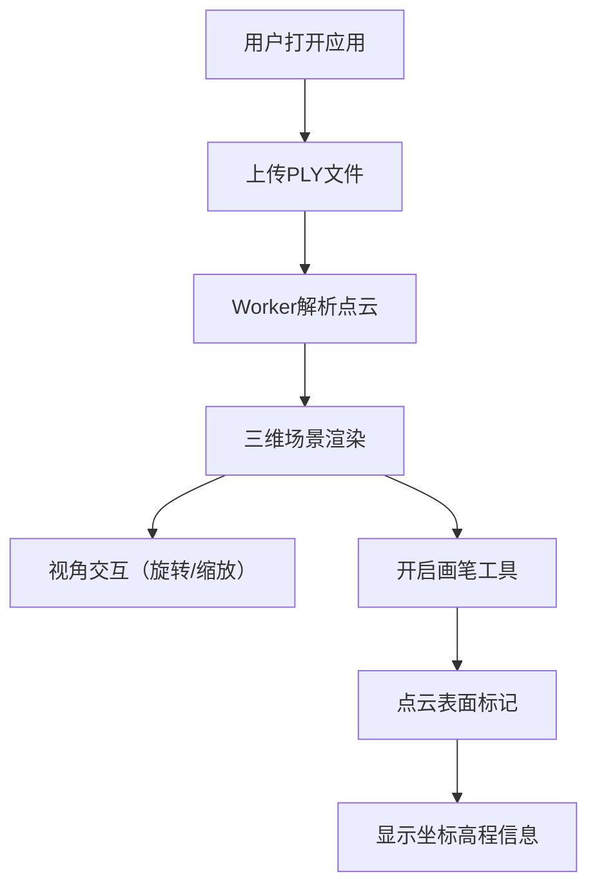

## 1. 产品概述

基于三维点云数据的实时重建与交互可视化工具，支持深度相机拍摄的PLY格式点云文件上传、实时渲染、视角交互与表面标记，适用于考古或建筑现场勘测场景。

- 核心价值：提供轻量级、高性能的点云数据可视化与标注能力
- 目标用户：考古工作者、建筑勘测人员、三维数据分析师
- 解决问题：传统点云查看器安装复杂、交互卡顿、标注功能缺失

## 2. 核心功能

### 2.1 功能模块

1. **文件上传模块**：拖拽/点击上传PLY文件，进度显示，缩略预览
2. **三维渲染模块**：点云实时渲染，相机控制，LOD策略
3. **标记工具模块**：画笔标记，粒子高亮，坐标信息显示
4. **界面交互模块**：暗色科技主题，响应式布局，动画效果

### 2.2 页面详情

| 页面名称 | 模块名称 | 功能描述 |
|-----------|-------------|---------------------|
| 主页面 | 左侧上传区 | 360x200px虚线边框拖拽区域，支持PLY文件上传 |
| 主页面 | 进度条组件 | 80%宽度渐变进度条（#ff6b6b→#00ff88） |
| 主页面 | 缩略预览窗 | 150x150px半透明缩略图，显示点云俯视轮廓 |
| 主页面 | 三维渲染区 | 深蓝黑渐变背景，彩色圆球粒子渲染 |
| 主页面 | 工具栏 | 画笔工具切换按钮，悬停水波特效 |
| 主页面 | 浮动标签 | 显示选中点的高程和坐标信息 |

## 3. 核心流程

用户打开应用 → 拖拽或点击上传PLY文件 → Worker线程解析点云数据 → 三维场景实时渲染 → 用户旋转/缩放查看 → 开启画笔工具 → 在点云表面标记 → 查看标记点坐标信息

## 4. 用户界面设计

### 4.1 设计风格
- **主色调**：深蓝 #0f0f2e
- **辅助色**：青色 #00d4ff，金黄 #ffd700
- **背景渐变**：#0a0a1a 到 #1a1a3a
- **按钮风格**：圆角矩形（8px），悬停水波扩散特效（0.2s）
- **字体**：等宽字体 + 现代无衬线字体，科技感
- **布局**：左右两栏，左侧固定400px，右侧自适应

### 4.2 页面设计概述

| 页面名称 | 模块名称 | UI元素 |
|-----------|-------------|-------------|
| 主页面 | 上传区 | 2px虚线边框#00ff88，圆角12px，背景#2a2a3a |
| 主页面 | 进度条 | 高6px，圆角3px，渐变动画 |
| 主页面 | 三维场景 | 彩色粒子（2-4px半径），平滑相机跟随（阻尼0.15） |
| 主页面 | 标记高亮 | 亮黄色#ffff00，1.5倍放大，3秒后恢复 |
| 主页面 | 响应式 | <768px时左侧折叠为抽屉式侧边栏 |

### 4.3 响应式设计
- 桌面端（>768px）：左右两栏布局，左侧上传区固定400px
- 移动端（≤768px）：左侧折叠为抽屉，左上角菜单按钮控制展开/收起
- 触摸优化：支持手势缩放和旋转

### 4.4 3D场景指导
- **环境**：深蓝黑渐变背景，无外部光源，使用点云自带颜色
- **相机设置**：默认正上方45度俯视，阻尼系数0.15，缩放范围0.5x-5x包围盒
- **动画**：相机缓动动画0.3秒，高亮粒子3秒后恢复
- **性能**：>10万粒子自动LOD降采样，帧率≥30fps
