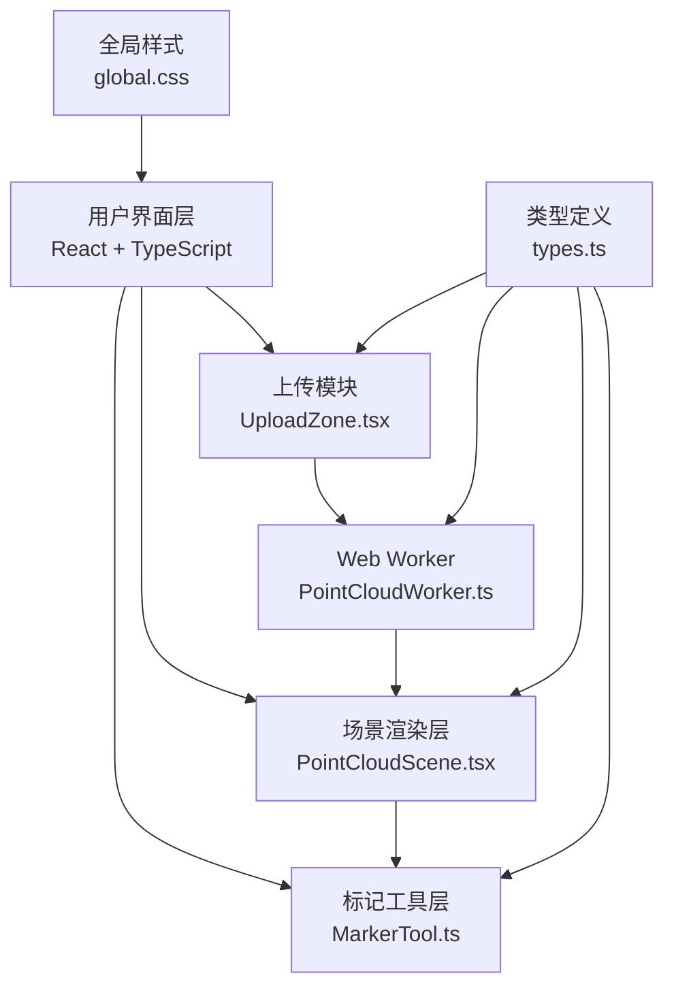

## 1. 架构设计



## 2. 技术描述

- **前端框架**：React 18 + TypeScript
- **三维渲染**：Three.js + @react-three/fiber + @react-three/drei
- **构建工具**：Vite + vite-plugin-worker
- **状态管理**：React useState/useRef（轻量场景）
- **性能优化**：Web Worker 解析点云，LOD 降采样策略

## 3. 目录结构

```
src/
├── main.tsx                    # React挂载入口
├── modules/
│   ├── upload/
│   │   └── UploadZone.tsx      # 拖拽上传组件
│   ├── pointcloud/
│   │   ├── PointCloudScene.tsx # 三维场景组件
│   │   └── PointCloudWorker.ts # Worker解析模块
│   └── marker/
│       └── MarkerTool.ts       # 画笔标记逻辑
├── utils/
│   └── types.ts                # 共享类型定义
└── styles/
    └── global.css              # 全局样式
```

## 4. 数据模型

### 4.1 类型定义

```typescript
interface PointData {
  position: Float32Array;  // x, y, z 坐标
  color: Float32Array;     // r, g, b 颜色 (0-1)
  originalIndices?: Uint32Array; // LOD时的原始索引
}

interface Marker {
  id: string;
  pointIndex: number;
  position: [number, number, number];
  color: [number, number, number];
  timestamp: number;
}

interface WorkerMessage {
  type: 'parse' | 'progress' | 'complete' | 'error';
  payload?: any;
}
```

## 5. 性能策略

### 5.1 LOD渲染策略
- 粒子数 ≤ 10万：全量渲染
- 10万 < 粒子数 ≤ 50万：按2:1降采样
- 50万 < 粒子数 ≤ 100万：按4:1降采样
- 粒子数 > 100万：按8:1降采样

### 5.2 交互优化
- 相机阻尼系数：0.15（平滑跟随）
- 缩放缓动动画：0.3秒
- 高亮粒子：3秒后自动恢复
- Worker线程处理文件解析，避免主线程阻塞

## 6. 关键技术点

1. **PLY文件解析**：支持ASCII和Binary格式，提取vertex、color属性
2. **Web Worker通信**：postMessage传输ArrayBuffer，使用Transferable对象
3. **Three.js性能**：使用Points + BufferGeometry，避免频繁GPU数据上传
4. **射线拾取**：使用Raycaster进行点云粒子拾取，计算最近点
5. **响应式布局**：CSS Grid + Media Query，抽屉式侧边栏
