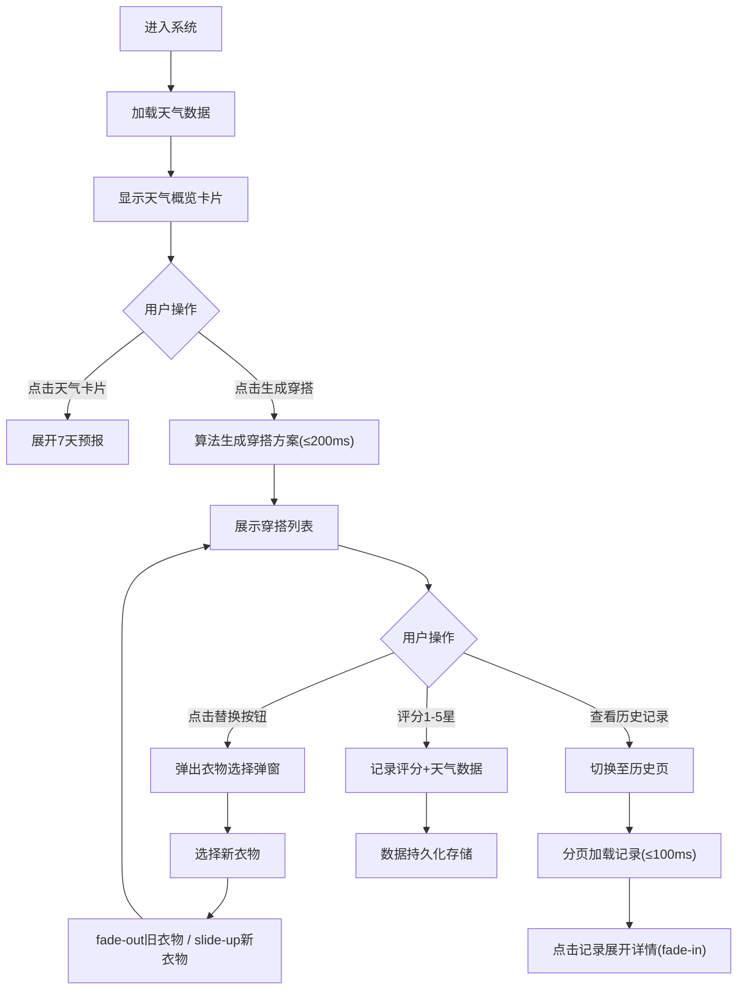

## 1. 产品概述

智能天气穿搭推荐系统是一款基于实时天气数据自动生成个性化穿搭方案的在线应用，旨在解决用户每日面对衣橱不知如何搭配的痛点，尤其关注温度、湿度、风速等天气因素对体感舒适度的影响。

- **核心目标**：通过智能算法将天气数据转化为实用的穿搭建议，节省用户决策时间，提升穿着舒适度
- **目标用户**：所有需要根据天气选择衣物的日常用户，尤其是注重穿搭舒适度和效率的都市人群
- **市场价值**：填补天气与穿搭智能结合的空白，提供个性化、可迭代的穿搭推荐体验

## 2. 核心特性

### 2.1 用户角色
| 角色 | 注册方式 | 核心权限 |
|------|----------|----------|
| 普通用户 | 无需注册，本地存储 | 查看天气、生成穿搭、评分记录、修改方案、浏览历史 |

### 2.2 功能模块
1. **首页/天气面板**：城市天气概览卡片、7天预报展开、天气数据切换
2. **穿搭生成器**：一键生成穿搭方案、衣物列表展示、手动替换、推荐理由
3. **评分系统**：1-5星评分、评分记录持久化
4. **历史记录**：时间倒序浏览、方案缩略图、详情展开、筛选查看
5. **衣物选择器**：弹窗式选择、搜索筛选、分页展示、高亮选中

### 2.3 页面详情
| 页面名称 | 模块名称 | 功能描述 |
|----------|----------|----------|
| 首页 | 天气概览卡片 | 320x160px圆角卡片，天气渐变背景，显示城市、温度、图标、风速、湿度，点击展开400px高7天预报网格 |
| 首页 | 生成穿搭按钮 | 240x48px红色圆角按钮，hover加深阴影，点击缩放反馈 |
| 首页 | 穿搭方案列表 | 垂直列表展示衣物，包含类别图标、名称、推荐理由，浅色分隔线，hover背景变化 |
| 首页 | 评分组件 | 24px星星图标，5级评分，悬停预览效果 |
| 首页 | 替换按钮 | 80x32px灰色圆角按钮，点击弹出衣物选择弹窗 |
| 历史记录页 | 记录列表 | 时间倒序排列，显示日期、天气小卡片、方案缩略图、评分，点击fade-in展开详情 |
| 衣物选择弹窗 | 搜索筛选栏 | 搜索框、类别筛选标签 |
| 衣物选择弹窗 | 衣物网格 | 120x150px衣物卡片，蓝色边框高亮选中 |
| 全局 | 导航栏 | 60px宽左侧导航，hover蓝色指示条，<768px转为底部标签栏 |

## 3. 核心流程

### 3.1 主流程描述
用户进入系统 → 查看当前城市天气概览 → 点击天气卡片展开7天预报 → 点击"生成今日穿搭"按钮 → 系统基于天气权重模型在200ms内生成穿搭方案 → 用户浏览方案详情和推荐理由 → 用户可评分(1-5星)或替换单件衣物 → 方案和评分自动保存至历史记录 → 用户可切换至历史记录页查看和展开过往方案

### 3.2 流程图

## 4. 用户界面设计

### 4.1 设计风格
- **主色调**：导航栏深色#2c3e50，主内容区浅灰#f0f2f5，按钮红色#ff6b6b，强调蓝#3498db
- **天气主题色**：晴天渐变#ffcc00→#ff8800，阴天渐变#8888aa→#666688，雨天渐变#4488ff→#2255cc
- **按钮风格**：统一圆角设计，24px大按钮圆角，6px小按钮圆角，hover阴影加深，点击缩放反馈
- **字体**：系统默认无衬线字体，白色文字用于深色背景，标题加粗24px，正文14-18px
- **布局风格**：左侧60px窄导航+右侧内容区卡片式布局，响应式断点768px
- **图标风格**：Emoji天气图标(☀️🌧️⛅) + FontAwesome风格类别图标(👕👖🧥👟🎒)，简洁直观

### 4.2 页面设计概览
| 页面名称 | 模块名称 | UI元素 |
|----------|----------|--------|
| 首页 | 天气卡片 | 渐变背景、圆角16px、白色粗体温度、底部三栏信息、ease-out展开动画 |
| 首页 | 穿搭列表 | 白底卡片、1px浅色分隔、hover#f8f9fa、右侧替换按钮、左对齐类别图标 |
| 首页 | 评分星星 | 24px大小、灰色未选/金色选中/悬停浅金、点击选择动画 |
| 历史记录页 | 记录项 | 日期标签、迷你天气卡片、三图标缩略图、评分摘要、0.2s fade-in展开 |
| 衣物弹窗 | 选择网格 | 120x150px卡片、8px圆角、#4488ff选中边框、分页控件 |
| 全局 | 导航栏 | 60px深色竖栏、图标按钮60px高、3px蓝色hover指示条、移动端底部标签栏 |

### 4.3 响应式设计
- **桌面优先**：≥768px采用左侧60px导航+右侧24px内边距内容区
- **移动端适配**：<768px导航栏收缩为底部标签栏，内容区内边距调整为16px，卡片宽度自适应容器
- **触控优化**：按钮最小48px触控区域，弹窗滚动支持，列表项点击反馈明显

### 4.4 动画设计
- 天气卡片展开：0.3s ease-out高度过渡
- 按钮交互：hover阴影加深3px，active scale(0.95)回弹
- 衣物替换：旧衣物0.2s fade-out → 新衣物0.3s slide-up
- 历史展开：0.2s fade-in渐显
- 星星悬停：颜色过渡0.15s，选中轻微scale(1.1)
