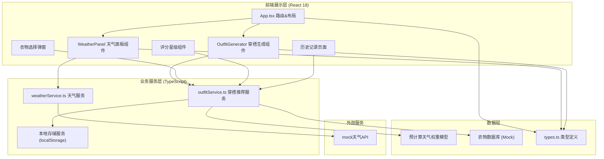

## 1. 架构设计



## 2. 技术描述

- **前端框架**：React 18 + TypeScript 5.x
- **构建工具**：Vite 5.x（含@vitejs/plugin-react）
- **路由管理**：React Router DOM 6.x（HashRouter，两页面：首页/历史记录）
- **样式方案**：原生CSS（CSS Modules + CSS Variables），无需CSS框架
- **状态管理**：React Hooks（useState、useEffect、useContext）
- **数据持久化**：localStorage（历史记录、用户评分）
- **初始化方式**：手动创建项目结构（指定文件清单）

## 3. 路由定义

| 路由 | 页面 | 主要组件 | 目的 |
|------|------|----------|------|
| `/` | 首页 | WeatherPanel + OutfitGenerator | 天气展示+穿搭生成+评分+衣物替换 |
| `/history` | 历史记录页 | 历史记录列表组件 | 浏览过往方案、展开详情、查看评分 |

## 4. 类型定义（types.ts核心接口）

```typescript
// 天气类型
type WeatherType = 'sunny' | 'cloudy' | 'rainy';

interface DailyWeather {
  date: string;        // YYYY-MM-DD
  temp: number;        // 摄氏度
  tempHigh: number;
  tempLow: number;
  humidity: number;    // 0-100%
  windSpeed: number;   // km/h
  rainProb: number;    // 0-100%
  type: WeatherType;
  icon: string;        // emoji
}

interface WeatherData {
  city: string;
  current: DailyWeather;
  forecast: DailyWeather[];  // 7天
}

// 衣物系统
type ClothingCategory = 'top' | 'bottom' | 'outerwear' | 'shoes' | 'accessory';

interface ClothingItem {
  id: string;
  name: string;
  category: ClothingCategory;
  icon: string;       // emoji
  warmthWeight: number;  // 1-10保暖值
  waterproof: boolean;
  windproof: boolean;
  suitableTemp: [number, number];  // 适宜温度区间
}

// 穿搭方案
interface OutfitItem extends ClothingItem {
  reason: string;     // 推荐理由
}

interface OutfitPlan {
  id: string;
  timestamp: number;
  weatherSnapshot: DailyWeather;
  items: OutfitItem[];
  rating?: number;    // 1-5
  modified: boolean;  // 用户是否修改过
}

// 权重模型
interface WeatherWeight {
  tempWeight: number;
  humidityWeight: number;
  windWeight: number;
  rainWeight: number;
}
```

## 5. 穿搭推荐算法架构


算法约束：
- 总计算时长 ≤ 200ms（预计算衣物库索引，无外部API调用）
- 体感公式：`feelsLike = temp - windSpeed*0.1 + (humidity>70 ? -2 : 0)`
- 推荐理由模板化拼接，基于命中的匹配规则

## 6. 性能优化策略

| 优化点 | 方案 | 目标指标 |
|--------|------|----------|
| 穿搭算法 | 预计算衣物温度区间倒排索引，线性扫描而非嵌套循环 | ≤ 200ms |
| 历史分页 | localStorage分段读取，虚拟滚动或懒加载，每页20条 | 每页加载 ≤ 100ms |
| 动画性能 | 纯CSS transform/opacity动画，避免layout thrash | 60fps |
| 组件渲染 | React.memo包裹纯展示组件，useMemo缓存计算结果 | 无不必要重渲染 |
| 响应式 | CSS媒体查询断点768px，避免JS监听resize | 切换流畅 |

## 7. 文件结构（严格按需求）

```
auto21/
├── package.json
├── vite.config.js
├── tsconfig.json
├── index.html
└── src/
    ├── App.tsx
    ├── types.ts
    ├── services/
    │   ├── weatherService.ts
    │   └── outfitService.ts
    ├── components/
    │   ├── WeatherPanel.tsx
    │   └── OutfitGenerator.tsx
    └── styles/
        └── global.css
```
