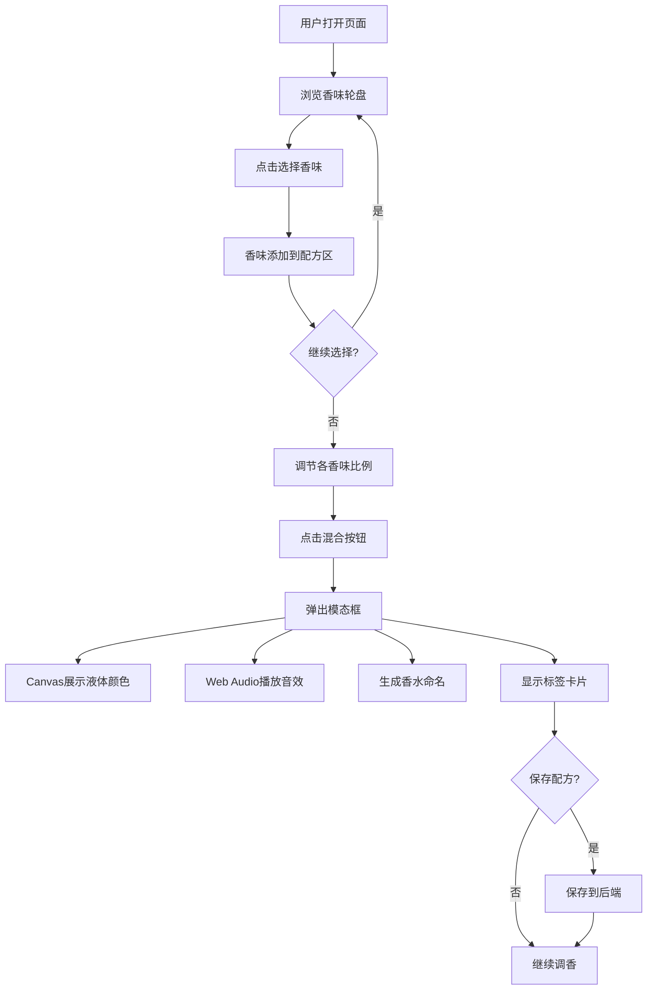

## 1. 产品概述

基于植物气味的虚拟调香师应用，用户通过选择基础香味和调香配方在浏览器中模拟混合出独特香水，生成可视化香味轮盘和个性化香水标签卡片，支持将配方保存到个人账户。

- 目标用户：香水爱好者、创意设计师、对香氛文化感兴趣的用户
- 核心价值：以直觉化、可视化的方式体验调香艺术，降低调香门槛，激发创作灵感

## 2. 核心功能

### 2.1 用户角色

| 角色 | 注册方式 | 核心权限 |
|------|----------|----------|
| 普通用户 | 无需注册 | 浏览香味轮盘、选择香味、混合香水、查看结果 |
| 注册用户 | 用户名注册 | 保存配方、查看历史配方 |

### 2.2 功能模块

1. **主页**：香味轮盘、混合配方区、混合结果展示

### 2.3 页面详情

| 页面名称 | 模块名称 | 功能描述 |
|----------|----------|----------|
| 主页 | 香味轮盘 | 直径400px圆形轮盘，背景渐变#fff5e6→#ffe0b2，分布16种基础香味标签，按类型分组着色（花香粉色调/木质棕色调/果香橙色调），悬停放大1.1倍并显示简介气泡，点击选香 |
| 主页 | 混合配方区 | 宽300px，高度100%，渐变条表示各香味比例，宽度按比例动态变化，拖动滑块调节比例 |
| 主页 | 混合结果模态框 | 半透明黑底50%，Canvas画布展示香水液体颜色（RGB混合算法，试管底部向上渐变为透明），Web Audio液体流动音效，自动生成香水命名，香水标签卡片 |
| 主页 | 香水标签卡片 | 宽200px高300px圆角8px，背景混合色→白色渐变，顶部香水名+日期，底部香水瓶图标 |
| 主页 | 配方保存 | 注册用户可保存配方到后端，查看历史配方列表 |

## 3. 核心流程

用户打开页面 → 浏览香味轮盘 → 点击选择香味 → 香味添加到配方区 → 调节各香味比例 → 点击混合按钮 → 弹出模态框展示混合结果 → 查看香水名称和标签卡片 → 可选保存配方

## 4. 用户界面设计

### 4.1 设计风格

- 主色调：暖色系，主背景#fff8f0，卡片背景白色，边框#e0c8a0圆角12px
- 按钮：渐变色#ff9933→#ff6600，点击缩小0.95倍0.2秒弹回
- 字体：正文16px，标题24px，使用优雅衬线体作为展示字体
- 布局：左侧香味轮盘+右侧配方区，大屏并排小屏上下
- 图标风格：线条式植物与香氛图标

### 4.2 页面设计概览

| 页面名称 | 模块名称 | UI元素 |
|----------|----------|--------|
| 主页 | 香味轮盘 | 400px直径圆形，径向渐变背景，16个圆角10px色块标签，悬停1.1倍放大+气泡简介 |
| 主页 | 混合配方区 | 300px宽，渐变条+滑块，添加/删除香味，比例百分比显示 |
| 主页 | 混合按钮 | 渐变#ff9933→#ff6600，居中大按钮，点击动画0.2s |
| 主页 | 结果模态框 | 黑底50%透明遮罩，居中白色卡片，Canvas试管动画，音效播放 |
| 主页 | 香水标签卡片 | 200×300px，圆角8px，渐变背景，香水名+日期+图标 |
| 主页 | 配方列表 | 侧边栏或底部，卡片式排列，显示已保存配方 |

### 4.3 响应式适配

- 桌面优先设计，768px以上宽度轮盘和配方区左右并排
- 768px以下轮盘和配方区上下排列
- 触摸优化：滑块和按钮适配触摸操作

### 4.4 性能要求

- 每次混合计算在50ms内完成
- 动画帧率不低于50fps
- Canvas渲染使用requestAnimationFrame
