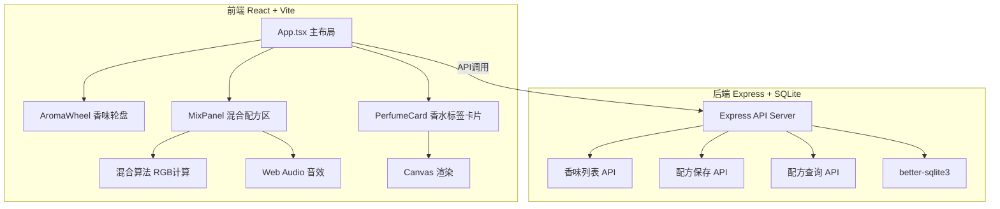
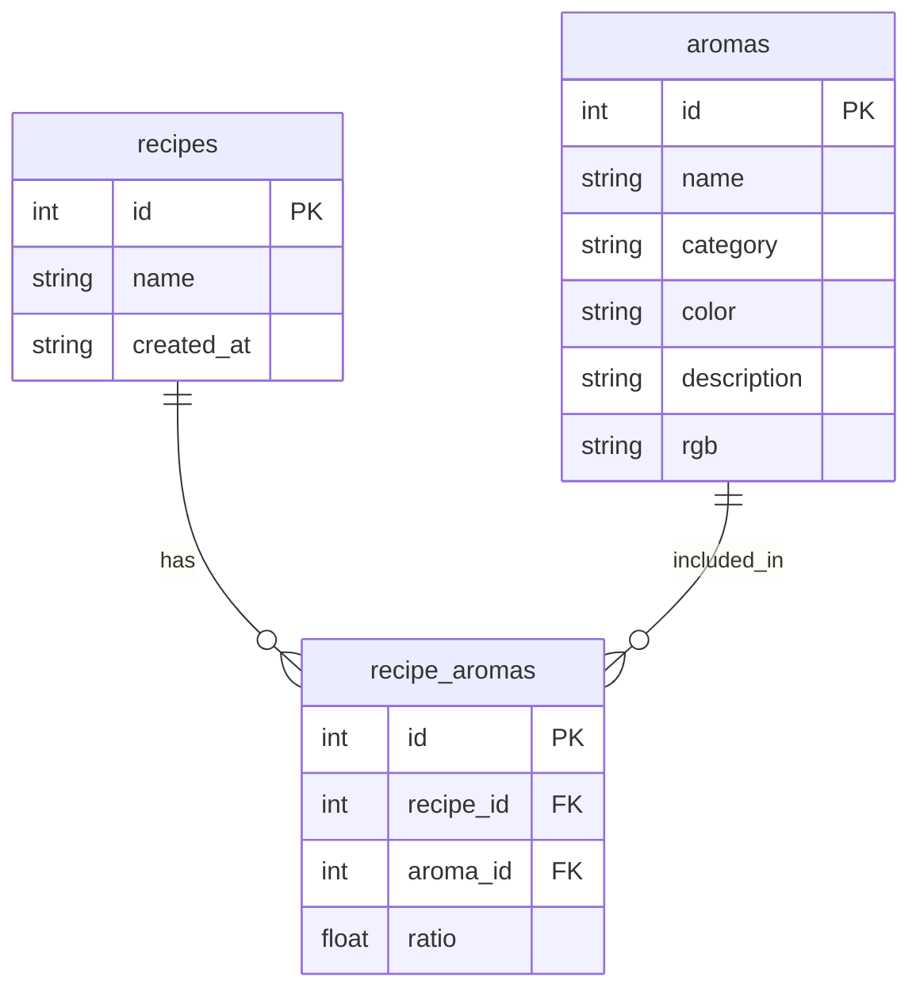

## 1. 架构设计



## 2. 技术说明

- 前端：React@18 + TypeScript + Vite + Tailwind CSS
- 初始化工具：vite-init（react-express-ts 模板）
- 后端：Express@4 + cors
- 数据库：SQLite（better-sqlite3）
- 状态管理：Zustand
- 图标：lucide-react

## 3. 路由定义

| 路由 | 用途 |
|------|------|
| / | 主页，香味轮盘+配方区+混合结果 |

## 4. API 定义

### 4.1 获取香味列表

```typescript
GET /api/aromas
Response: {
  id: number;
  name: string;
  category: 'floral' | 'woody' | 'fruity' | 'fresh' | 'spicy' | 'herbal';
  color: string;       // HEX颜色
  description: string;  // 香味简介
  rgb: [number, number, number];
}[]
```

### 4.2 保存配方

```typescript
POST /api/recipes
Request: {
  name: string;
  aromas: { id: number; ratio: number }[];
}
Response: { id: number; name: string; aromas: { id: number; ratio: number }[]; createdAt: string }
```

### 4.3 获取配方列表

```typescript
GET /api/recipes
Response: {
  id: number;
  name: string;
  aromas: { id: number; ratio: number }[];
  createdAt: string;
}[]
```

## 5. 服务器架构图


## 6. 数据模型

### 6.1 数据模型定义



### 6.2 数据定义语言

```sql
CREATE TABLE aromas (
  id INTEGER PRIMARY KEY AUTOINCREMENT,
  name TEXT NOT NULL,
  category TEXT NOT NULL CHECK(category IN ('floral', 'woody', 'fruity', 'fresh', 'spicy', 'herbal')),
  color TEXT NOT NULL,
  description TEXT NOT NULL,
  rgb TEXT NOT NULL
);

CREATE TABLE recipes (
  id INTEGER PRIMARY KEY AUTOINCREMENT,
  name TEXT NOT NULL,
  created_at TEXT NOT NULL DEFAULT (datetime('now'))
);

CREATE TABLE recipe_aromas (
  id INTEGER PRIMARY KEY AUTOINCREMENT,
  recipe_id INTEGER NOT NULL REFERENCES recipes(id) ON DELETE CASCADE,
  aroma_id INTEGER NOT NULL REFERENCES aromas(id),
  ratio REAL NOT NULL CHECK(ratio > 0 AND ratio <= 1)
);

INSERT INTO aromas (name, category, color, description, rgb) VALUES
  ('柑橘', 'fruity', '#FFA726', '清新明亮的柑橘果香，充满活力与阳光', '[255,167,38]'),
  ('佛手柑', 'fruity', '#FFB74D', '优雅的柑橘香气，带有淡淡的花香底蕴', '[255,183,77]'),
  ('柠檬', 'fresh', '#FFF176', '酸爽清透的柠檬气息，提神醒脑', '[255,241,118]'),
  ('薄荷', 'fresh', '#A5D6A7', '清凉沁人的薄荷香气，令人精神一振', '[165,214,167]'),
  ('迷迭香', 'herbal', '#81C784', '草本清香中带着木质底蕴，沉稳而提神', '[129,199,132]'),
  ('薰衣草', 'herbal', '#CE93D8', '温柔的花草香气，安神助眠的经典之选', '[206,147,216]'),
  ('玫瑰', 'floral', '#F48FB1', '浓郁浪漫的玫瑰花香，永恒的经典', '[244,143,177]'),
  ('茉莉', 'floral', '#F8BBD0', '甜美馥郁的茉莉花香，东方韵味的代表', '[248,187,208]'),
  ('牡丹', 'floral', '#EF9A9A', '富贵华丽的牡丹芬芳，雍容而柔美', '[239,154,154]'),
  ('铃兰', 'floral', '#F0F4C3', '清甜纯真的铃兰香气，如清晨的露珠', '[240,244,195]'),
  ('肉桂', 'spicy', '#D4A373', '温暖辛辣的肉桂芬芳，充满异域风情', '[212,163,115]'),
  ('胡椒', 'spicy', '#BCAAA4', '微辛的胡椒气息，为香水增添一抹大胆', '[188,170,164]'),
  ('雪松', 'woody', '#8D6E63', '沉稳宁静的雪松木香，大自然的呼吸', '[141,110,99]'),
  ('檀香', 'woody', '#A1887F', '醇厚温润的檀香，冥想与宁静的象征', '[161,136,127]'),
  ('橡木', 'woody', '#795548', '深邃的橡木桶香，岁月沉淀的味道', '[121,85,72]'),
  ('香根草', 'woody', '#6D4C41', '泥土与草根的原始气息，回归大地的味道', '[109,76,65]');
```
