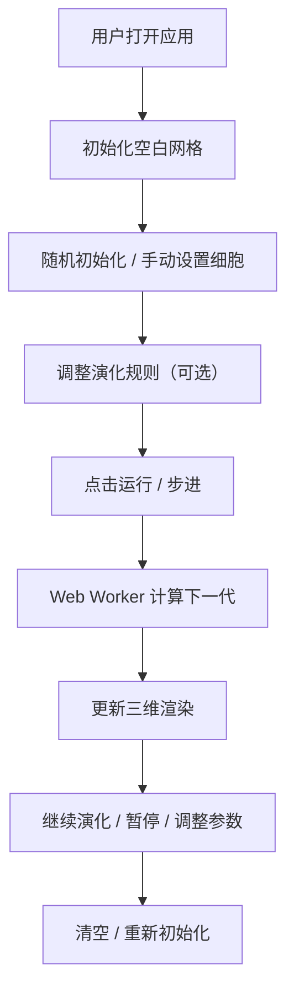

## 1. 产品概述

三维细胞自动机生命演化模拟与可视化应用，让用户在三维网格空间中设置初始细胞状态，观察细胞根据预设规则自动演化的过程，支持实时交互调整规则参数和视角。

- 主要用途：科研教育工具，可视化演示生命演化、涌现行为等复杂系统
- 目标用户：学生、研究人员、对复杂系统和人工生命感兴趣的爱好者
- 产品价值：将抽象的细胞自动机理论转化为直观的三维可视化体验，支持交互式探索

## 2. 核心功能

### 2.1 功能模块

1. **演化引擎模块**：Web Worker 中运行细胞自动机逻辑，周期性计算下一代状态
2. **可视化渲染模块**：Three.js 渲染三维细胞网格，提供视角控制和交互反馈
3. **控制面板模块**：React DOM 组件，提供规则调整、速度控制、初始化等操作
4. **状态管理模块**：Zustand 存储库，管理网格状态、演化规则、运行状态等

### 2.2 页面详情

| 页面名称 | 模块名称 | 功能描述 |
|-----------|-------------|---------------------|
| 主页面 | 三维场景区域 | 渲染 16×16×16 三维细胞网格，支持鼠标拖拽旋转、滚轮缩放，显示辅助网格地面 |
| 主页面 | 右侧控制面板 | 开始/暂停、步进、速度滑块、规则输入、随机初始化、清空按钮、性能模式开关 |
| 主页面 | 细胞交互 | 点击切换单个细胞状态，Shift+拖拽框选多个细胞，状态切换动画反馈 |

## 3. 核心流程

用户打开应用 → 看到空白三维网格 → 通过随机初始化或手动点击设置初始状态 → 调整演化规则（可选）→ 点击运行或步进观察演化 → 实时调整速度、规则参数 → 可随时暂停、清空或重新初始化

## 4. 用户界面设计

### 4.1 设计风格

- **主色调**：深蓝到黑色渐变背景（#0a0a2a 到 #000011），科技感暗色主题
- **强调色**：亮绿色（#00ff88）- 新生细胞，橙色（#ff8800）- 成熟细胞，红色（#ff3355）- 老年细胞
- **按钮样式**：圆角渐变按钮，开始按钮（#00ff88 到 #00cc66），暂停按钮（#ff8844 到 #cc6622）
- **字体**：现代无衬线字体，标题 18px，正文 14px，颜色浅灰（#e0e0e0）
- **布局风格**：左侧 80% 三维场景，右侧 280px 半透明毛玻璃控制面板滑入式布局
- **交互反馈**：悬停亮度提升 1.2 倍 + 上浮 2px，点击闪烁动画

### 4.2 页面设计概述

| 页面名称 | 模块名称 | UI 元素 |
|-----------|-------------|-------------|
| 主页面 | 三维场景 | 深蓝渐变背景，半透明浅蓝色辅助网格（透明度 0.15），彩色半透明细胞立方体（透明度 0.7），默认相机位置 (8,6,8) |
| 主页面 | 控制面板 | 毛玻璃背景（backdrop-filter: blur(10px)，背景 #111122cc），圆角左边缘 16px，深色输入框（#2a2a3a，边框 #00ff88），渐变按钮 |
| 主页面 | 性能提示 | 网格超过 16³ 时显示尺寸提示，控制面板添加性能模式开关 |

### 4.3 响应式

- 桌面端优先设计，最低支持 1280px 宽度
- 控制面板固定宽度 280px，三维场景自适应剩余空间
- 触控设备支持：单指旋转、双指缩放

### 4.4 3D 场景指导

- **环境**：深蓝到黑色渐变背景，无外部 HDRI，营造宇宙空间感
- **光照**：环境光 + 方向光组合，确保细胞立方体各面可见，边缘有高光
- **相机**：透视相机，默认位置 (8,6,8)，看向网格中心，支持 OrbitControls 拖拽旋转、滚轮缩放
- **交互**：Raycaster 实现细胞点击检测，框选时显示半透明蓝色矩形
- **动画**：细胞生成爆炸扩散动画（1 秒），死亡淡出动画（0.1 秒），点击闪烁反馈（0.2 秒白色）
- **性能**：InstancedMesh 批量渲染细胞，大网格可切换为点精灵模式
