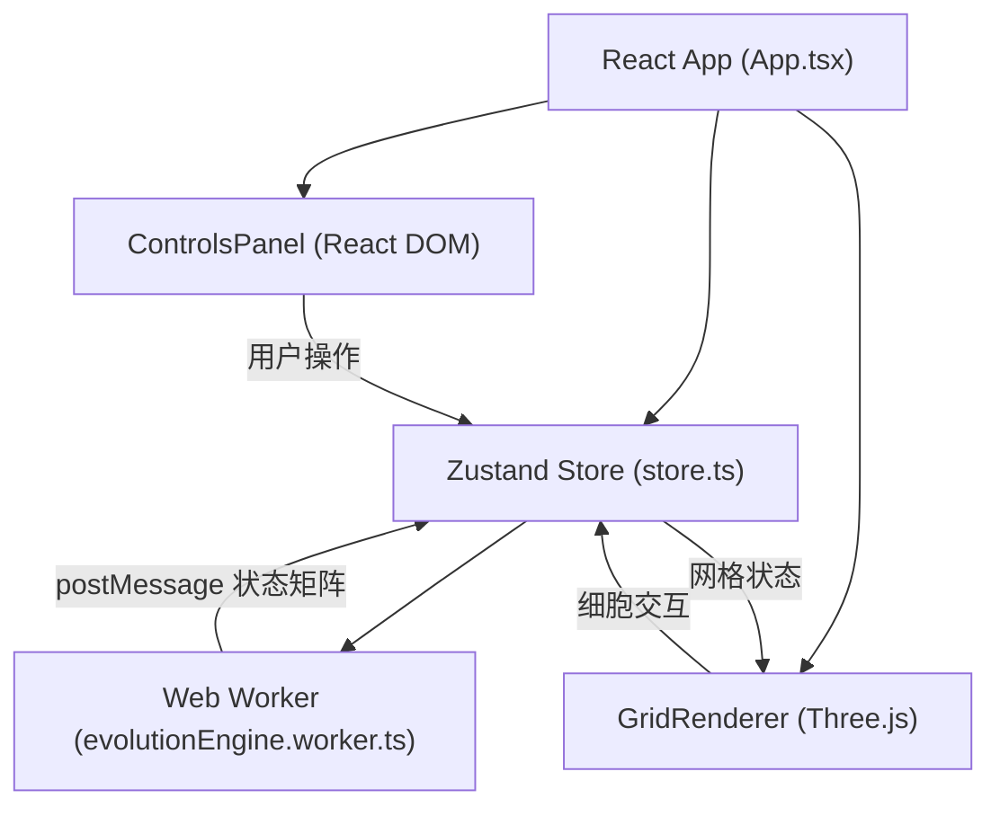

## 1. 架构设计



## 2. 技术描述

- **前端**：React 18 + TypeScript + Vite
- **三维渲染**：Three.js + @react-three/fiber + @react-three/drei
- **状态管理**：Zustand
- **并行计算**：Web Worker（演化引擎独立线程）
- **样式**：原生 CSS + CSS 变量（无需 Tailwind）
- **初始化工具**：Vite

## 3. 核心数据结构

### 3.1 细胞状态

```typescript
interface Cell {
  alive: boolean;
  age: number; // 存活代数
  isNew: boolean; // 是否新生成（用于动画）
  isDying: boolean; // 是否正在死亡（用于淡出动画）
}

type Grid = Cell[][][]; // 三维数组 [x][y][z]
```

### 3.2 演化规则

```typescript
interface Rules {
  survive: number[]; // 存活需要的邻居数量，如 [2, 3]
  birth: number[];   // 出生需要的邻居数量，如 [3]
}
```

### 3.3 Store 状态

```typescript
interface StoreState {
  grid: Grid;
  gridSize: number;
  rules: Rules;
  isRunning: boolean;
  speed: number; // 1-10 步/秒
  generation: number;
  performanceMode: boolean;
  // actions
  setRunning: (running: boolean) => void;
  setSpeed: (speed: number) => void;
  setRules: (rules: Rules) => void;
  step: () => void;
  randomInit: () => void;
  clear: () => void;
  toggleCell: (x: number, y: number, z: number) => void;
  toggleCells: (cells: [number, number, number][]) => void;
  setPerformanceMode: (enabled: boolean) => void;
}
```

## 4. 模块职责

### 4.1 evolutionEngine.worker.ts
- 接收初始网格和规则
- 实现 3D 生命游戏算法（26 邻居 Moore 邻域）
- 每帧计算下一代状态
- 通过 postMessage 发送新网格到主线程
- 支持暂停、步进、规则更新

### 4.2 store.ts
- 管理应用全局状态
- 封装 Web Worker 通信逻辑
- 提供细胞操作方法
- 处理动画状态（新生、死亡）

### 4.3 GridRenderer.tsx
- 使用 @react-three/fiber 渲染三维场景
- InstancedMesh 批量渲染活跃细胞
- 根据细胞年龄设置颜色（绿→橙→红）
- 实现 OrbitControls 视角控制
- Raycaster 细胞点击检测
- Shift+拖拽框选逻辑
- 动画效果（生成爆炸、死亡淡出、点击闪烁）

### 4.4 ControlsPanel.tsx
- React DOM 组件，右侧浮层布局
- 开始/暂停按钮（带旋转加载动画）
- 步进按钮
- 速度滑块（1-10）
- 规则输入框（存活规则、出生规则）
- 随机初始化、清空按钮
- 性能模式开关（大网格时显示）
- 尺寸提示

### 4.5 App.tsx
- 根组件，组合所有子组件
- 初始化 Store 和 Worker
- 处理 Worker 消息
- 全局样式和布局

## 5. 性能优化

1. **Web Worker 计算**：演化逻辑完全在 Worker 线程，不阻塞 UI
2. **InstancedMesh**：使用 Three.js InstancedMesh 批量渲染所有细胞，减少 draw call
3. **增量更新**：只更新状态变化的细胞矩阵数据
4. **性能模式**：大网格时切换为 Points（点精灵）渲染，降低 GPU 压力
5. **TypedArray**：使用 Uint8Array 传输网格数据，减少序列化开销
6. **节流控制**：根据速度参数控制演化帧率，避免过度计算
