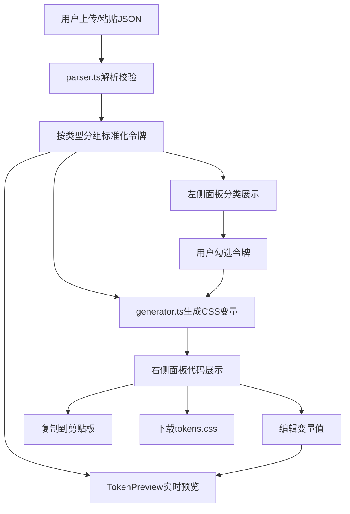

## 1. 产品概述
设计令牌提取与CSS变量生成器是一款面向前端开发者的浏览器端工具，用于将设计稿中的颜色、字体、间距等设计令牌自动提取并转换为CSS变量，减少手动抄写和样式维护成本。无需后端支持，所有处理在浏览器内完成。

- 主要用途：将JSON格式的设计令牌解析、分类并生成可直接使用的CSS变量代码
- 解决问题：手动抄写设计令牌耗时易出错，样式维护成本高
- 目标用户：前端开发者、UI/UX设计师
- 产品价值：提升开发效率，确保设计系统一致性，降低样式维护成本

## 2. 核心功能

### 2.1 用户角色
无需登录，所有用户均可使用全部功能

| 角色 | 注册方式 | 核心权限 |
|------|----------|----------|
| 匿名用户 | 无需注册 | 上传文件、粘贴文本、解析令牌、生成CSS、编辑预览、导出下载 |

### 2.2 功能模块
1. **令牌导入模块**：拖拽上传JSON文件、点击选择文件、手动粘贴JSON文本
2. **令牌解析与分类模块**：按颜色、字体、间距、阴影等类型自动分组，数据校验
3. **令牌列表展示模块**：分类展示、折叠/展开、复选框选择、卡片式呈现
4. **CSS变量生成模块**：实时生成CSS变量代码、语法高亮、行号显示
5. **代码操作模块**：一键复制到剪贴板、下载为.css文件、进度动画
6. **实时编辑模块**：直接编辑CSS变量值，实时更新预览
7. **视觉预览模块**：颜色色块网格、字体样式示例、间距标尺展示

### 2.3 页面详情

| 页面名称 | 模块名称 | 功能描述 |
|-----------|-------------|---------------------|
| 主应用页面 | 拖拽上传区域 | 支持拖拽JSON文件上传，悬停时边框样式变化，宽400px高180px圆角12px |
| 主应用页面 | 文本粘贴区域 | 文本域手动粘贴JSON，宽100%高200px，等宽字体 |
| 主应用页面 | 左侧令牌列表 | 分类展示解析结果，卡片形式，可滚动（80vh），折叠/展开动画 |
| 主应用页面 | 右侧代码区域 | CSS变量代码展示，Dark+主题语法高亮，行号显示 |
| 主应用页面 | 操作按钮区 | 复制按钮（淡入淡出通知）、下载按钮（旋转进度动画） |
| 主应用页面 | 实时预览区 | TokenPreview组件，颜色4x4网格、字体三行示例、间距虚线标尺 |

## 3. 核心流程
用户通过拖拽或点击上传JSON设计令牌文件，或手动粘贴JSON文本到文本域。系统自动解析并按类型（颜色、字体、间距等）分组校验，生成标准化令牌对象。左侧面板分类展示令牌卡片，用户可勾选需要导出的令牌。右侧面板实时显示生成的CSS变量代码，支持语法高亮和行号。用户可点击任意CSS变量值进行编辑，编辑后实时更新预览面板。用户可一键复制代码到剪贴板（显示0.3秒淡入淡出通知）或下载为tokens.css文件（下载按钮显示旋转进度动画）。

## 4. 用户界面设计

### 4.1 设计风格
- **主题**：深色科技风格，面向开发者的专业工具
- **主背景**：#1a1a2e（深蓝紫色调）
- **卡片背景**：#2a2a3a（略浅的深色调）
- **强调色**：#00d4ff（亮青色）、#4a90d9（蓝色）
- **文字主色**：#e0e0e0（浅灰色）
- **分隔线**：#3a3a4a（灰色）
- **按钮样式**：圆角过渡，悬停时0.2秒缩放和阴影效果（box-shadow: 0px 0px 12px rgba(0,212,255,0.3)）
- **字体**：代码区域使用等宽字体，界面使用现代无衬线字体，避免使用Inter/Roboto/Arial等通用字体
- **布局**：桌面端两栏布局（左侧35%，右侧65%），移动端上下堆叠
- **动画**：所有交互有0.2秒过渡效果，折叠箭头旋转90度动画，色块悬停放大1.1倍，气泡淡入效果

### 4.2 页面设计概述

| 页面名称 | 模块名称 | UI元素 |
|-----------|-------------|-------------|
| 主应用页面 | 拖拽上传区 | 虚线边框(2px #4a90d9)，悬停变实线#00d4ff，背景#1a1a2e，圆角12px |
| 主应用页面 | 令牌卡片 | 背景#2a2a3a，悬停阴影过渡，圆角8px，复选框勾选 |
| 主应用页面 | 分类标题 | 折叠箭头，点击旋转90度动画（0.2秒），加粗字体 |
| 主应用页面 | 代码区域 | Dark+语法高亮，行号显示，可编辑值（背景#3a3a4a，边框#00d4ff） |
| 主应用页面 | 颜色预览 | 4x4网格，色块圆角8px，间距8px，悬停放大1.1倍显示名称气泡 |
| 主应用页面 | 字体预览 | 三行展示，行高1.5倍，颜色从浅到深渐变 |
| 主应用页面 | 间距预览 | 灰色虚线框表示数值大小 |
| 主应用页面 | 复制通知 | 0.3秒淡入淡出，显示"已复制到剪贴板" |
| 主应用页面 | 下载按钮 | 旋转图标进度动画 |

### 4.3 响应式
- **桌面端（>768px）**：两栏布局，左侧令牌列表35%，右侧预览与导出65%，中间1px灰色分隔线
- **移动端（≤768px）**：上下堆叠布局，左侧令牌列表在上，右侧预览与导出在下
- **触控优化**：按钮最小高度44px，足够的触控间距，避免误触

### 4.4 性能要求
- 解析和生成CSS变量：100个令牌以内50ms内完成
- 预览面板实时更新：每次编辑后30ms内反映变化
- 避免不必要的重渲染，使用合理的React优化
