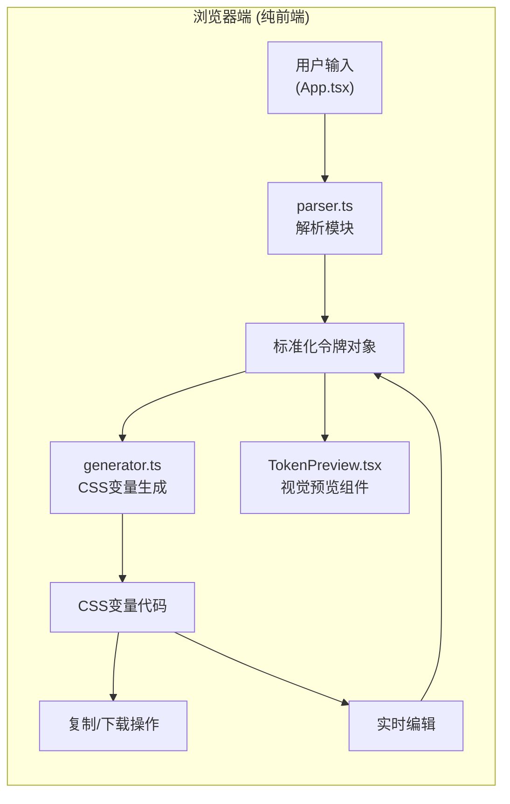

## 1. 架构设计



## 2. 技术描述

- **前端框架**：React@18 + TypeScript + Vite
- **初始化工具**：vite-init
- **构建工具**：Vite
- **后端**：无（纯前端应用，所有处理在浏览器内完成
- **状态管理**：React useState/useReducer
- **CSS框架**：TailwindCSS （根据需要使用）
- **第三方库**：
  - react-color：颜色选择器（可选
  - file-saver：文件保存
  - clipboard-polyfill：剪贴板操作
  - lucide-react：图标库

## 3. 项目文件结构与职责

| 文件路径 | 职责描述 | 依赖关系 |
|-----------|----------|-----------|
| package.json | 项目配置、依赖管理、脚本定义 | 无 |
| vite.config.js | Vite构建配置，React插件 | 无 |
| tsconfig.json | TypeScript严格模式配置 | 无 |
| index.html | 入口HTML页面 | 无 |
| src/App.tsx | 主应用组件，状态管理，面板切换，用户交互处理 | parser.ts, generator.ts, TokenPreview.tsx |
| src/parser.ts | 解析原始JSON令牌数据，按类型分组校验，输出标准化令牌对象 | 无（被App.tsx调用 |
| src/generator.ts | 接收标准化令牌，生成CSS变量声明字符串，支持导出和复制 | 无（被App.tsx调用）|
| src/components/TokenPreview.tsx | 视觉预览组件，渲染颜色、字体、间距预览 | 无（被App.tsx调用）|

## 4. 数据流向

```
用户输入（JSON文件/文本）
    ↓
src/App.tsx（接收并传递给parser）
    ↓
src/parser.ts（解析→分组→校验→标准化令牌）
    ↓
    ├─→ src/App.tsx（存储状态）
    │     │
    │     ├─→ src/generator.ts（生成CSS变量）
    │     │     ↓
    │     │   显示/导出/复制
    │     │
    │     └─→ src/components/TokenPreview.tsx（实时预览）
    │
    └─→ 用户编辑CSS变量值
          ↓
        更新状态→重新生成CSS→更新预览
```

## 5. 数据模型定义

### 5.1 令牌类型定义

```typescript
// 令牌基础类型
type TokenType = 'color' | 'font' | 'spacing' | 'shadow' | 'other';

// 基础令牌接口
interface BaseToken {
  name: string;
  type: TokenType;
  value: string;
  description?: string;
}

// 颜色令牌
interface ColorToken extends BaseToken {
  type: 'color';
  value: string; // hex, rgb, rgba, hsl等
}

// 字体令牌
interface FontToken extends BaseToken {
  type: 'font';
  value: string;
  fontFamily: string;
  fontSize: string;
  fontWeight?: number;
  lineHeight?: number;
}

// 间距令牌
interface SpacingToken extends BaseToken {
  type: 'spacing';
  value: string; // px, rem, em等
  pixelValue?: number;
}

// 阴影令牌
interface ShadowToken extends BaseToken {
  type: 'shadow';
  value: string;
}

// 其他令牌
interface OtherToken extends BaseToken {
  type: 'other';
}

// 联合类型
type DesignToken = ColorToken | FontToken | SpacingToken | ShadowToken | OtherToken;

// 分组后的令牌
interface TokenGroup {
  type: TokenType;
  label: string;
  tokens: DesignToken[];
}

// 标准化令牌对象
interface NormalizedTokens {
  color: ColorToken[];
  font: FontToken[];
  spacing: SpacingToken[];
  shadow: ShadowToken[];
  other: OtherToken[];
}

// 选中状态
interface TokenSelection {
  [tokenName: string]: boolean;
}
```

### 5.2 输入JSON格式支持

支持多种常见设计令牌JSON格式：

```json
// 格式1: 扁平结构
{
  "color-primary": "#4a90d9",
  "color-secondary": "#00d4ff",
  "font-size-base": "16px",
  "spacing-md": "16px"
}

// 格式2: 嵌套结构
{
  "color": {
    "primary": "#4a90d9",
    "secondary": "#00d4ff"
  },
  "font": {
    "size": {
      "base": "16px"
    }
  }
}

// 格式3: 标准设计令牌格式
{
  "tokens": [
    {
      "name": "color-primary",
      "value": "#4a90d9",
      "type": "color"
    }
  ]
}
```

## 6. 核心模块功能说明

### 6.1 parser.ts 解析模块

- **函数签名**：`parseDesignTokens(rawData: any): NormalizedTokens`
- **功能**：
  1. 接收原始JSON数据（支持多种格式）
  2. 递归遍历对象，提取所有令牌
  3. 根据名称或类型字段推断令牌类型
  4. 按类型分组（颜色、字体、间距、阴影、其他）
  5. 校验令牌值格式有效性
  6. 输出标准化令牌对象

### 6.2 generator.ts 生成模块

- **函数签名**：
  - `generateCSSVariables(tokens: DesignToken[], selection: TokenSelection): string`
  - `downloadCSS(css: string, filename?: string): void`
  - `copyToClipboard(text: string): Promise<boolean>`
- **功能**：
  1. 接收标准化令牌和选中状态
  2. 生成`:root`下的CSS变量声明
  3. 支持导出为.css文件
  4. 支持复制到剪贴板

### 6.3 TokenPreview.tsx 预览组件

- **Props**：`{ tokens: NormalizedTokens }`
- **功能**：
  1. 颜色预览：4x4网格排列色块，圆角8px，间距8px，悬停放大1.1倍显示名称
  2. 字体预览：三行展示字号、字重、行高，行高1.5倍，颜色从浅到深
  3. 间距预览：灰色虚线框表示数值大小

## 7. 性能优化策略

1. **解析性能**：使用递归优化的对象遍历，避免重复计算
2. **渲染性能**：使用React.memo优化TokenPreview组件，避免不必要重渲染
3. **状态更新**：编辑时使用useCallback缓存回调函数
4. **CSS生成**：使用useMemo缓存生成的CSS代码，仅在令牌或选中状态变化时重新生成
5. **防抖处理**：编辑输入时使用轻微防抖（但需满足30ms内更新）

## 8. 依赖版本

```json
{
  "dependencies": {
    "react": "^18.2.0",
    "react-dom": "^18.2.0",
    "react-color": "^2.19.3",
    "file-saver": "^2.0.5",
    "clipboard-polyfill": "^4.0.1",
    "lucide-react": "^0.294.0"
  },
  "devDependencies": {
    "@types/react": "^18.2.0",
    "@types/react-dom": "^18.2.0",
    "@types/file-saver": "^2.0.7",
    "typescript": "^5.3.0",
    "vite": "^5.0.0",
    "@vitejs/plugin-react": "^4.2.0"
  }
}
```
