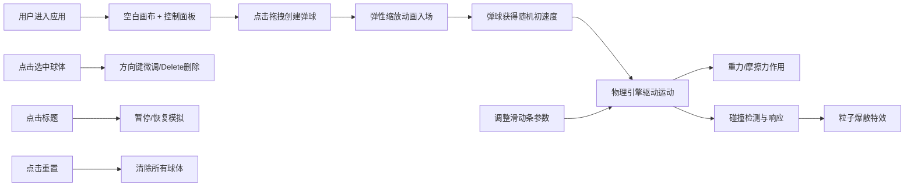

## 1. 产品概述

交互式物理沙盒应用，通过桌面弹球碰撞模拟直观展示动量守恒与能量损耗概念，解决物理教学中抽象概念难以体验的问题。

- 核心用途：物理教学辅助工具，帮助学生直观理解碰撞、动量、能量守恒等概念
- 目标用户：物理教师、学生、物理爱好者
- 产品价值：将抽象的物理公式转化为可视化、可交互的动态演示

## 2. 核心功能

### 2.1 用户角色
| 角色 | 注册方式 | 核心权限 |
|------|----------|----------|
| 普通用户 | 无需注册 | 完整使用所有交互功能 |

### 2.2 功能模块
1. **弹球创建系统**：点击拖拽创建不同半径和颜色的弹球，弹性缩放入场动画，随机初始速度，半透明拖尾轨迹
2. **物理引擎系统**：重力与摩擦力模拟，弹性碰撞检测与响应，动量守恒计算，恢复系数0.85
3. **粒子特效系统**：碰撞时生成粒子爆散效果，碎片扩散动画，衰减消失
4. **控制面板系统**：重力/摩擦力滑动条调节，重置按钮，实时显示球体数量和总动能
5. **球体交互系统**：点击选中球体，键盘方向键微调速度，Delete键删除球体，删除收缩动画
6. **模拟控制系统**：标题点击暂停/恢复，暂停覆盖层显示，性能自适应碰撞检测

### 2.3 页面详情
| 页面名称 | 模块名称 | 功能描述 |
|----------|----------|----------|
| 主页面 | 画布区域 | 占据页面主体，径向渐变背景，弹球运动与碰撞展示 |
| 主页面 | 控制面板 | 底部60px高度，滑动条调节物理参数，重置按钮，状态显示 |
| 主页面 | 标题悬浮 | 左上角固定，点击暂停/恢复，字体加粗带阴影 |
| 主页面 | 颜色选择器 | 创建弹球时显示16色调色板供选择 |

## 3. 核心流程

用户进入应用 → 看到空白画布和控制面板 → 在画布上点击拖拽创建弹球 → 弹球获得随机初速度开始运动 → 观察弹球受重力下落、与边界/其他球碰撞 → 通过滑动条调整重力/摩擦力参数 → 观察物理效果变化 → 点击单个球体选中 → 使用方向键微调球体速度或Delete删除 → 点击标题暂停/恢复模拟 → 点击重置按钮清除所有球体

## 4. 用户界面设计

### 4.1 设计风格
- 主色调：深蓝到深紫径向渐变（中心点#1a1a2e，边缘#0f0f23）
- 强调色：#ffcc00（重力滑块）、#ff5555（重置按钮）、白色描边（选中高亮）
- 配色板：16种预设颜色供弹球选择，涵盖彩虹色系及柔和色调
- 按钮样式：圆角8px，悬停放大1.1倍，按下缩小至0.95倍，0.15秒过渡
- 字体：24px加粗标题（带2px黑色阴影），monospace字体显示动能数据
- 布局：全屏画布 + 底部固定控制面板 + 左上角悬浮标题
- 视觉风格：深色科幻风格，半透明磨砂效果，高对比度UI元素

### 4.2 页面设计概述
| 页面名称 | 模块名称 | UI元素 |
|----------|----------|--------|
| 主页面 | 画布区域 | 径向渐变背景，弹球（含拖尾轨迹），粒子特效，选中高亮描边（闪烁周期0.5秒），暂停半透明覆盖层（PAUSED文字） |
| 主页面 | 控制面板 | 背景#2a2a3a，backdrop-filter: blur(8px)，重力滑块（范围0-2，步长0.1，圆形滑块#ffcc00，拖拽放大至24px），摩擦力滑块（范围0-0.1，步长0.001），重置按钮（#ff5555，闪烁反馈），球体数量和动能显示（monospace白色，保留两位小数） |
| 主页面 | 标题 | 固定左上角，24px加粗白色，2px黑色阴影，点击交互 |
| 主页面 | 颜色选择器 | 16色网格，点击选择，创建弹球时出现 |

### 4.3 响应性
- 桌面优先设计，画布尺寸随窗口自适应
- 控制面板宽度100%，高度固定60px
- 触控优化：滑动条和按钮足够大，便于触控操作
- Canvas分辨率适配高DPI屏幕

### 4.4 性能优化
- 使用requestAnimationFrame驱动60FPS动画循环
- 球体数量超过200个时自动降低碰撞精度（每2帧检测一次）
- 拖尾轨迹只保留最近5帧位置，优化绘制性能
- 粒子对象池复用，避免频繁GC
