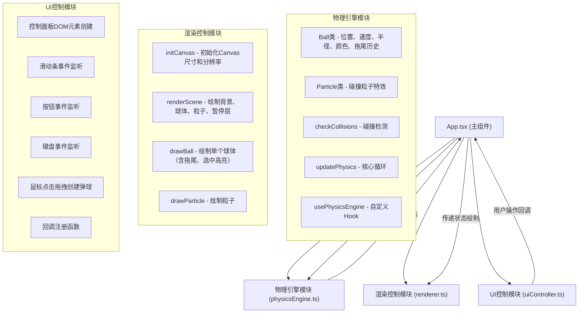
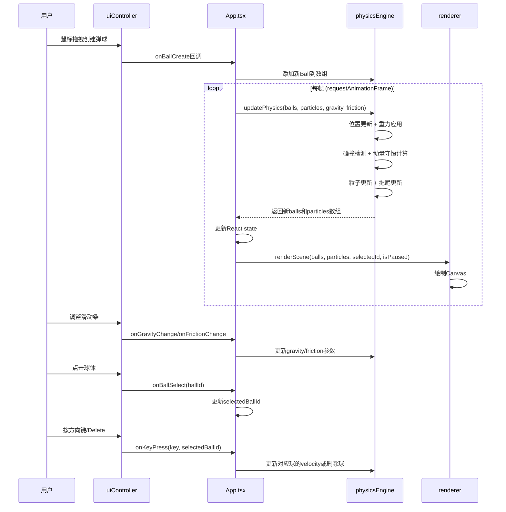

## 1. 架构设计



## 2. 技术描述

- 前端框架：React@18 + TypeScript@5
- 构建工具：Vite@5
- 状态管理：React useState/useRef（无需额外状态管理库）
- 渲染方式：HTML5 Canvas 2D
- 动画驱动：requestAnimationFrame
- 样式方案：原生CSS + CSS变量 + 内联样式

## 3. 核心模块说明

### 3.1 物理引擎模块 (physicsEngine.ts)

**Ball类属性**：
```typescript
interface Ball {
  id: string;
  x: number;
  y: number;
  vx: number;
  vy: number;
  radius: number;
  color: string;
  trail: { x: number; y: number }[];
  scale: number; // 弹性缩放动画用
  selected: boolean;
  highlightPhase: number; // 选中闪烁相位
}
```

**Particle类属性**：
```typescript
interface Particle {
  x: number;
  y: number;
  vx: number;
  vy: number;
  radius: number;
  color: string;
  life: number; // 0-1 衰减系数
  maxLife: number;
}
```

**核心函数**：
- `checkCollisions(balls: Ball[], restitution: number)`: 检测球-球、球-边界碰撞，按动量守恒更新速度
- `updatePhysics(balls: Ball[], particles: Particle[], gravity: number, friction: number, canvasWidth: number, canvasHeight: number, frameCount: number)`: 每帧更新位置、应用重力摩擦力、更新拖尾、更新粒子

### 3.2 渲染控制模块 (renderer.ts)

**核心函数**：
- `initCanvas(canvas: HTMLCanvasElement)`: 设置Canvas尺寸，处理devicePixelRatio
- `renderScene(ctx: CanvasRenderingContext2D, balls: Ball[], particles: Particle[], selectedId: string | null, isPaused: boolean, canvasWidth: number, canvasHeight: number)`: 绘制整个场景
- `drawBackground(ctx: CanvasRenderingContext2D, w: number, h: number)`: 径向渐变背景
- `drawBallTrail(ctx: CanvasRenderingContext2D, ball: Ball)`: 绘制拖尾轨迹
- `drawBall(ctx: CanvasRenderingContext2D, ball: Ball, isSelected: boolean)`: 绘制球体（含选中高亮）
- `drawParticles(ctx: CanvasRenderingContext2D, particles: Particle[])`: 绘制粒子
- `drawPauseOverlay(ctx: CanvasRenderingContext2D, w: number, h: number)`: 暂停覆盖层

### 3.3 UI控制模块 (uiController.ts)

**回调接口**：
```typescript
interface UICallbacks {
  onGravityChange: (value: number) => void;
  onFrictionChange: (value: number) => void;
  onReset: () => void;
  onKeyPress: (key: string, selectedBallId: string | null) => void;
  onBallCreate: (x: number, y: number, radius: number, color: string) => void;
  onBallSelect: (ballId: string | null) => void;
  onTogglePause: () => void;
}
```

**核心函数**：
- `createControlPanel(container: HTMLElement, callbacks: UICallbacks)`: 创建控制面板DOM
- `bindCanvasEvents(canvas: HTMLCanvasElement, callbacks: UICallbacks)`: 绑定画布鼠标事件
- `bindKeyboardEvents(callbacks: UICallbacks)`: 绑定键盘事件
- `showColorPicker(x: number, y: number, onSelect: (color: string) => void)`: 显示颜色选择器

### 3.4 App.tsx 主组件

**状态管理**：
```typescript
const [balls, setBalls] = useState<Ball[]>([]);
const [particles, setParticles] = useState<Particle[]>([]);
const [gravity, setGravity] = useState(0.5);
const [friction, setFriction] = useState(0.01);
const [selectedBallId, setSelectedBallId] = useState<string | null>(null);
const [isPaused, setIsPaused] = useState(false);
const [ballCount, setBallCount] = useState(0);
const [totalKineticEnergy, setTotalKineticEnergy] = useState(0);
```

**生命周期**：
- 使用useRef获取canvas和animationFrameId
- useEffect启动物理循环，每帧调用updatePhysics并更新状态
- 挂载时创建UI控制器，卸载时取消animationFrame

## 4. 数据流向



## 5. 性能优化策略

1. **碰撞检测优化**：
   - 球体数量 ≤ 200：每帧检测
   - 球体数量 > 200：每2帧检测一次
   - 使用空间网格划分减少检测对数

2. **渲染优化**：
   - 拖尾只保留最近5帧
   - Canvas使用devicePixelRatio适配清晰度
   - 离屏缓存静态背景

3. **内存优化**：
   - 粒子对象池复用
   - 及时清除已消失的粒子
   - 避免React频繁重渲染（使用useRef存储高频更新数据）

4. **动画优化**：
   - 全部使用requestAnimationFrame
   - CSS transitions处理UI元素动画
   - 避免布局抖动

## 6. 预设颜色调色板

16色预设：
```typescript
const COLOR_PALETTE = [
  '#ff6b6b', '#ffa94d', '#ffd43b', '#a9e34b',
  '#51cf66', '#38d9a9', '#4dabf7', '#748ffc',
  '#9775fa', '#cc5de8', '#f06595', '#ff922b',
  '#e64980', '#20c997', '#339af0', '#845ef7'
];
```

## 7. 物理公式

**动量守恒碰撞响应**（一维弹性碰撞扩展到二维）：
```
沿碰撞法线方向分解速度
v1' = ((m1 - e*m2)*v1 + (1+e)*m2*v2) / (m1 + m2)
v2' = ((m2 - e*m1)*v2 + (1+e)*m1*v1) / (m1 + m2)
其中：
  m = π * r²（质量与面积成正比）
  e = 0.85（恢复系数）
```

**动能计算**：
```
KE = Σ 0.5 * m * (vx² + vy²)
单位：J（焦耳），质量单位取相对值
```
