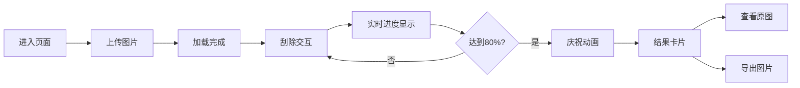

## 1. 产品概述

秘密刮刮乐是一款基于 Canvas 画布擦除技术的在线互动应用，用户上传图片后通过鼠标或触屏"刮除"上层覆盖层来揭示隐藏的图片内容。适用于寻宝游戏、解谜互动、生日祝福等创意场景，为用户带来沉浸式的揭密体验。

## 2. 核心功能

### 2.1 功能模块

1. **图片上传模块**：拖拽上传、点击选择文件、上传进度展示、缩略图预览
2. **刮除交互模块**：笔刷半径调节、擦除绘制、实时百分比计算
3. **庆祝动画模块**：金色纸屑粒子效果、结果卡片展示
4. **结果操作模块**：查看原图、导出 PNG 图片

### 2.2 页面详情

| 页面名称 | 模块名称 | 功能描述 |
|---------|---------|---------|
| 上传页 | 拖拽上传区 | 支持拖拽和点击上传，虚线边框提示，浅橙背景 |
| 上传页 | 进度展示 | 文件名、大小显示，渐变进度条 |
| 刮除页 | 操作面板 | 笔刷滑块、清除全部、还原按钮 |
| 刮除页 | 画布区域 | 图片展示、灰色覆盖层、擦除交互 |
| 刮除页 | 进度指示 | 右上角圆形进度环，实时百分比 |
| 刮除页 | 庆祝效果 | 80%触发金色纸屑粒子动画 |
| 刮除页 | 结果卡片 | 祝语展示、查看原图、导出按钮 |

## 3. 核心流程

用户进入页面 → 上传图片（拖拽/点击）→ 加载完成进入刮除界面 → 鼠标/触屏拖动擦除覆盖层 → 实时显示刮除进度 → 达到80%触发庆祝动画 → 弹出结果卡片 → 查看原图或导出图片

## 4. 用户界面设计

### 4.1 设计风格

- **主色调**：深色主题，主背景 #121212，文字浅灰 #e0e0e0
- **强调色**：橙色系 #ffb347、#ff9966、#ff5e62，用于按钮和进度指示
- **按钮风格**：圆角设计，悬停有平滑过渡动画，点击有收缩反馈
- **字体**：现代无衬线字体，清晰易读
- **布局风格**：卡片式布局，左右分栏（桌面），上下布局（移动端）
- **动效风格**：平滑 0.2 秒过渡，粒子动画有质感

### 4.2 页面设计概览

| 页面名称 | 模块名称 | UI 元素 |
|---------|---------|---------|
| 上传页 | 上传区域 | 虚线边框 2px #ffb347，320x200px，圆角 16px，背景 #fff3e0 |
| 上传页 | 进度条 | 宽 60%，高 4px，圆角 2px，渐变 #ff9966 → #ff5e62 |
| 刮除页 | 操作面板 | 宽 240px，背景 #2b2b2b，圆角 8px |
| 刮除页 | 滑块控件 | 轨道 #444，按钮圆形 #ffb347，悬停 #ffa726 |
| 刮除页 | 画布区域 | 600x600px，背景 #1e1e1e，圆角 8px |
| 刮除页 | 进度环 | 直径 48px，环宽 4px，底色 #333，进度色 #ffb347 |
| 刮除页 | 结果卡片 | 320x160px，圆角 12px，毛玻璃效果 |
| 刮除页 | 粒子效果 | 金色 #ffd700 到橙色 #ff8c00，大小 6-12px，圆形/矩形随机 |

### 4.3 响应式

- **桌面优先**，宽度小于 768px 时操作面板移至画布上方变为横向布局
- **触屏优化**：支持 touch 事件，移动端流畅交互
- **性能要求**：擦除响应延迟 ≤ 50ms，FPS ≥ 30

