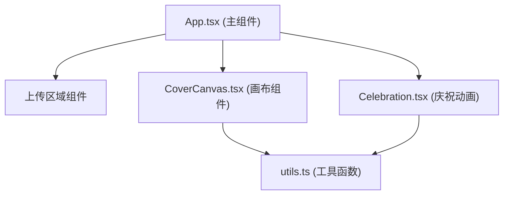

## 1. 架构设计



## 2. 技术描述

- **前端框架**：React 18 + TypeScript
- **构建工具**：Vite
- **样式方案**：原生 CSS + CSS 变量
- **Canvas API**：2D 上下文，用于擦除绘制和图像合成
- **状态管理**：React useState/useRef，轻量场景无需额外状态库
- **性能优化**：requestAnimationFrame 调度，离屏 Canvas 计算百分比

## 3. 文件结构

```
.
├── package.json
├── vite.config.js
├── tsconfig.json
├── index.html
└── src/
    ├── App.tsx              # 主组件，布局和状态管理
    ├── CoverCanvas.tsx      # 画布组件，擦除逻辑
    ├── Celebration.tsx      # 庆祝动画组件
    └── utils.ts             # 工具函数
```

## 4. 核心模块说明

### 4.1 App.tsx
- 管理应用状态：上传状态、图片数据、刮除进度、庆祝触发
- 布局切换：上传界面 ↔ 刮除界面
- 响应式布局监听
- 子组件数据传递

### 4.2 CoverCanvas.tsx
- 双层 Canvas：底层显示图片，上层为覆盖层
- 鼠标/触屏事件处理：mousedown/mousemove/mouseup, touchstart/touchmove/touchend
- 擦除绘制：使用 destination-out 合成模式
- 毛边效果：径向渐变画笔
- 进度计算：定时采样像素数据

### 4.3 Celebration.tsx
- 粒子系统：Canvas 绘制金色纸屑
- 粒子属性：大小、形状、颜色、速度、旋转随机
- 动画控制：2 秒持续时间，requestAnimationFrame 驱动
- 入场动画：从边缘向中心飞入

### 4.4 utils.ts
- `calculateErasePercentage`: 计算已擦除百分比
- `exportCanvasAsPNG`: 导出画布为 PNG
- `formatFileSize`: 格式化文件大小显示
- `throttle`: 节流函数，优化性能

## 5. 关键技术点

### 5.1 擦除实现
- 使用 Canvas 2D 的 `globalCompositeOperation = 'destination-out'`
- 画笔使用径向渐变实现边缘半透明毛边效果
- 监听 pointer 事件保证鼠标和触屏统一处理

### 5.2 性能优化
- 进度计算使用离屏 Canvas 降低分辨率采样
- 节流处理进度更新（每 100ms 计算一次）
- 使用 requestAnimationFrame 保证绘制流畅

### 5.3 响应式
- CSS Media Query 实现布局切换
- Canvas 尺寸动态适配
- 触屏事件支持多点触控（仅取第一点）

