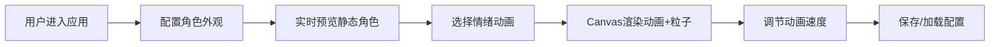

## 1. 产品概述

像素角色情绪动画预览与测试工具，为独立游戏开发团队的美术人员提供快速预览和测试角色在不同情绪下动画表现的在线工具。通过可视化配置编辑器和实时Canvas渲染，帮助美术人员高效迭代角色设计和动画效果。

## 2. 核心功能

### 2.1 功能模块
1. **角色配置编辑器**：肤色、服装色、发型、眼睛样式的实时预览配置
2. **情绪动画播放器**：6种情绪动画序列播放（开心、悲伤、愤怒、惊讶、恐惧、无聊）
3. **粒子特效系统**：每种情绪对应的实时粒子效果
4. **动画速度调节**：0.5x-3x速度滑块控制
5. **配置持久化**：后端API保存/加载角色配置和动画序列

### 2.2 页面详情
| 页面名称 | 模块名称 | 功能描述 |
|-----------|-------------|---------------------|
| 主页面 | 配置面板 | 颜色选择器、发型下拉、眼睛样式下拉、情绪按钮、速度滑块 |
| 主页面 | 预览区域 | Canvas画布渲染角色动画、粒子特效、背景色调变化、帧信息显示 |
| 主页面 | 数据管理 | 保存配置按钮、加载配置按钮 |

## 3. 核心流程

用户进入应用 → 配置角色外观（肤色/服装/发型/眼睛）→ 选择情绪动画 → 动画在Canvas实时渲染（含粒子特效）→ 调节速度观察效果 → 保存配置到后端

## 4. 用户界面设计

### 4.1 设计风格
- **主色调**：深灰背景 #1e1e2e，面板背景 #2a2a3e，画布背景 #12121e
- **按钮样式**：圆角8px，悬停时背景色变亮10%
- **字体**：使用像素风格等宽字体，保持游戏开发工具的复古感
- **布局**：左侧320px固定配置面板，右侧自适应预览区域
- **图标**：使用情绪相关的emoji作为按钮图标（😊😢😠😮😨😴）

### 4.2 页面设计概述
| 页面名称 | 模块名称 | UI元素 |
|-----------|-------------|-------------|
| 主页面 | 配置面板 | 分组卡片式布局，颜色预设网格，下拉选择器，情绪按钮组，速度滑块 |
| 主页面 | 预览区域 | 居中Canvas（600x400），左下角帧信息文本，平滑背景色过渡动画 |

### 4.3 响应式设计
- 桌面端（≥800px）：左右分栏布局，配置面板宽320px固定
- 移动端（<800px）：配置面板折叠到顶部，预览区占满剩余高度
- 触摸优化：增大按钮点击区域，滑块支持触摸拖动

## 5. 非功能性需求

### 5.1 性能约束
- 动画帧率稳定60fps
- 粒子数量实时不超过50个
- 情绪选择到动画开始延迟≤100ms

### 5.2 技术约束
- 前端所有动画逻辑在Canvas渲染
- TypeScript严格模式
- 后端Express + SQLite
- Vite构建工具
