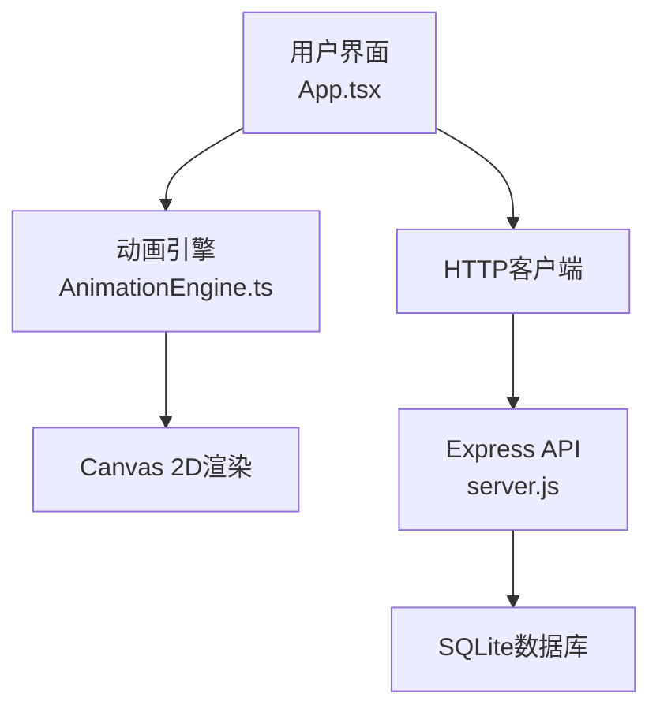
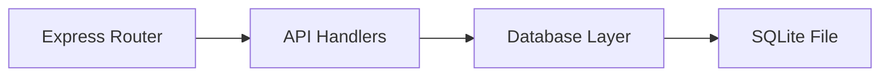

## 1. 架构设计



**数据流向**：
1. 用户操作 → App.tsx（状态管理）→ AnimationEngine.ts（渲染指令）→ Canvas（像素绘制）
2. 保存/加载配置 → App.tsx → Express API → SQLite
3. 动画帧数据 → AnimationEngine.ts → App.tsx（显示帧信息）

## 2. 技术描述

- **前端**：React@18 + TypeScript@5 + Vite@5
- **后端**：Express@4 + SQLite3（better-sqlite3）
- **构建工具**：Vite@5，配置代理到后端3001端口
- **状态管理**：React useState/useEffect（轻量级应用无需额外状态库）
- **渲染**：Canvas 2D API，纯像素风格绘制

## 3. 目录结构

```
auto27/
├── package.json          # 依赖配置（react, react-dom, express, sqlite3, typescript, vite）
├── vite.config.js        # Vite配置，代理/api到localhost:3001
├── tsconfig.json         # TypeScript严格模式配置
├── index.html            # 应用入口
├── server/
│   └── server.js         # Express后端，CRUD API
└── src/
    ├── App.tsx           # 主组件，状态管理，UI渲染
    ├── AnimationEngine.ts # 动画引擎，Canvas渲染，粒子系统
    └── types.ts          # TypeScript类型定义
```

**文件调用关系**：
- [App.tsx](file:///d:/VersionFastPro/tasks/auto27/src/App.tsx) → 引入 [AnimationEngine.ts](file:///d:/VersionFastPro/tasks/auto27/src/AnimationEngine.ts) 创建引擎实例
- [App.tsx](file:///d:/VersionFastPro/tasks/auto27/src/App.tsx) → fetch API 调用 [server.js](file:///d:/VersionFastPro/tasks/auto27/server/server.js)
- [AnimationEngine.ts](file:///d:/VersionFastPro/tasks/auto27/src/AnimationEngine.ts) → 不依赖其他模块，纯Canvas操作

## 4. API 定义

### 类型定义
```typescript
interface CharacterConfig {
  id?: number;
  name: string;
  skinColor: string;
  clothingColor: string;
  hairstyle: number; // 0-3
  eyeStyle: number; // 0-3
  createdAt?: string;
}

interface AnimationSequence {
  id?: number;
  name: string;
  emotion: string; // happy, sad, angry, surprised, scared, bored
  duration: number; // 毫秒
  keyframes: Keyframe[];
}

interface Keyframe {
  time: number;
  headY: number;
  eyeScale: number;
  bodyRotate: number;
  backgroundColor: string;
}
```

### API 端点
| Method | Route | Purpose | Request | Response |
|--------|-------|---------|---------|----------|
| GET | /api/characters | 获取所有角色配置 | - | CharacterConfig[] |
| POST | /api/characters | 保存角色配置 | CharacterConfig | { id: number } |
| GET | /api/characters/:id | 获取单个配置 | - | CharacterConfig |
| PUT | /api/characters/:id | 更新配置 | CharacterConfig | { success: boolean } |
| DELETE | /api/characters/:id | 删除配置 | - | { success: boolean } |
| GET | /api/animations | 获取所有动画序列 | - | AnimationSequence[] |

## 5. 服务端架构



- **server.js**：单文件Express应用，包含路由、数据库初始化、CRUD操作
- 数据库自动初始化：应用启动时创建characters和animations表，插入预设动画序列数据

## 6. 数据模型

### 6.1 ER图
```mermaid
erDiagram
    CHARACTERS {
        INTEGER id PK
        TEXT name
        TEXT skinColor
        TEXT clothingColor
        INTEGER hairstyle
        INTEGER eyeStyle
        DATETIME createdAt
    }
    ANIMATIONS {
        INTEGER id PK
        TEXT name
        TEXT emotion
        INTEGER duration
        TEXT keyframes JSON
    }
```

### 6.2 DDL
```sql
CREATE TABLE IF NOT EXISTS characters (
  id INTEGER PRIMARY KEY AUTOINCREMENT,
  name TEXT NOT NULL,
  skinColor TEXT NOT NULL,
  clothingColor TEXT NOT NULL,
  hairstyle INTEGER NOT NULL,
  eyeStyle INTEGER NOT NULL,
  createdAt DATETIME DEFAULT CURRENT_TIMESTAMP
);

CREATE TABLE IF NOT EXISTS animations (
  id INTEGER PRIMARY KEY AUTOINCREMENT,
  name TEXT NOT NULL,
  emotion TEXT UNIQUE NOT NULL,
  duration INTEGER NOT NULL,
  keyframes TEXT NOT NULL
);
```

### 6.3 初始数据
- 6种预设情绪动画序列（开心、悲伤、愤怒、惊讶、恐惧、无聊）
- 每种动画2-3秒，包含头部、眼睛、身体动作关键帧
