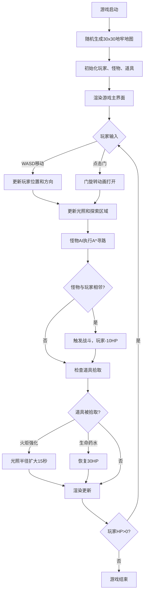

## 1. 产品概述

本产品是一个基于Canvas的2D地下城冒险游戏，解决传统2D地牢中视野静态、缺乏沉浸感的问题。玩家在探索时只能看到火炬照亮和角色周围的小范围区域，其余被迷雾覆盖，怪物会从暗处突袭，带来紧张刺激的探索体验。

- 目标用户：喜欢复古像素风格地牢探索游戏的玩家
- 产品价值：通过动态光照与迷雾探索机制，提供沉浸式的地牢冒险体验

## 2. 核心功能

### 2.1 功能模块

1. **地牢地图系统**：30x30网格随机生成，包含墙壁、地板、门，所有房间连通
2. **玩家控制系统**：WASD键盘移动，方向箭头旋转，火炬光照
3. **怪物AI系统**：A*寻路算法，从迷雾中突袭，自动战斗
4. **道具系统**：火炬强化道具、生命药水，拾取动画反馈
5. **探索进度系统**：小地图显示已探索区域，探索恢复生命值
6. **UI状态面板**：生命值、火炬时间、房间编号、探索百分比

### 2.2 功能详情

| 模块名称 | 功能描述 |
|---------|---------|
| 地牢地图生成 | 30x30网格，矮墙（光可越过）和高墙（光无法越过），门可点击打开（0.3秒旋转动画），所有房间连通 |
| 玩家移动 | WASD控制，每步0.3秒间隔，箭头朝方向平滑旋转（0.15秒过渡） |
| 火炬光照 | 圆形光照区域，半径5格，径向渐变（中心#ffee88透明度0.6，边缘#000000透明度0.1），光照内墙壁高亮#777777 |
| 怪物系统 | 5-8个红色骷髅，迷雾中不可见，光照到时闪烁红光（0.5秒周期），A*寻路向玩家移动（1秒步频），相邻触发战斗（-10HP） |
| 道具系统 | 火炬强化（半径扩至8格，持续15秒，金色光晕动画）、生命药水（恢复30HP，绿色粒子爆发），每房间至少1个 |
| 小地图 | 8x8缩略图，右上角显示，已探索#cccccc填充，未探索黑色 |
| 状态面板 | 左侧显示，红色血条（#ff4444→#ff8888渐变）、黄色火炬进度条、房间编号、探索百分比 |
| 交互反馈 | 受攻击时屏幕边缘闪红（0.1秒），拾取道具时中央图标浮起消失（1秒动画） |

## 3. 核心流程

## 4. 用户界面设计

### 4.1 设计风格
- **整体风格**：复古像素地牢风
- **主色调**：深棕#3a2a1a、暗红#ff4444、暗黄#ffee88
- **字体**：PixelFont，6px粗细，颜色#e8d8a0
- **背景**：游戏主区域深棕色#3a2a1a，状态面板#1a1a2a

### 4.2 界面布局

| 区域 | 位置 | 尺寸 | 内容 |
|------|------|------|------|
| 游戏主区域 | 居中 | 800x800px | Canvas渲染地牢、玩家、怪物、光照迷雾 |
| 状态面板 | 左侧 | 200px宽，圆角8px | 生命值血条、火炬进度条、房间编号、探索百分比 |
| 小地图 | 右上角 | 8x8网格缩略图 | 已探索区域#cccccc，未探索黑色 |
| 网格线 | 地牢内 | 1px | 暗灰色#444444 |

### 4.3 视觉元素

| 元素 | 颜色/样式 |
|------|----------|
| 矮墙 | #555555，高度1，光可越过 |
| 高墙 | #555555，高度2，光无法越过 |
| 地板 | #2a2a2a |
| 门 | #8B4513，点击旋转打开 |
| 玩家 | 蓝色箭头图标，中心为坐标 |
| 怪物 | 红色骷髅图标，光照到时闪烁红光 |
| 光照中心 | #ffee88，透明度0.6 |
| 光照边缘 | #000000，透明度0.1，边缘模糊 |
| 光照内墙壁 | #777777高亮 |
| 血条 | 宽180x高12px，圆角6px，#ff4444→#ff8888渐变 |
| 火炬进度条 | 宽180x高8px，圆角4px，黄色 |

### 4.4 响应式
桌面端优先设计，固定布局尺寸，无需移动端适配。

## 5. 性能要求
- 游戏帧率保持60FPS
- 光照计算在Canvas上通过像素着色实现
- 无明显卡顿
