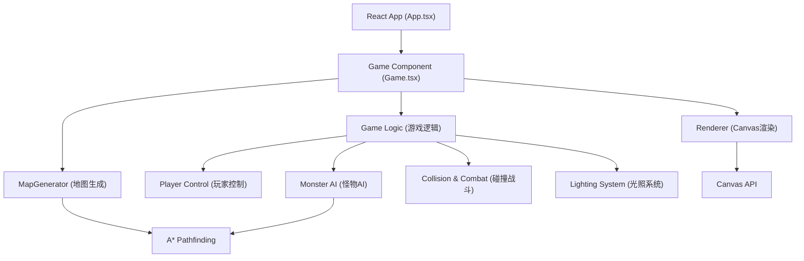

## 1. 架构设计



## 2. 技术描述

- **前端框架**：React@18 + TypeScript
- **构建工具**：Vite
- **渲染技术**：HTML5 Canvas 2D API
- **状态管理**：React Hooks (useState, useRef, useEffect, useCallback)
- **后端服务**：无需，纯前端实现

## 3. 项目结构

```
.
├── package.json
├── vite.config.js
├── tsconfig.json
├── index.html
└── src/
    ├── Game.tsx          # 核心游戏循环和状态管理
    ├── MapGenerator.ts   # 地牢地图随机生成算法
    ├── Renderer.ts       # Canvas渲染逻辑
    └── types.ts          # 类型定义
```

## 4. 类型定义 (types.ts)

```typescript
// 瓦片类型
enum TileType {
  FLOOR = 'floor',
  LOW_WALL = 'low_wall',   // 矮墙，高度1，光可越过
  HIGH_WALL = 'high_wall', // 高墙，高度2，光无法越过
  DOOR = 'door',
}

interface Tile {
  type: TileType;
  explored: boolean;       // 是否已探索
  roomId: number;          // 所属房间ID
}

// 方向
type Direction = 'up' | 'down' | 'left' | 'right';

// 玩家
interface Player {
  x: number;
  y: number;
  hp: number;
  maxHp: number;
  direction: Direction;
  torchRadius: number;     // 当前火炬半径
  torchBoostTimer: number; // 火炬强化剩余时间(ms)
  moveCooldown: number;    // 移动冷却
  rotation: number;        // 当前旋转角度
  targetRotation: number;  // 目标旋转角度
  rotationProgress: number;// 旋转过渡进度
}

// 怪物
interface Monster {
  id: number;
  x: number;
  y: number;
  hp: number;
  blinkTimer: number;      // 闪烁计时器
  moveCooldown: number;    // 移动冷却
}

// 道具类型
enum ItemType {
  TORCH_BOOST = 'torch_boost',
  HEALTH_POTION = 'health_potion',
}

interface Item {
  id: number;
  type: ItemType;
  x: number;
  y: number;
}

// 门状态
interface DoorState {
  x: number;
  y: number;
  open: boolean;
  rotation: number;        // 0-90度
}

// 游戏状态
interface GameState {
  map: Tile[][];
  player: Player;
  monsters: Monster[];
  items: Item[];
  doors: DoorState[];
  rooms: Room[];
  exploredCount: number;
  totalFloorCount: number;
  damageFlash: number;     // 受伤闪烁剩余时间
  pickupEffect: PickupEffect | null;
}

interface Room {
  id: number;
  x: number;
  y: number;
  width: number;
  height: number;
}

interface PickupEffect {
  type: ItemType;
  x: number;
  y: number;
  timer: number;
}
```

## 5. 核心算法

### 5.1 地牢生成算法 (MapGenerator)
1. 随机生成5-10个房间（大小4-8格）
2. 确保房间不重叠
3. 按房间顺序用走廊连接（L形或直线）
4. 走廊两侧生成矮墙或高墙
5. 房间连接处放置门
6. 每个房间放置至少1个道具
7. 随机放置5-8个怪物（不在起始房间）

### 5.2 A*寻路算法
- 启发函数：曼哈顿距离
- 只在地板和已开门上行走
- 墙壁不可通过

### 5.3 光照计算 (Renderer)
- 以玩家为中心，按半径进行像素级径向渐变
- 光线投射检测：遇到高墙停止，矮墙可被越过但自身被照亮
- 每帧在离屏Canvas计算光照遮罩，再与地图合成

### 5.4 游戏主循环 (Game.tsx)
- 使用 requestAnimationFrame 维持60FPS
- deltaTime计算更新各计时器
- 更新顺序：输入→玩家→怪物→碰撞→道具→渲染
