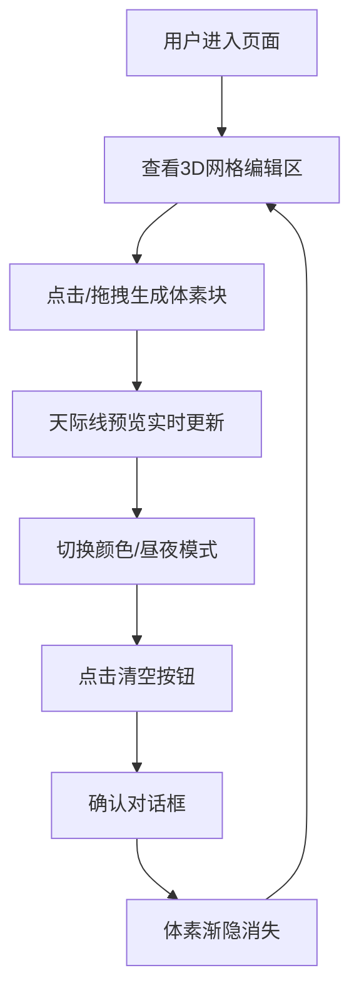

## 1. 产品概述
基于3D体素的城市天际线交互生成器，用户通过点击和拖拽在三维网格上快速搭建建筑体块，系统自动生成与之匹配的虚拟城市天际线轮廓，并实时渲染出日夜交替的光影效果。
- 面向城市规划爱好者、设计师和普通用户，提供直观的3D体素搭建体验
- 创造性地将体素编辑与天际线预览结合，实现即时可视化反馈

## 2. 核心功能

### 2.1 功能模块
1. **3D编辑区**：三维透视网格地面，体素块点击生成/删除，拖拽连续生成
2. **天际线预览**：实时Canvas渲染，白色折线轮廓，半透明蓝色剪影，随机闪烁窗户灯光
3. **昼夜切换**：太阳/月亮图标按钮，平滑光照过渡，白天漫反射，夜晚辉光效果
4. **控制面板**：8色预设体素选择器，清空按钮带确认动画

### 2.2 页面详情
| 页面名称 | 模块名称 | 功能描述 |
|-----------|-------------|---------------------|
| 主应用 | 3D编辑区 | 1x1x1单位体素块生成，缩放动画，拖拽间隔0.5单位，网格线#555555透明度0.3 |
| 主应用 | 天际线预览 | 200x300px Canvas，#1a1a2e背景，2px白色折线，半透明蓝色填充，0.5-1.5秒随机闪烁灯光 |
| 主应用 | 昼夜切换 | 36px圆形按钮，太阳渐变#ffaa00→#ff6600，月亮渐变#3366cc→#1a1a3a，1秒平滑过渡 |
| 主应用 | 控制面板 | 8种预设颜色，120x40px红色圆角清空按钮，0.3秒渐隐消失动画 |

## 3. 核心流程
用户进入页面后，在3D网格上点击或拖拽生成体素块，右侧实时预览天际线变化，可切换颜色、昼夜模式，或清空所有体素重新开始。

## 4. 用户界面设计
### 4.1 设计风格
- 深色主题，主背景#0d0d1a
- 左侧编辑区70%，右侧面板30%
- 体素默认浅灰色#cccccc，夜晚深灰色#333355
- 预设颜色：红#ff4444、橙#ff8844、黄#ffcc44、绿#44ff44、蓝#4488ff、紫#aa44ff、粉#ff44aa、白#ffffff
- 圆角按钮，平滑过渡动画

### 4.2 页面设计概述
| 页面名称 | 模块名称 | UI元素 |
|-----------|-------------|-------------|
| 主应用 | 3D编辑区 | 透视网格，体素块缩放动画，方向光/点光源切换 |
| 主应用 | 天际线预览 | Canvas折线图，半透明填充，闪烁灯光粒子 |
| 主应用 | 昼夜切换 | 渐变圆形图标，悬停效果，1秒过渡动画 |
| 主应用 | 控制面板 | 颜色选择器网格，红色清空按钮，确认弹窗 |

### 4.3 响应性
- 桌面端优先设计，左侧3D区自适应，右侧面板固定30%宽度
- 体素数量最多支持500个，帧率稳定30FPS以上

### 4.4 3D场景指引
- **环境**：深色背景，简洁网格地面，无多余装饰
- **光照**：白天左上角45度方向光，夜晚地面向上点光源（强度0.3，范围10）
- **相机**：透视相机，可环绕观察，默认3/4视角
- **动画**：体素生成缩放动画（0.15秒ease-out），清空渐隐动画（0.3秒），昼夜切换（1秒）
- **性能**：体素合并渲染，帧率控制，500个体素稳定30FPS+
