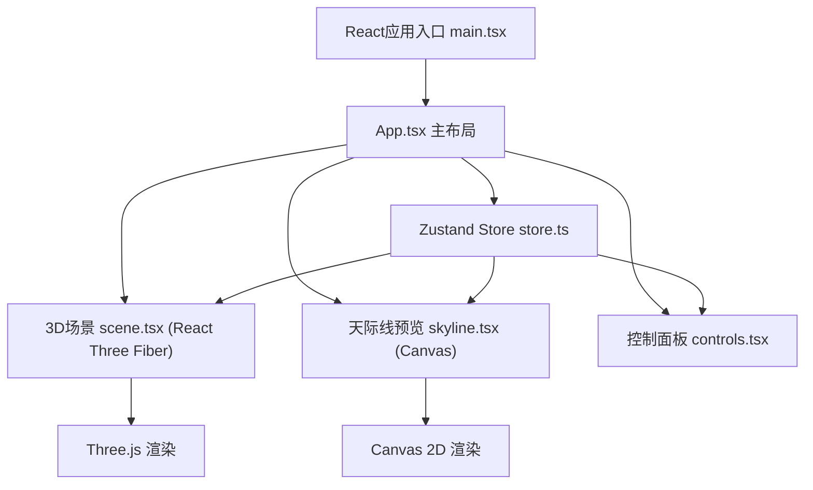

## 1. 架构设计


## 2. 技术描述
- **前端**：React@18 + TypeScript + Vite
- **3D渲染**：three + @react-three/fiber + @react-three/drei
- **状态管理**：zustand
- **构建工具**：Vite
- **无后端，纯前端应用**

### 依赖包
- three: ^0.160.0
- @react-three/fiber: ^8.15.0
- @react-three/drei: ^9.92.0
- zustand: ^4.4.0
- react: ^18.2.0
- react-dom: ^18.2.0
- @types/react: ^18.2.0
- @types/three: ^0.160.0
- typescript: ^5.3.0
- vite: ^5.0.0

## 3. 目录结构
```
auto30/
├── package.json
├── vite.config.js
├── tsconfig.json
├── index.html
└── src/
    ├── main.tsx
    ├── App.tsx
    ├── store.ts
    ├── scene.tsx
    ├── skyline.tsx
    └── controls.tsx
```

## 4. 数据模型

### 4.1 体素数据结构
```typescript
interface Voxel {
  id: string;
  x: number;
  y: number;
  z: number;
  color: string;
}
```

### 4.2 Store状态
```typescript
interface VoxelStore {
  voxels: Voxel[];
  currentColor: string;
  isDay: boolean;
  addVoxel: (x: number, y: number, z: number) => void;
  removeVoxel: (id: string) => void;
  clearVoxels: () => void;
  setColor: (color: string) => void;
  toggleDayNight: () => void;
}
```

## 5. 核心模块说明

### 5.1 store.ts - Zustand状态管理
- 管理体素列表、当前颜色、昼夜模式
- 提供增删改查方法
- 预设8种颜色常量

### 5.2 scene.tsx - 3D场景组件
- GridHelper网格地面（10x10单位，#555555，透明度0.3）
- 体素块渲染（MeshStandardMaterial）
- 点击/拖拽事件处理（Raycaster）
- 光照系统（方向光/点光源切换）
- 体素生成缩放动画（useFrame）
- OrbitControls相机控制

### 5.3 skyline.tsx - 天际线预览
- Canvas 2D渲染
- 计算每列最高体素高度
- 白色折线（lineWidth: 2）
- 半透明蓝色填充（rgba(68, 136, 255, 0.3)）
- 随机黄色灯光点（0.5-1.5秒闪烁周期）

### 5.4 controls.tsx - 控制面板
- 8色网格选择器
- 昼夜切换按钮（太阳/月亮渐变）
- 清空按钮（带window.confirm确认）
- 渐隐动画效果

### 5.5 App.tsx - 主应用布局
- 左侧70% 3D编辑区
- 右侧30% 控制面板 + 预览窗口
- 深色主题CSS样式
