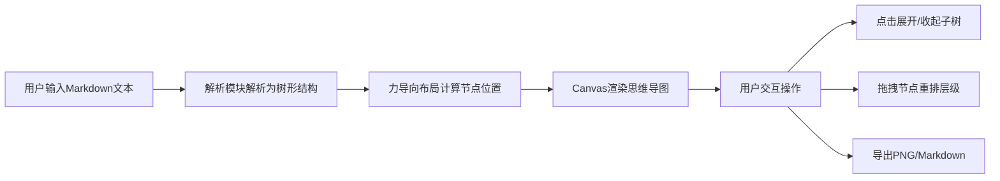

## 1. 产品概述

基于浏览器的思维导图生成与编辑工具，通过缩进式 Markdown 文本快速可视化逻辑关联和层级关系，解决传统笔记工具难以展现复杂项目结构的问题。

- **核心价值**：文本编辑与图形化导图实时同步，降低思维导图创作门槛
- **目标用户**：知识工作者、项目管理者、学生等需要整理思路和规划项目的人群
- **使用场景**：长文档结构梳理、项目规划、头脑风暴、学习笔记整理

## 2. 核心功能

### 2.1 功能模块

1. **文本输入模块**：左侧 Markdown 编辑器，支持多级缩进
2. **导图渲染模块**：右侧 Canvas 力导向布局思维导图
3. **交互操作模块**：节点点击展开/收起、拖拽重排
4. **导出功能模块**：PNG 图片导出、Markdown 文件导出
5. **视图控制模块**：画布平移、缩放

### 2.2 功能详情

| 功能模块 | 子功能 | 功能描述 |
|---------|-------|---------|
| 文本输入 | 多级缩进 | 支持最多4级缩进（#,##,###,####），每行代表一个节点 |
| 文本输入 | 实时同步 | 文本修改后0.5秒内无闪烁同步更新导图 |
| 导图渲染 | 力导向布局 | 根节点居中，子节点放射性扩散，自动排列 |
| 导图渲染 | 层级配色 | 1级浅蓝、2级浅绿、3级浅橙、4级浅红 |
| 交互操作 | 展开收起 | 点击节点展开/收起子树，带渐隐渐显动画 |
| 交互操作 | 子节点徽章 | 节点右侧显示子节点数量圆形徽章 |
| 交互操作 | 拖拽重排 | 拖拽节点到另一节点上成为其子节点，带脉冲反馈 |
| 导出功能 | 导出PNG | Canvas 截图保存为 PNG 图片 |
| 导出功能 | 导出Markdown | 生成缩进文本下载为 .md 文件 |
| 视图控制 | 平移缩放 | 鼠标拖拽平移、滚轮缩放（0.5x~2x） |

## 3. 核心流程

### 3.1 主流程

用户在左侧输入区编写缩进式 Markdown 文本，系统自动解析为树形结构，右侧导图区通过力导向布局算法实时渲染思维导图。用户可点击节点展开/收起子树，拖拽节点调整层级关系，最终导出为图片或 Markdown 文件。

### 3.2 流程图

## 4. 用户界面设计

### 4.1 设计风格

- **设计基调**：干净简洁的工具类产品风格
- **主色调**：浅蓝 #4FC3F7（primary）
- **辅助色**：浅绿 #81C784（secondary）、浅橙 #FFB74D（accent）
- **中性色**：背景白 #FFFFFF、浅灰 #f9f9f9、边框 #ddd、文字 #333
- **按钮风格**：圆角 6px，实心背景，悬停变深
- **字体**：系统默认 sans-serif，14px 正文
- **布局**：双栏布局，顶部工具栏

### 4.2 页面设计

| 区域 | 模块 | UI 元素 |
|-----|-----|--------|
| 顶部 | 工具栏 | 高度48px，背景#eee，底部1px边框#ddd，导出按钮 |
| 左侧 | 输入区 | 宽度40%，高度100%，背景#f9f9f9，文本编辑器 |
| 右侧 | 导图区 | 宽度60%，背景白色，Canvas画布 |

### 4.3 节点设计

- 形状：圆角矩形，圆角 8px
- 尺寸：宽 120px，高 40px
- 文字：左对齐，14px，颜色 #333
- 背景色按层级渐变：
  - 1级：#4FC3F7 浅蓝
  - 2级：#81C784 浅绿
  - 3级：#FFB74D 浅橙
  - 4级：#E57373 浅红
- 子节点徽章：半径 12px 圆形，白色背景，10px 加粗文字，颜色与层级对应

### 4.4 动画效果

- 文本更新同步：0.5秒弹性过渡（ease-out）
- 节点收起：0.3秒渐隐消失
- 节点展开：0.5秒渐显出现
- 放置目标节点：0.2秒放大脉冲（1.15倍后恢复）
- 缩放过渡：0.2s ease

### 4.5 响应式设计

- **桌面端**（≥960px）：左右双栏布局
- **移动端**（<768px）：上下布局，顶部墨绿色工具栏，输入区和导图区各占50%高度，节点字号缩小至10px

## 5. 性能要求

- 200个节点布局计算与渲染在1秒内完成
- 导图拖拽平移和缩放帧率不低于45fps
- 文本输入后0.5秒内完成同步更新，无闪烁
