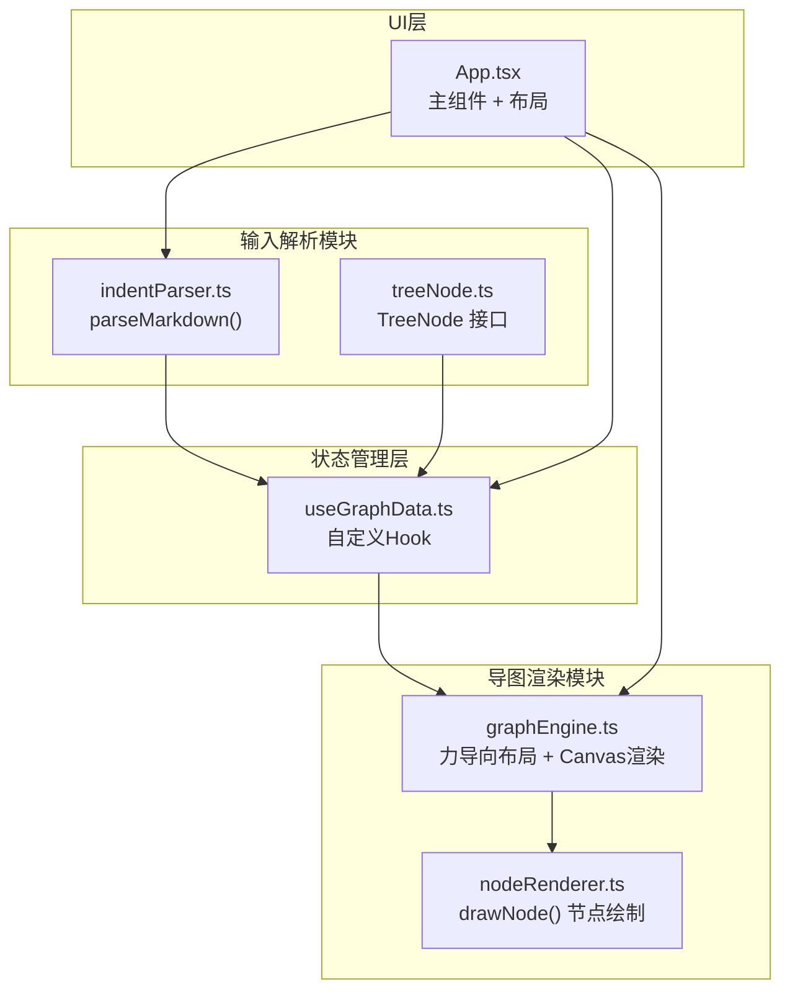

## 1. 架构设计

### 1.1 整体架构



### 1.2 模块划分

| 模块 | 文件 | 职责 |
|-----|------|------|
| 输入解析模块 | src/Parser/treeNode.ts | 定义 TreeNode 数据结构 |
| 输入解析模块 | src/Parser/indentParser.ts | 解析缩进文本为树形节点数据 |
| 桥接模块 | src/hooks/useGraphData.ts | 自定义Hook，管理节点树状态 |
| 导图渲染模块 | src/Graph/graphEngine.ts | 力导向布局算法，Canvas渲染主逻辑 |
| 导图渲染模块 | src/Graph/nodeRenderer.ts | 单个节点的绘制逻辑 |
| 主组件 | src/App.tsx | 双栏布局，集成输入区和导图区 |

## 2. 技术描述

- **前端框架**：React 18 + TypeScript
- **构建工具**：Vite
- **渲染技术**：Canvas 2D API
- **状态管理**：React Hooks + Context API（按用户要求）
- **布局算法**：力导向布局（Force-Directed Layout）
- **动画方式**：requestAnimationFrame + 缓动函数

## 3. 数据模型

### 3.1 TreeNode 接口

```typescript
interface TreeNode {
  id: string;
  text: string;
  level: number;
  parentId: string | null;
  children: TreeNode[];
  x?: number;
  y?: number;
  collapsed?: boolean;
}
```

### 3.2 GraphNode 接口

```typescript
interface GraphNode extends TreeNode {
  x: number;
  y: number;
  vx: number;
  vy: number;
  width: number;
  height: number;
  visible: boolean;
  opacity: number;
}
```

### 3.3 GraphEdge 接口

```typescript
interface GraphEdge {
  source: string;
  target: string;
}
```

## 4. 核心算法

### 4.1 力导向布局算法

- **斥力**：节点之间的库仑斥力，避免节点重叠
- **引力**：父子节点之间的胡克力，维持连接关系
- **中心力**：根节点受到向画布中心的吸引力
- **迭代次数**：100~300次迭代，或达到能量阈值停止
- **阻尼系数**：0.9，防止震荡

### 4.2 文本解析算法

- 按行分割输入文本
- 根据开头 `#` 数量或缩进空格数确定层级
- 使用栈结构维护当前父节点
- 生成带 id 的树形结构

## 5. 性能优化

- **防抖更新**：文本输入防抖 500ms 后更新导图
- **增量布局**：节点变化时复用已有位置，减少重排
- **离屏渲染**：使用双 Canvas 缓冲，避免闪烁
- **requestAnimationFrame**：所有动画使用 RAF 保证帧率
- **可见性裁剪**：只渲染视口内的节点（可选）

## 6. 文件结构

```
.
├── package.json
├── vite.config.js
├── tsconfig.json
├── index.html
└── src/
    ├── Parser/
    │   ├── treeNode.ts          # TreeNode 接口定义
    │   └── indentParser.ts      # Markdown 解析函数
    ├── Graph/
    │   ├── graphEngine.ts       # 力导向布局 + Canvas 渲染
    │   └── nodeRenderer.ts      # 单节点绘制函数
    ├── hooks/
    │   └── useGraphData.ts      # 自定义 Hook
    ├── App.tsx                  # 主组件
    └── main.tsx                 # 入口文件
```

## 7. 导出功能

### 7.1 PNG 导出
- 使用 `canvas.toDataURL('image/png')` 获取图片数据
- 创建 `<a>` 标签触发下载
- 文件名：`mindmap-YYYYMMDD-HHMMSS.png`

### 7.2 Markdown 导出
- 递归遍历节点树，根据层级生成对应缩进的 `#` 前缀
- 生成 .md 文件内容
- 创建 Blob 和下载链接
- 文件名：`mindmap-YYYYMMDD-HHMMSS.md`
