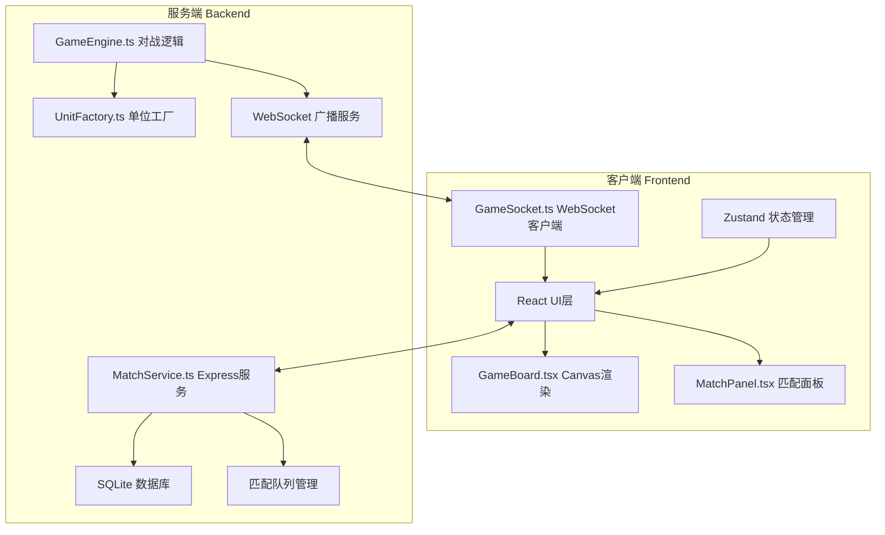
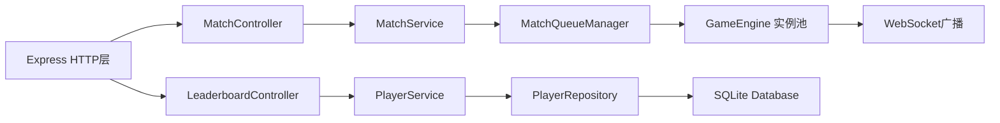
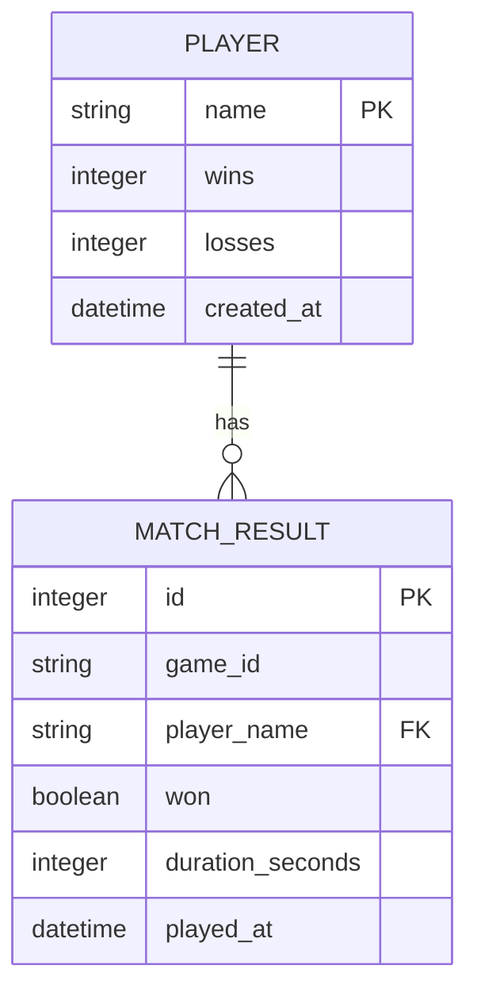

## 1. 架构设计



## 2. 技术说明
- **前端**：React 18 + TypeScript + Vite
- **渲染**：HTML5 Canvas 2D（六边形网格、单位、粒子特效）
- **状态管理**：Zustand
- **实时通信**：WebSocket (ws库)
- **后端**：Express 4 + TypeScript
- **数据库**：SQLite (sqlite3库)
- **算法**：A*寻路算法、六边形网格坐标系统

## 3. 项目结构
```
.
├── package.json
├── vite.config.js
├── tsconfig.json
├── index.html
├── src/
│   ├── game/
│   │   ├── GameEngine.ts       # 对战逻辑核心
│   │   └── UnitFactory.ts      # 兵种和塔工厂
│   ├── network/
│   │   ├── MatchService.ts     # 匹配战绩HTTP服务
│   │   └── GameSocket.ts       # WebSocket客户端
│   ├── ui/
│   │   ├── GameBoard.tsx       # 主战场Canvas渲染
│   │   └── MatchPanel.tsx      # 匹配战绩面板
│   ├── shared/
│   │   └── types.ts            # 共享类型定义
│   └── main.tsx
└── api/
    └── server.ts               # Express服务入口
```

## 4. API定义

### 4.1 REST API
```typescript
// 玩家匹配
POST /api/match/join
Request: { playerName: string }
Response: { queueId: string, status: 'waiting' | 'matched' }

// 查询匹配状态
GET /api/match/status/:queueId
Response: { status: 'waiting' | 'matched' | 'failed', gameId?: string }

// 取消匹配
POST /api/match/cancel
Request: { queueId: string }

// 上传战绩
POST /api/match/result
Request: { gameId: string, playerName: string, won: boolean, duration: number }
Response: { success: boolean }

// 获取排行榜
GET /api/leaderboard?limit=10
Response: [{ rank: number, playerName: string, wins: number, losses: number, winRate: number }]

// 获取玩家战绩
GET /api/player/:name/stats
Response: { playerName: string, wins: number, losses: number, winRate: number }
```

### 4.2 WebSocket消息
```typescript
// 客户端发送
type ClientMessage = 
  | { type: 'join_game'; gameId: string; playerName: string; playerId: 'red' | 'blue' }
  | { type: 'build_unit'; playerId: 'red' | 'blue'; unitType: 'attack_tower' | 'ice_tower' | 'fast_unit' | 'heavy_unit' }
  | { type: 'surrender'; playerId: 'red' | 'blue' }

// 服务端广播
type ServerMessage =
  | { type: 'game_state'; state: GameState }
  | { type: 'game_over'; winner: 'red' | 'blue' | 'draw'; stats: LeaderboardEntry[] }
  | { type: 'unit_spawned'; unit: Unit }
  | { type: 'unit_died'; unitId: string }
```

## 5. 服务端架构图



## 6. 数据模型

### 6.1 ER图


### 6.2 DDL语句
```sql
CREATE TABLE IF NOT EXISTS players (
    name TEXT PRIMARY KEY,
    wins INTEGER DEFAULT 0,
    losses INTEGER DEFAULT 0,
    created_at DATETIME DEFAULT CURRENT_TIMESTAMP
);

CREATE TABLE IF NOT EXISTS match_results (
    id INTEGER PRIMARY KEY AUTOINCREMENT,
    game_id TEXT NOT NULL,
    player_name TEXT NOT NULL,
    won BOOLEAN NOT NULL,
    duration_seconds INTEGER NOT NULL,
    played_at DATETIME DEFAULT CURRENT_TIMESTAMP,
    FOREIGN KEY (player_name) REFERENCES players(name)
);

CREATE INDEX IF NOT EXISTS idx_match_results_game_id ON match_results(game_id);
CREATE INDEX IF NOT EXISTS idx_players_wins ON players(wins DESC);
```

## 7. 核心游戏逻辑

### 7.1 六边形坐标系统
使用轴向坐标系（Axial Coordinates）q, r，转换为像素坐标：
- x = size * (3/2 * q)
- y = size * (sqrt(3)/2 * q + sqrt(3) * r)

### 7.2 单位属性
| 类型 | 血量 | 攻击力 | 移动速度 | 射程 | 特殊效果 |
|------|------|--------|----------|------|----------|
| 攻击塔 | 100 | 20 | 0 | 3格 | 固定位置 |
| 冰塔 | 80 | 5 | 0 | 3格 | 减速50% 持续2秒 |
| 快速兵 | 50 | 10 | 2格/秒 | 1格 | 高机动 |
| 重型兵 | 150 | 30 | 1格/秒 | 1格 | 高血量高伤害 |

### 7.3 游戏状态
```typescript
interface GameState {
    grid: HexCell[][];           // 20x20网格
    crystal: { owner: 'neutral' | 'red' | 'blue'; captureProgress: number };
    bases: { red: Base; blue: Base };
    units: Unit[];
    towers: Tower[];
    timeRemaining: number;       // 秒
    scores: { red: number; blue: number };
    status: 'waiting' | 'playing' | 'ended';
}
```
