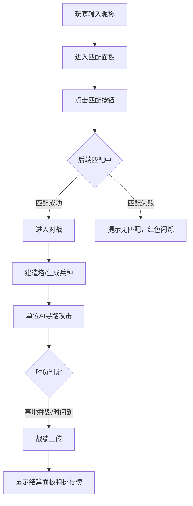

## 1. 产品概述
虚空领域争夺战是一款基于即时战略的双人对战游戏，玩家在20x20六边形网格地图上通过建造防御塔和生成兵种争夺中立水晶控制权，最终摧毁敌方基地获胜。
- 核心玩法：策略对战、资源争夺、塔防+兵种组合
- 目标用户：喜欢即时战略和策略对战的玩家
- 市场价值：填补浏览器端轻量级RTS对战游戏的空白

## 2. 核心功能

### 2.1 用户角色
| 角色 | 注册方式 | 核心权限 |
|------|----------|----------|
| 玩家 | 输入昵称进入 | 匹配对战、查看战绩、排行榜查询 |

### 2.2 功能模块
1. **对战主界面**：六边形网格地图、水晶、基地、单位渲染、粒子特效
2. **建造系统**：攻击塔、冰塔、快速兵种、重型兵种
3. **AI战斗系统**：A*寻路、自动攻击、血条显示、胜负判定
4. **匹配系统**：玩家匹配队列、匹配状态反馈
5. **战绩系统**：战绩上传、胜率统计、排行榜展示

### 2.3 页面详情
| 页面名称 | 模块名称 | 功能描述 |
|----------|----------|----------|
| 主游戏界面 | 战场渲染 | Canvas绘制六边形网格、单位、水晶、粒子特效，60FPS |
| 主游戏界面 | 顶部状态栏 | 双方得分（水晶数量）、15分钟倒计时、红蓝渐变得分条 |
| 主游戏界面 | 建造菜单 | 点击基地弹出建造选项，含塔和兵种，淡入动画0.2s |
| 主游戏界面 | 结算面板 | 游戏结束显示战绩和排行榜，深色半透明背景，淡入0.3s |
| 匹配面板 | 匹配区域 | 匹配按钮、旋转加载动画、匹配失败提示 |
| 匹配面板 | 排行榜 | 显示前十名玩家，胜率和场次统计 |

## 3. 核心流程
玩家输入昵称后进入匹配面板，点击匹配按钮加入队列，后端匹配成功后双方进入游戏。游戏中玩家建造防御塔和生成兵种，单位自动寻路攻击敌方目标，争夺水晶控制权。摧毁敌方基地或倒计时结束时得分高的一方获胜，战绩自动上传并显示排行榜。

## 4. 用户界面设计

### 4.1 设计风格
- **主色调**：深空蓝黑背景 #0a0a1a，暗绿网格线 #2a5a2a（透明度0.5）
- **阵营色**：红方 #ff4444，蓝方 #4444ff，水晶蓝 #4488ff 到 #2266cc
- **高亮色**：悬停淡黄 #ffdd44（透明度0.3）
- **特效色**：攻击红闪、橙色爆炸粒子、阵营色粒子轨迹
- **字体**：科技感无衬线字体，标题粗体，数值等宽
- **布局**：全屏Canvas战场，顶部状态栏，底部建造菜单，移动端底部固定栏
- **动画**：水晶脉动2秒周期、菜单淡入0.2s、单位弹出0.3s、爆炸粒子0.5s

### 4.2 页面设计概览
| 页面名称 | 模块名称 | UI元素 |
|----------|----------|--------|
| 主游戏界面 | 战场Canvas | 20x20六边形网格、悬停高亮、粒子轨迹、攻击特效 |
| 主游戏界面 | 顶部状态栏 | 红蓝得分条（随时间增高）、倒计时、水晶数量 |
| 主游戏界面 | 建造菜单 | 4个建造选项卡片、弹出动画、点击反馈 |
| 主游戏界面 | 结算面板 | 深色半透明#1a1a2e(0.9)、圆角12px、排行榜表格 |
| 匹配面板 | 匹配区 | 大按钮、旋转加载圈、失败提示红色闪烁 |
| 匹配面板 | 排行榜 | 表格排名、玩家名、胜率、场次、滚动区域 |

### 4.3 响应式设计
- 桌面端：全屏Canvas，建造菜单在基地下方弹出
- 移动端：建造菜单改为底部固定栏，六边形网格支持双指缩放
- 触控优化：增大按钮点击区域，优化滑动操作

## 5. 性能要求
- 战场帧率稳定60FPS
- 单位数量最多50个时无卡顿
- WebSocket状态同步延迟<100ms
- Canvas渲染采用分层优化
