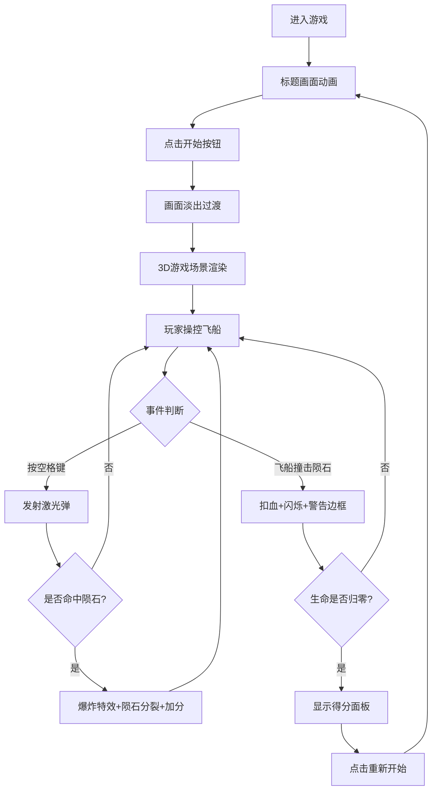

## 1. 产品概述
一款基于Web浏览器的3D太空飞行射击游戏，玩家操控飞船在陨石带中躲避障碍物并射击摧毁小行星，解决传统2D射击游戏缺乏立体空间感和沉浸感的问题。
- 目标用户：休闲游戏玩家、3D网页游戏爱好者
- 产品价值：提供沉浸式3D太空飞行体验，通过流畅的操控、精美的粒子特效和丰富的UI反馈带来高质量游戏体验

## 2. 核心功能

### 2.1 功能模块
1. **飞船操控系统**：WASD移动、QE翻滚、鼠标朝向控制、动态尾焰粒子
2. **陨石生成系统**：持续生成30-50颗随机大小/速度的小行星，带凹凸纹理，靠近高亮
3. **射击系统**：空格键发射蓝色激光弹，击中陨石爆炸+分裂
4. **生命与得分系统**：3条生命，撞击扣血，得分统计，游戏结束面板
5. **HUD界面**：生命值心形图标、得分、计时、雷达图
6. **标题与结束画面**：动画标题、开始按钮、结算面板

### 2.2 页面详情
| 页面名称 | 模块名称 | 功能描述 |
|-----------|-------------|---------------------|
| 标题画面 | 标题动画 | 科技感字体从下到上浮现动画（1.5秒ease-out） |
| 标题画面 | 开始按钮 | 橙色圆角按钮，悬停变色，点击缩放反馈，淡出过渡 |
| 游戏主画面 | 3D场景 | 飞船、陨石、激光、粒子特效渲染 |
| 游戏主画面 | HUD | 生命值、得分、时间、雷达图实时显示 |
| 游戏主画面 | 警告边框 | 被撞击时红色边缘闪烁警告 |
| 结束画面 | 得分面板 | 击毁数、存活时间、总分显示，重新开始按钮 |

## 3. 核心流程
用户进入游戏 → 显示标题画面（动画浮现）→ 点击开始按钮（画面淡出）→ 进入3D游戏场景 → 玩家操控飞船躲避/射击陨石 → 被撞击扣血或击中陨石得分 → 生命归零 → 显示得分面板 → 点击重新开始回到标题画面

## 4. 用户界面设计

### 4.1 设计风格
- **主色调**：#0a0a2e 深蓝色太空背景
- **强调色**：#00ddff 亮蓝色（HUD、激光），#ff6600 橙色（按钮）
- **辅助色**：#ff4400/#ffaa00 爆炸粒子，#ff8800/#ffcc00 尾焰，红色心形生命
- **按钮风格**：圆角8px矩形（120×40px），悬停#ff8833，点击缩放0.95
- **字体**：Exo2科技感字体，sans-serif后备
- **布局**：全屏Canvas，HUD元素相对定位（百分比）
- **视觉风格**：扁平化设计，半透明面板，粒子半透明渐变纹理

### 4.2 页面设计概览
| 页面名称 | 模块名称 | UI元素 |
|-----------|-------------|-------------|
| 标题画面 | 标题区域 | 居中大标题Exo2字体，从下往上1.5秒ease-out动画 |
| 标题画面 | 开始按钮 | 居中橙色圆角按钮，悬停/点击反馈 |
| 游戏主画面 | HUD-左上 | 3个红色心形(24×24)+白色得分(20px粗体)+白色时间(16px) |
| 游戏主画面 | HUD-右上 | 雷达图(半径60px，#333背景，2秒扫描线，红点陨石，绿三角飞船) |
| 游戏主画面 | 警告边框 | 5px红色边框，透明度0.6，持续0.5秒 |
| 结束画面 | 得分面板 | 半透明黑色，圆角16px，内边距20px，白色18px字体 |
| 结束画面 | 重新开始 | 橙色圆角按钮，同开始按钮样式 |

### 4.3 响应式
- Desktop-first设计，Canvas自适应窗口大小（监听resize事件）
- HUD使用相对定位（百分比计算位置）
- 窗口宽度<768px时HUD字体缩小至80%
- 触摸设备支持触屏模拟（鼠标事件兼容）

### 4.4 3D场景指引
- **环境**：深空背景，无HDRI，营造宇宙孤独感
- **光照**：环境光+方向光组合，突出飞船和陨石轮廓
- **相机**：第三人称跟随视角，鼠标拖拽控制俯仰(±60°)和偏航，禁用平移
- **构图**：飞船位于视野中心偏下，陨石分布在前方立体空间
- **交互**：WASD平移、QE翻滚(±30°/0.3秒)、鼠标朝向、空格射击
- **后处理**：发光效果(激光、尾焰)，无重型后期以保证性能
- **性能预算**：小行星≤50颗，总粒子≤200个（Object Pool），目标30FPS+
