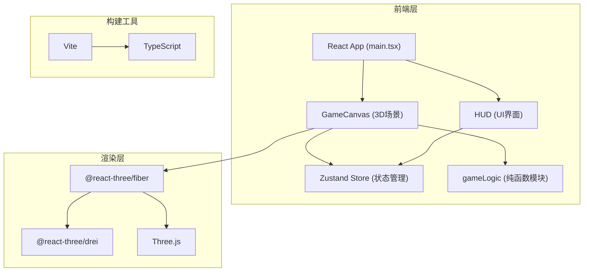

## 1. 架构设计



## 2. 技术说明
- **前端框架**：React@18 + TypeScript@5（严格模式）
- **3D渲染**：Three.js + @react-three/fiber + @react-three/drei
- **状态管理**：Zustand
- **构建工具**：Vite@5
- **后端**：无（纯前端游戏）
- **数据库**：无
- **字体**：Google Fonts - Exo2（CDN加载）

## 3. 路由定义
| 路由 | 用途 |
|-------|---------|
| / | 游戏主页面（包含标题画面、游戏场景、结束画面） |

## 4. 模块划分与文件结构

```
src/
├── main.tsx              # React入口，渲染根组件
├── App.tsx               # 根组件，组合GameCanvas+HUD+状态
├── GameCanvas.tsx        # Three.js场景组件
├── gameLogic.ts          # 纯函数逻辑模块
├── HUD.tsx               # HUD界面组件
├── useGameStore.ts       # Zustand状态管理
└── index.css             # 全局样式
```

### 4.1 模块职责

| 模块 | 职责 | 是否与React耦合 |
|------|------|----------------|
| gameLogic.ts | 碰撞检测(包围球)、陨石生成算法、物体运动更新、分裂计算 | 否（纯函数） |
| useGameStore.ts | 玩家位置/朝向/生命、陨石列表、激光列表、粒子池、得分/时间 | 是（Zustand Hook） |
| GameCanvas.tsx | Canvas画布、飞船模型、陨石渲染、激光渲染、粒子系统、相机控制、帧循环 | 是（R3F组件） |
| HUD.tsx | 生命值心形、得分、时间、雷达图、标题画面、结束面板、样式 | 是（React组件） |

## 5. 数据模型

### 5.1 核心类型定义

```typescript
// 向量
interface Vector3 { x: number; y: number; z: number; }

// 飞船状态
interface Ship {
  position: Vector3;
  rotation: Vector3;
  roll: number; // 翻滚角度 ±30°
  health: number; // 3条命
  isInvincible: boolean; // 撞击后无敌帧
  flashCount: number;
}

// 陨石
interface Asteroid {
  id: string;
  position: Vector3;
  velocity: Vector3;
  radius: number;
  color: string;
  rotation: Vector3; // 自转
  seed: number; // 纹理随机种子
}

// 激光弹
interface Laser {
  id: string;
  position: Vector3;
  direction: Vector3;
  speed: number;
  life: number;
}

// 粒子
interface Particle {
  id: string;
  active: boolean;
  position: Vector3;
  velocity: Vector3;
  life: number;
  maxLife: number;
  color: string;
  startSize: number;
  endSize: number;
  type: 'tail' | 'explosion';
}

// 游戏状态
interface GameState {
  phase: 'title' | 'playing' | 'gameover';
  score: number;
  destroyedCount: number;
  startTime: number;
  elapsedTime: number;
  ship: Ship;
  asteroids: Asteroid[];
  lasers: Laser[];
  particles: Particle[];
  lastShotTime: number;
  showWarning: boolean;
  warningStartTime: number;
}
```

### 5.2 Object Pool设计
- 粒子对象池：预分配200个Particle对象
- 每次获取/归还只修改active标记和属性值，不新建/销毁对象
- 尾焰粒子上限100，爆炸粒子上限100

## 6. 关键算法

### 6.1 碰撞检测（包围球）
```typescript
// 两个球体碰撞检测
function checkSphereCollision(
  p1: Vector3, r1: number,
  p2: Vector3, r2: number
): boolean {
  const dx = p1.x - p2.x, dy = p1.y - p2.y, dz = p1.z - p2.z;
  const distSq = dx*dx + dy*dy + dz*dz;
  return distSq < (r1 + r2) * (r1 + r2);
}
```

### 6.2 陨石生成策略
- 初始生成40颗，分布在飞船前方10-50单位的球形空间
- 每帧检查：距离飞船>60单位的陨石回收，补充新陨石保持30-50颗
- 分裂逻辑：半径>0.5的陨石被击中分裂为2个（半径减半），否则销毁

### 6.3 相机控制
- 禁用OrbitControls的平移
- 自定义PointerLock或鼠标拖拽：仅俯仰(±60°)和偏航
- 相机始终跟随在飞船后方

## 7. 性能优化
1. **Object Pool**：粒子、激光、陨石对象复用，避免GC
2. **可见性剔除**：距离过远的陨石跳过渲染计算
3. **数学计算**：碰撞检测使用距离平方避免开方
4. **粒子上限**：总粒子≤200，超出则优先回收最早粒子
5. **渲染优化**：使用BufferGeometry，共享材质，避免频繁创建Three对象
6. **Vite配置**：Three.js优化，生产构建treeshaking
