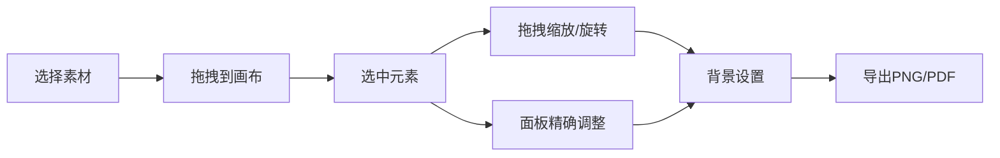

## 1. 产品概述

交互式杂志封面排版设计工具，用户通过拖拽和调整快速创建具有专业感的杂志封面布局。面向设计师、内容创作者和营销人员，提供零门槛的封面设计体验。

## 2. 核心功能

### 2.1 功能模块

1. **素材库面板**：左侧拖拽素材区，包含标题文本、图片占位符、装饰线和几何形状
2. **画布编辑区**：中央主画布，支持元素拖拽、缩放、旋转和文本编辑
3. **工具属性面板**：右侧属性面板，显示选中元素的详细属性设置
4. **导出模态框**：支持 PNG 和 PDF 格式导出，带预览缩略图
5. **历史记录系统**：无限撤销/重做，操作提示反馈

### 2.3 页面详情

| 页面名称 | 模块名称 | 功能描述 |
|---------|---------|---------|
| 主编辑器 | 左侧素材库 | 4类可拖拽元素：标题文本、图片占位符、装饰线、几何形状 |
| 主编辑器 | 中央画布 | 白色画布带网格线，元素拖放、缩放、旋转、双击编辑 |
| 主编辑器 | 右侧工具面板 | 坐标/尺寸/旋转/不透明度/字体/颜色等属性精确调整 |
| 主编辑器 | 背景设置 | 10种渐变预设 + 纯色拾色器 + 自定义背景图 + 3种拉伸模式 |
| 主编辑器 | 历史操作 | Ctrl+Z 撤销、Ctrl+Shift+Z 重做，操作提示自动淡出 |
| 导出模态框 | 导出功能 | PNG/PDF 格式选择，预览缩略图，文件下载 |

## 3. 核心流程

用户从左侧素材库拖拽元素到画布 → 选中元素进行缩放/旋转/移动 → 通过右侧面板精确调整属性 → 设置背景样式 → 预览满意后导出为图片或PDF。

## 4. 用户界面设计

### 4.1 设计风格
- **主题色调**：深色科技风，主背景 #1a1a2e，侧边栏 #16213e，激活色 #0f3460，强调色 #e94560
- **画布样式**：白色画布 + 浅灰网格线（间距20px，透明度0.3）
- **交互反馈**：悬停半透明发光边框（2px #4488ff），选中实线边框，弹性动画落位
- **过渡动画**：所有操作 0.15s 微过渡，元素落位 0.2s cubic-bezier(0.34, 1.56, 0.64, 1) 弹性动画

### 4.2 页面设计概览

| 页面名称 | 模块名称 | UI 元素 |
|---------|---------|---------|
| 主编辑器 | 左侧素材库 | 240px 宽，深色背景，元素卡片悬停发光 |
| 主编辑器 | 中央画布 | 自适应宽度，白色画布，网格底纹，拖拽预览半透明 |
| 主编辑器 | 右侧工具面板 | 320px 宽，分组属性设置，滑块/输入框/拾色器 |
| 主编辑器 | 操作提示条 | 画布顶部，1.5秒自动淡出 |
| 导出模态框 | 导出弹窗 | 居中遮罩，预览图，格式选择，导出按钮 |

### 4.3 响应式
- 桌面端优先（1024px+）：三栏布局
- 窗口宽度 < 1024px：侧面板折叠为抽屉式
- 画布始终保持可见且可交互

### 4.4 性能要求
- 拖拽和缩放操作保持 60FPS 流畅度
- 支持至少 10 个元素同时存在不卡顿
- 画布渲染使用 CSS transforms 优化性能
