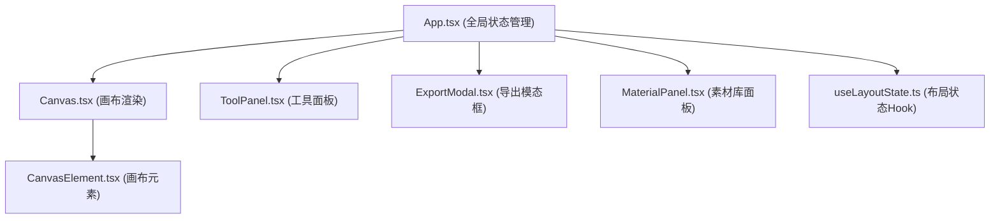

## 1. 架构设计



## 2. 技术描述

- **前端框架**：React 18 + TypeScript
- **构建工具**：Vite
- **拖拽库**：react-dnd + react-dnd-html5-backend
- **颜色选择器**：react-color
- **文件导出**：file-saver + html2canvas + jspdf
- **状态管理**：自定义 Hook (useLayoutState) + useReducer
- **样式方案**：CSS Modules + CSS Variables
- **字体方案**：Google Fonts 中文字体（通过 @font-face 引入）

## 3. 文件结构

```
src/
├── App.tsx                      # 主应用组件
├── components/
│   ├── Canvas.tsx               # 画布组件
│   ├── CanvasElement.tsx        # 画布元素组件
│   ├── ToolPanel.tsx            # 工具属性面板
│   ├── MaterialPanel.tsx        # 左侧素材库面板
│   └── ExportModal.tsx          # 导出模态框
├── hooks/
│   └── useLayoutState.ts        # 布局状态管理Hook
├── types/
│   └── index.ts                 # TypeScript类型定义
├── utils/
│   └── constants.ts             # 常量配置（渐变、字体等）
└── styles/
    └── global.css               # 全局样式
```

## 4. 数据模型

### 4.1 元素类型定义

```typescript
type ElementType = 'text' | 'image' | 'line' | 'shape';

interface LayoutElement {
  id: string;
  type: ElementType;
  x: number;
  y: number;
  width: number;
  height: number;
  rotation: number;
  opacity: number;
  // 文本属性
  text?: string;
  fontFamily?: string;
  fontSize?: number;
  fontColor?: string;
  lineHeight?: number;
  letterSpacing?: number;
  textAlign?: 'left' | 'center' | 'right';
  // 图片属性
  imageUrl?: string;
  imageFit?: 'cover' | 'contain' | 'fill';
  // 形状属性
  shapeType?: 'rectangle' | 'circle' | 'triangle';
  fillColor?: string;
  strokeColor?: string;
  strokeWidth?: number;
  // 装饰线属性
  lineStyle?: 'solid' | 'dashed' | 'dotted';
  lineColor?: string;
  lineThickness?: number;
}

interface CanvasState {
  elements: LayoutElement[];
  selectedId: string | null;
  background: {
    type: 'solid' | 'gradient' | 'image';
    color?: string;
    gradient?: { from: string; to: string; angle: number };
    imageUrl?: string;
    imageFit?: 'cover' | 'contain' | 'fill';
  };
  history: LayoutElement[][];
  historyIndex: number;
}
```

### 4.2 常量配置

- **渐变预设**：10种（日出橙、海洋蓝、森林绿、暮光紫、樱花粉、深海蓝、金色阳光、薄荷清新、烈焰红、深邃黑）
- **中文字体**：10种预设（思源黑体、思源宋体、站酷文艺体、站酷快乐体、站酷高端黑、庞门正道标题体、汉仪尚巍手书、汉仪小麦体、胡晓波男神体、胡晓波骚包体）
- **画布尺寸**：默认 A4 比例（宽度自适应，高度按比例）

## 5. 核心功能实现方案

### 5.1 拖拽系统
- 使用 react-dnd 的 HTML5 backend 实现素材拖拽到画布
- 自定义拖拽预览效果（半透明）
- 落位时使用 CSS transition 实现弹性动画

### 5.2 元素交互
- 选中元素显示 8 个缩放控制点 + 旋转手柄
- 缩放保持长宽比（按住 Shift 可自由缩放）
- 旋转时显示角度数值标签
- 双击编辑文本或替换图片

### 5.3 历史记录
- 使用数组存储历史快照
- 每次操作 push 新状态，historyIndex 指向当前状态
- 撤销/重做通过移动 historyIndex 实现

### 5.4 导出功能
- PNG 导出：使用 html2canvas 渲染画布为 Canvas，再转 PNG
- PDF 导出：使用 jsPDF 将 Canvas 内容写入 PDF
- 导出前生成预览缩略图

### 5.5 性能优化
- 使用 CSS transform 进行元素定位和变换，触发 GPU 加速
- 元素使用 will-change: transform 优化
- 拖拽时使用 requestAnimationFrame 节流
