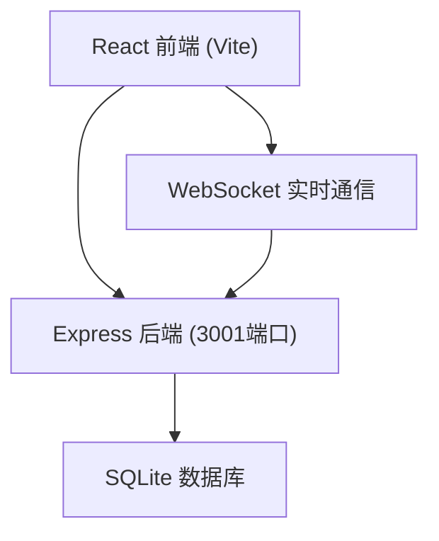
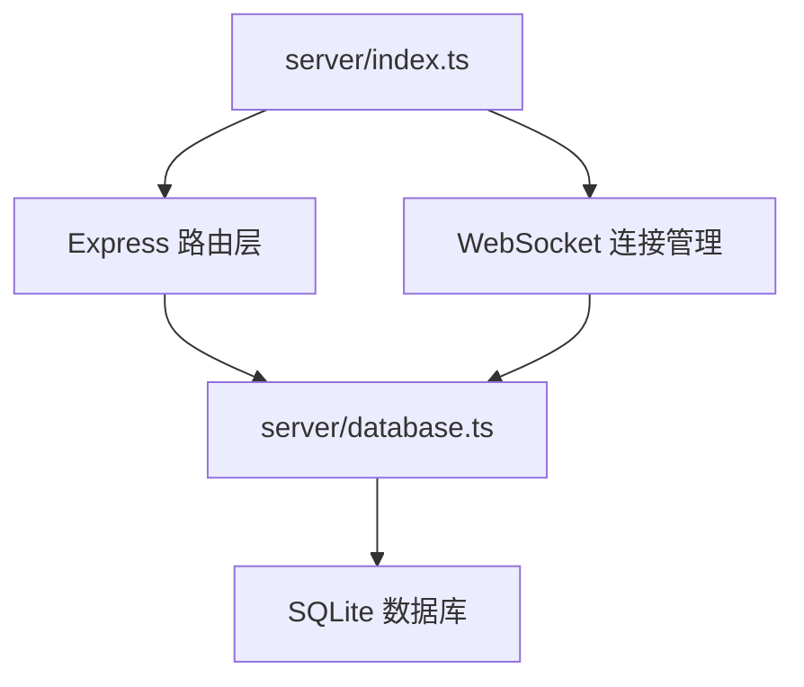
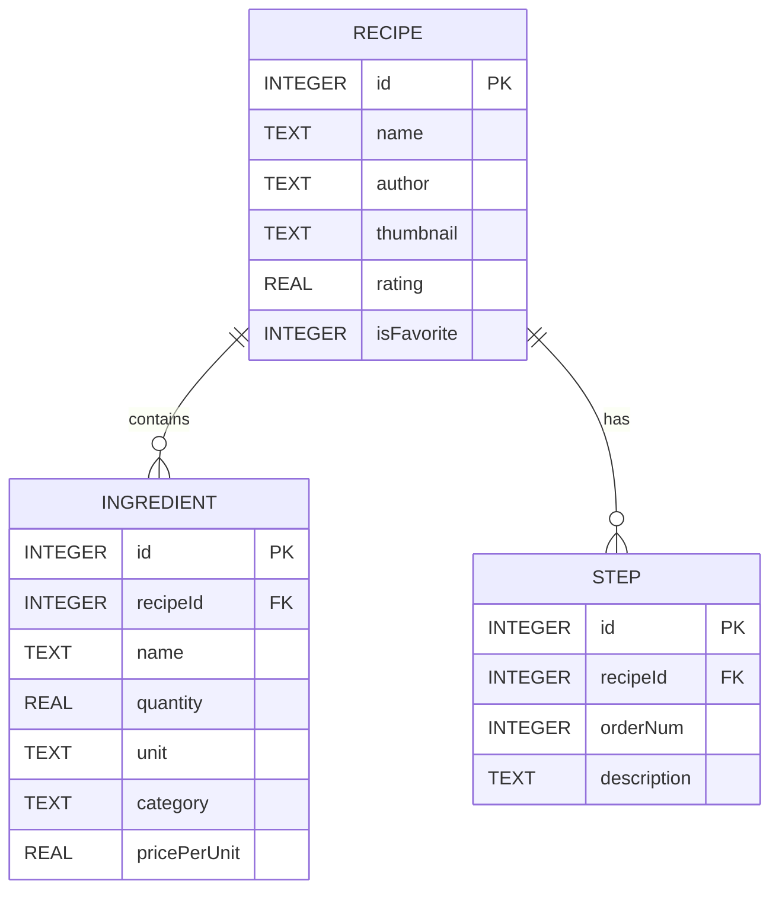

## 1. 架构设计



## 2. 技术说明

- 前端：React 18 + TypeScript + Vite + react-router-dom
- 后端：Express 4 + TypeScript + ws (WebSocket)
- 数据库：SQLite (sqlite3)
- 状态管理：React useState/useContext
- 构建工具：Vite

## 3. 路由定义

| 路由 | 用途 |
|-------|---------|
| / | 菜谱列表页（RecipeModule） |
| /recipe/:id | 菜谱详情页 |
| /grocery | 协同购物清单页（GroceryModule） |

## 4. API 定义

```typescript
// 菜谱类型
interface Ingredient {
  id: number;
  name: string;
  quantity: number;
  unit: string;
  category: string;
  pricePerUnit?: number;
}

interface RecipeStep {
  order: number;
  description: string;
}

interface Recipe {
  id: number;
  name: string;
  author: string;
  thumbnail: string;
  rating: number;
  isFavorite: boolean;
  ingredients: Ingredient[];
  steps: RecipeStep[];
}

// REST API
GET    /api/recipes              // 获取菜谱列表，支持 ?search= 关键字
GET    /api/recipes/:id          // 获取单个菜谱详情
POST   /api/recipes              // 创建菜谱
PUT    /api/recipes/:id          // 更新菜谱
DELETE /api/recipes/:id          // 删除菜谱
PATCH  /api/recipes/:id/rating   // 更新评分 { rating: number }
PATCH  /api/recipes/:id/favorite // 切换收藏
POST   /api/grocery/aggregate    // 汇总食材 { recipeIds: number[], scales: Record<number, number> }

// WebSocket 消息
// 客户端发送:
{ type: 'join', listId: string }
{ type: 'item-update', listId: string, itemId: number, changes: Partial<GroceryItem> }
{ type: 'item-toggle', listId: string, itemId: number, checked: boolean }

// 服务端广播:
{ type: 'peer-update', itemId: number, changes: Partial<GroceryItem>, userId: string }
{ type: 'peer-toggle', itemId: number, checked: boolean, userId: string }
```

## 5. 服务端架构



## 6. 数据模型

### 6.1 ER图



### 6.2 DDL

```sql
CREATE TABLE IF NOT EXISTS recipes (
  id INTEGER PRIMARY KEY AUTOINCREMENT,
  name TEXT NOT NULL,
  author TEXT NOT NULL DEFAULT '匿名',
  thumbnail TEXT,
  rating REAL DEFAULT 0,
  isFavorite INTEGER DEFAULT 0
);

CREATE TABLE IF NOT EXISTS ingredients (
  id INTEGER PRIMARY KEY AUTOINCREMENT,
  recipeId INTEGER NOT NULL,
  name TEXT NOT NULL,
  quantity REAL NOT NULL,
  unit TEXT NOT NULL,
  category TEXT NOT NULL DEFAULT '其他',
  pricePerUnit REAL,
  FOREIGN KEY (recipeId) REFERENCES recipes(id)
);

CREATE TABLE IF NOT EXISTS steps (
  id INTEGER PRIMARY KEY AUTOINCREMENT,
  recipeId INTEGER NOT NULL,
  orderNum INTEGER NOT NULL,
  description TEXT NOT NULL,
  FOREIGN KEY (recipeId) REFERENCES recipes(id)
);
```

## 7. 文件结构

```
package.json
vite.config.js
tsconfig.json
index.html
server/
  index.ts        # Express后端 + WebSocket
  database.ts     # SQLite操作
src/
  types.ts        # 共享类型定义
  RecipeModule.tsx # 菜谱管理模块
  GroceryModule.tsx # 购物清单模块
  App.tsx
  main.tsx
```
