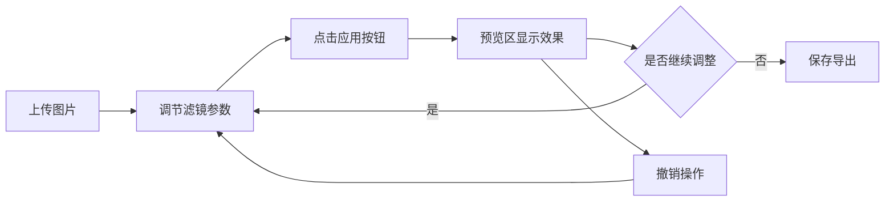

## 1. 产品概述

基于浏览器CSS滤镜和Canvas的实时图片风格迁移工具，用户可上传照片，通过滑块调节艺术滤镜参数，实时预览效果并导出处理后的图片。

- 主要用途：为普通用户提供简单易用的图片艺术化处理工具
- 目标用户：摄影爱好者、设计师、社交媒体内容创作者
- 产品价值：无需专业软件，在浏览器中即可实现多种艺术风格转换

## 2. 核心功能

### 2.1 用户角色
| 角色 | 注册方式 | 核心权限 |
|------|----------|---------|
| 普通用户 | 无需注册 | 上传图片、调节滤镜、预览效果、导出图片 |

### 2.2 功能模块
1. **图片上传模块**：支持点击和拖拽上传，显示缩略图、文件名、文件大小，提供重置按钮
2. **滤镜控制模块**：油画、水彩、素描、马赛克、胶片颗粒五种滤镜，各带滑块调节参数
3. **预览模块**：实时显示滤镜叠加效果，鼠标悬停显示滤镜参数
4. **操作模块**：撤销、保存、重置功能

### 2.3 页面详情
| 页面名称 | 模块名称 | 功能描述 |
|---------|---------|------------|
| 主页面 | 图片上传区 | 圆角虚线框，支持拖拽/点击上传，显示缩略图和文件信息 |
| 主页面 | 滤镜控制面板 | 五个独立面板，每个含滑块和应用按钮 |
| 主页面 | 预览区域 | 实时显示滤镜效果，悬停显示参数标签 |
| 主页面 | 底部操作区 | 撤销、保存、重置按钮 |

## 3. 核心流程

用户上传图片 → 调节滤镜参数 → 点击应用按钮 → 预览区实时显示效果 → 可多次叠加多个滤镜 → 可撤销上一步 → 满意后保存导出图片

## 4. 用户界面设计

### 4.1 设计风格
- 主背景色：#fafafa（米白色）
- 标题色：#333（深灰色）
- 卡片背景：白色，圆角16px，带微弱阴影#0000001a
- 交互过渡：0.3s ease平滑过渡
- 按钮风格：
  - 应用按钮：蓝紫色#7c4dff，圆角8px，点击时#651fff并缩小0.95倍
  - 撤销按钮：灰色#9e9e9e，圆角8px
  - 保存按钮：绿色#66bb6a，圆角8px
  - 重置按钮：红色#ef5350，圆角8px
- 字体：优雅的无衬线字体，标题加粗
- 布局：卡片式布局，功能分区清晰
- 图标风格：简约线性图标

### 4.2 页面设计概述
| 页面名称 | 模块名称 | UI元素 |
|---------|---------|--------|
| 主页面 | 上传区 | 圆角20px虚线框（2px宽#aaa），背景#f5f5f5，400x250px |
| 主页面 | 滤镜面板 | 220x100px，圆角12px，悬停阴影加深上移2px |
| 主页面 | 滑块样式 | 渐变轨道#ddd到#666，滑块圆圈#333，直径16px |
| 主页面 | 预览区 | 600x400px，背景#fafafa，圆角16px，1px#ddd边框 |
| 主页面 | 浮动标签 | 半透明黑色#000000aa，圆角6px，白色14px文字 |
| 主页面 | 底部按钮 | 120x40px，间距12px，白色文字居中 |

### 4.3 响应式
- 桌面端：上传区和预览区左右排列，滤镜面板横向排列
- 移动端（<768px）：上传区和预览区上下堆叠，滤镜面板两列网格
- 触摸优化：增大触摸目标尺寸

### 4.4 性能要求
- 滤镜处理时间：≤75ms
- 预览帧率：≥30fps
- 使用OffscreenCanvas优化性能
- 防止UI卡顿
