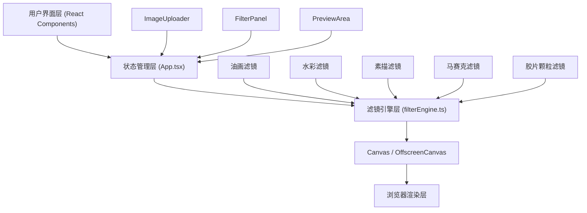

## 1. 架构设计



## 2. 技术描述

- 前端框架：React@18 + TypeScript@5
- 构建工具：Vite@5
- 状态管理：React useState/useRef（轻量级状态管理）
- 依赖库：
  - react-dom：React DOM渲染
  - @types/react：React类型定义
  - @types/react-dom：React DOM类型定义
  - file-saver：文件下载功能
  - @types/file-saver：file-saver类型定义
- 图像处理：原生Canvas API + OffscreenCanvas

## 3. 项目结构

```
src/
├── App.tsx                 # 主组件，状态管理
├── components/
│   ├── ImageUploader.tsx   # 图片上传组件
│   ├── FilterPanel.tsx     # 滤镜控制面板组件
│   └── PreviewArea.tsx     # 预览区域组件
├── utils/
│   └── filterEngine.ts     # 滤镜处理引擎
├── index.css               # 全局样式
└── main.tsx                # 入口文件
```

## 4. 核心类型定义

```typescript
// 滤镜类型
interface FilterState {
  oilPaint: { blockSize: number; applied: boolean };
  watercolor: { blurRadius: number; applied: boolean };
  sketch: { edgeStrength: number; applied: boolean };
  mosaic: { cellSize: number; applied: boolean };
  filmGrain: { density: number; applied: boolean };
}

// 历史记录
interface HistoryState {
  imageData: ImageData;
  filters: FilterState;
}

// 滤镜参数
interface FilterParams {
  oilPaint?: number;
  watercolor?: number;
  sketch?: number;
  mosaic?: number;
  filmGrain?: number;
}
```

## 5. 性能优化方案

1. **OffscreenCanvas**：在Web Worker中执行滤镜计算，不阻塞主线程
2. **requestAnimationFrame**：确保预览帧率≥30fps
3. **ImageData缓存**：缓存处理后的图像数据，避免重复计算
4. **防抖处理**：滑块调节时使用防抖，减少不必要的计算
5. **历史记录栈**：限制历史记录数量，防止内存溢出
6. **缩略图处理**：上传时生成缩略图，预览区使用合适尺寸
