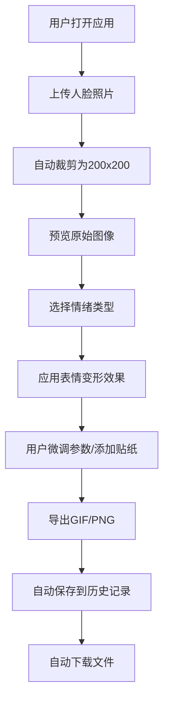

## 1. 产品概述

个性化动态表情包生成器是一款在线Web应用，用户可以上传人脸照片，通过选择预设情绪和调整参数生成个性化表情包，解决日常聊天中表情缺乏个性、无法表达细腻情绪的问题。

- 目标用户：日常社交软件用户，追求个性化表达的年轻人
- 核心价值：将用户自己的面孔转化为各种情绪的表情包，实现独一无二的个性化表达

## 2. 核心功能

### 2.1 用户角色

| 角色 | 注册方式 | 核心权限 |
|------|----------|----------|
| 普通用户 | 无需注册，基于session | 上传照片、生成表情包、导出、查看历史记录 |

### 2.2 功能模块

1. **主编辑区**：照片上传、预览、情绪选择、参数微调、贴纸编辑
2. **导出功能**：GIF动图导出、PNG静态图导出
3. **历史记录**：表情包历史保存、重新加载、删除
4. **图像处理模块**：人脸检测、变形算法、GIF/PNG渲染

### 2.3 页面详情

| 页面名称 | 模块名称 | 功能描述 |
|----------|----------|----------|
| 主页面 | 上传区域 | 400x240px拖拽上传区，支持jpg/png，拖拽时视觉反馈，自动裁剪为200x200正方形 |
| 主页面 | 预览区域 | 200x200px预览框，显示裁剪后的照片和变形效果 |
| 主页面 | 情绪选择 | 5种情绪按钮（高兴、惊讶、悲伤、愤怒、搞怪），点击触发变形动画 |
| 主页面 | 编辑面板 | 嘴型滑块(-50%~+50%)、眼睛大小滑块(-30%~+30%)、贴纸网格（2行5列） |
| 主页面 | 导出按钮 | 右上角导出GIF/PNG，带加载状态和自动下载 |
| 侧边栏 | 历史记录 | 表情包缩略图列表，点击可重新加载，显示情绪标签和时间 |

## 3. 核心流程

用户打开应用 → 上传人脸照片 → 系统自动裁剪并预览 → 选择情绪类型 → 系统自动应用变形效果 → 用户微调参数和添加贴纸 → 导出GIF或PNG → 自动保存到历史记录

## 4. 用户界面设计

### 4.1 设计风格

- 主色：#6c63ff（紫色）
- 辅色：#e8e6ff（浅紫）、#f0f0ff（淡紫背景）
- 强调色：#ff6584（粉红）
- 页面背景：#f5f5f5（浅灰）
- 按钮风格：圆角设计，悬停平滑过渡
- 布局：Flexbox，桌面端左右分布，移动端上下排列
- 阴影：微弱柔和阴影（0px 4px 20px rgba(0,0,0,0.08)）

### 4.2 页面设计概览

| 页面名称 | 模块名称 | UI元素 |
|----------|----------|----------|
| 主页面 | 主编辑区 | 900x600px白色卡片，圆角16px，居中显示 |
| 主页面 | 上传区 | 左侧55%，虚线边框，拖拽时实线上传区视觉反馈 |
| 主页面 | 预览区 | 右侧45%，200x200px圆角预览，内阴影效果 |
| 主页面 | 情绪按钮 | 5个横向排列胶囊按钮，80x40px，选中/未选中状态 |
| 主页面 | 编辑面板 | 底部180px高，浅灰顶部分隔线，滑块和贴纸网格 |
| 侧边栏 | 历史记录 | 280px宽，#fafafa背景，缩略图+标签列表 |

### 4.3 响应式

- 桌面优先设计
- 屏幕宽度 < 768px时：上传区和预览区改为上下排列，编辑面板高度自适应
- 触摸设备：按钮尺寸保持可点击区域

### 4.4 动画与交互

- 表情变形过渡：0.4秒 cubic-bezier(0.25, 0.1, 0.25, 1)
- 悬停过渡：0.2秒 ease-in-out
- 导出按钮悬停：放大1.05倍，0.2秒 ease-out
- 加载图标：蓝色环形旋转，周期0.8秒
- 情绪按钮切换：背景色过渡0.3秒
