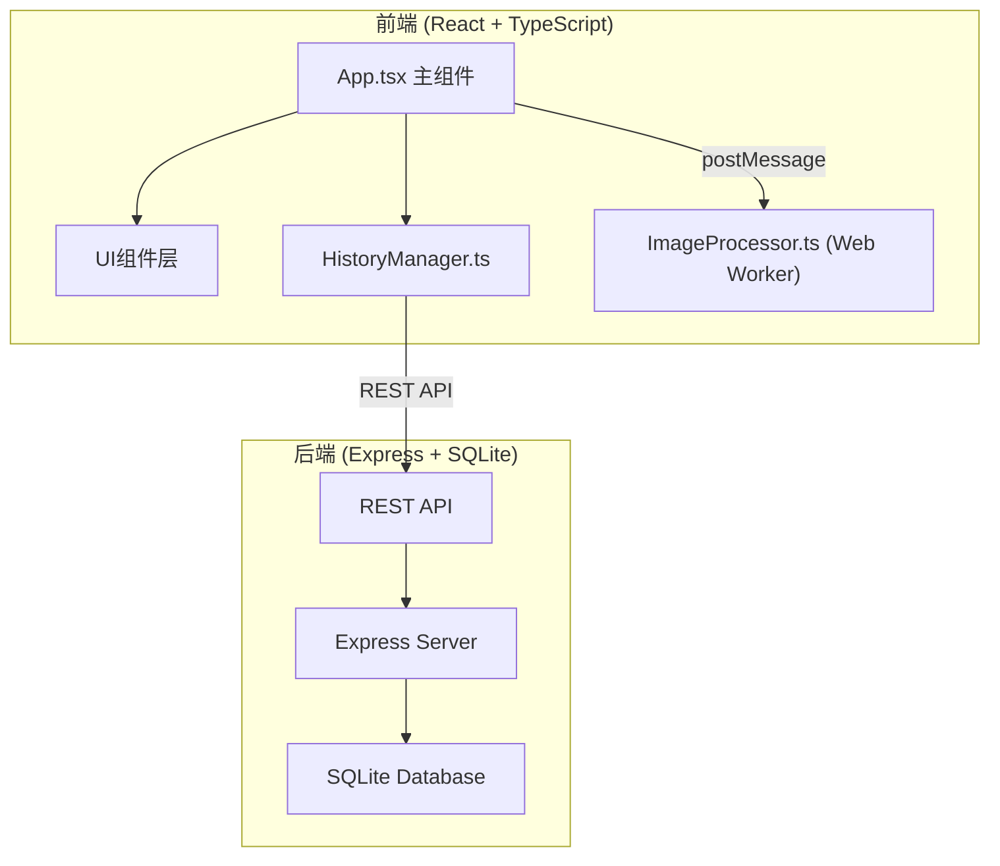
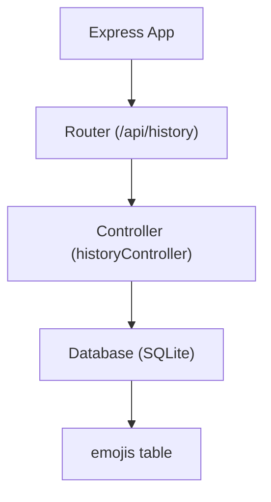
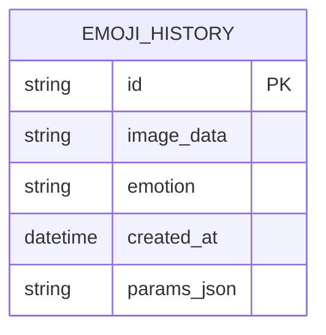

## 1. 架构设计



## 2. 技术说明

- 前端：React@18 + TypeScript + Vite
- 后端：Express@4 + SQLite3
- 图像处理：Web Worker + Canvas API + gif.js
- 状态管理：React useState/useReducer（轻量级）
- 样式：原生CSS（CSS变量 + Flexbox）

## 3. 路由定义

| 路由 | 用途 |
|------|------|
| / | 主页面（表情包编辑器） |

## 4. API定义

### 4.1 类型定义

```typescript
interface EmojiHistory {
  id: string;
  imageData: string; // base64
  emotion: string;
  createdAt: string;
  params: {
    mouth: number;
    eyes: number;
    stickers: Sticker[];
  };
}

interface Sticker {
  id: string;
  type: string;
  x: number;
  y: number;
}
```

### 4.2 API端点

| 方法 | 路径 | 描述 | 请求体 | 响应 |
|------|------|------|--------|------|
| POST | /api/history | 保存表情包 | EmojiHistory | { id: string } |
| GET | /api/history | 获取历史列表 | - | EmojiHistory[] |
| DELETE | /api/history/:id | 删除历史记录 | - | { success: boolean } |

## 5. 服务端架构图



## 6. 数据模型

### 6.1 ER图



### 6.2 DDL语句

```sql
CREATE TABLE IF NOT EXISTS emoji_history (
  id TEXT PRIMARY KEY,
  image_data TEXT NOT NULL,
  emotion TEXT NOT NULL,
  created_at DATETIME DEFAULT CURRENT_TIMESTAMP,
  params_json TEXT NOT NULL
);

CREATE INDEX IF NOT EXISTS idx_emoji_created_at ON emoji_history(created_at DESC);
```

## 7. 文件结构

```
├── package.json
├── vite.config.js
├── tsconfig.json
├── index.html
├── src/
│   ├── App.tsx          # 主组件
│   ├── ImageProcessor.ts # Web Worker 图像处理
│   ├── HistoryManager.ts # 历史记录API通信
│   └── styles.css       # 全局样式
└── server/
    └── index.ts         # Express服务器
```
