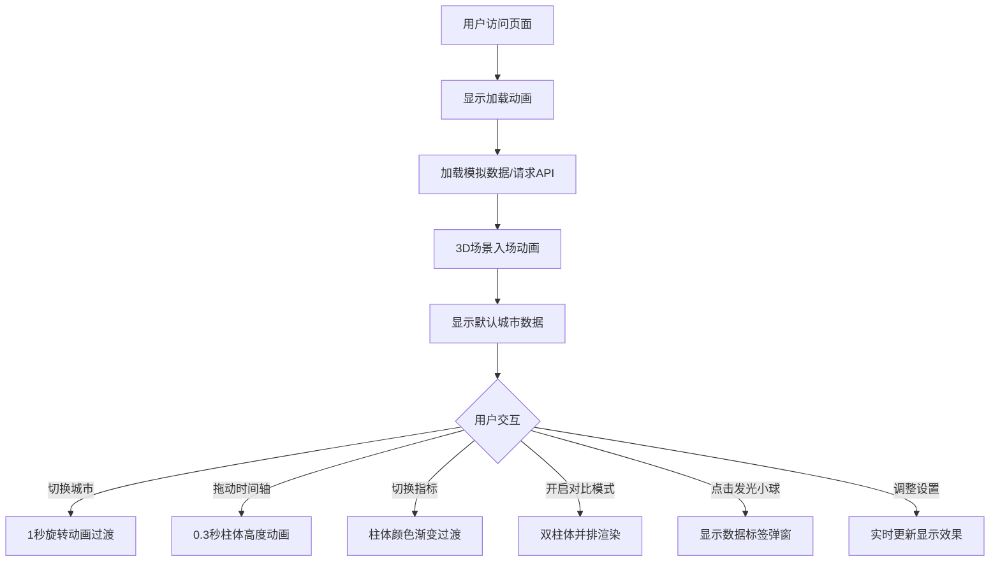

## 1. 产品概述

基于Web的3D交互式气象数据可视化应用，让用户能够以沉浸式3D方式探索和比较北京、上海、广州三座城市在过去一周内的气温、湿度和风速变化趋势。

- 主要目的：通过3D可视化技术直观展示气象数据的时空变化，帮助用户理解不同城市间的气象差异
- 目标用户：气象爱好者、学生、数据分析人员、普通用户
- 产品价值：将枯燥的气象数据转化为可交互的3D视觉体验，降低数据理解门槛

## 2. 核心功能

### 2.1 用户角色
| 角色 | 注册方式 | 核心权限 |
|------|----------|----------|
| 普通用户 | 无需注册 | 浏览3D场景、切换城市和指标、使用时间轴、开启对比模式 |

### 2.2 功能模块
1. **3D场景主视图**：全景3D柱状图和地形网格展示
2. **城市选择器**：北京/上海/广州三城市切换
3. **气象指标切换**：气温/湿度/风速三种指标
4. **时间轴控制**：7天时间范围滑块，支持动画过渡
5. **对比模式**：双城市数据并排对比
6. **个性化设置面板**：柱体透明度、视角重置等

### 2.3 页面详情
| 页面名称 | 模块名称 | 功能描述 |
|---------|---------|----------|
| 主页面 | 3D场景渲染 | 正交相机、渐变背景、环境光+点光源、半透明地形网格 |
| 主页面 | 3D柱状图 | 按城市分组的动态柱体，高度随数据变化，颜色随指标变化，顶部发光小球 |
| 主页面 | 时间轴滑块 | 底部80%宽度滑块，拖动时柱体0.3秒平滑过渡动画 |
| 主页面 | 城市选择下拉框 | 左上角城市切换，1秒场景旋转动画 |
| 主页面 | 对比模式开关 | 右上角按钮，开启后双城市数据并排显示 |
| 主页面 | 右侧设置面板 | 指标切换按钮、透明度滑块、视角重置按钮 |
| 主页面 | 数据标签弹窗 | 点击柱体顶部小球显示精确数值和日期 |
| 主页面 | 加载动画 | 2秒入场动画，分步文字提示 |

## 3. 核心流程

用户进入页面后，首先看到加载动画和分步提示文字。加载完成后，3D场景从中心放大旋转出现，默认显示北京最近7天的气温数据。用户可以通过左上角下拉框切换城市，右上角开启对比模式，底部时间轴查看不同日期的数据，右侧面板切换气象指标和调整显示效果。点击柱体顶部的发光小球可以查看精确数据。

## 4. 用户界面设计

### 4.1 设计风格
- **主色调**：深蓝渐变背景（#0a0a2e → #1a1a4e），深色科幻主题
- **强调色**：霓虹蓝（#00bcd4）、青绿色（#4db6ac）
- **指标色**：气温-红黄渐变（#ff6b35 → #ffd700），湿度-蓝绿渐变（#0288d1 → #4caf50），风速-紫蓝渐变（#7e57c2 → #42a5f5）
- **文字颜色**：浅灰色（#e0e0e0）
- **按钮风格**：圆角8px，半透明深色背景（#111122，透明度0.85），悬停时发光效果
- **字体**：采用现代无衬线字体，标题加粗，正文清晰易读
- **布局风格**：3D场景全屏，UI元素采用悬浮覆盖层设计
- **动效**：所有交互元素0.2秒过渡动画，场景切换1秒缓动

### 4.2 页面设计概述
| 页面名称 | 模块名称 | UI元素 |
|---------|---------|--------|
| 主页面 | 3D场景 | 正交相机45度视角，深蓝渐变背景，20x20半透明青色地形网格 |
| 主页面 | 柱状图 | X轴每1.5单位一组，每组7根柱体，最高5单位，顶部发光小球（半径0.2） |
| 主页面 | 左上角城市选择 | 半透明下拉框，圆角8px，霓虹蓝边框 |
| 主页面 | 右上角对比模式 | 切换按钮，开启时青绿色高亮 |
| 主页面 | 底部时间轴 | 80%宽度滑块，霓虹蓝轨道，青绿色滑块 |
| 主页面 | 右侧设置面板 | 240px宽，圆角12px，半透明背景（#1a1a2e），包含三个圆形指标按钮 |
| 主页面 | 加载动画 | 中心放大旋转效果，顶部分步文字提示 |

### 4.3 响应式
- **桌面端（≥768px）**：3D场景全屏，右侧设置面板固定显示
- **移动端（<768px）**：右侧面板折叠为底部可展开抽屉，UI元素自适应缩放，触控优化
- **通用**：场景始终占满视口，3D渲染保持55FPS以上性能

### 4.4 3D场景指导
- **环境**：深蓝渐变背景（#0a0a2e到#1a1a4e），营造科技感深邃空间
- **光照**：环境光强度0.5，点光源强度1，位置(10,20,10)，产生柔和阴影效果
- **相机**：正交相机，默认45度视角，支持轨道控制器交互
- **地形**：20x20单位半透明青色网格（#4fc3f7，透明度0.3），作为数据展示基底
- **交互**：点击发光小球触发数据标签，城市切换时场景平滑旋转，时间轴拖动时柱体高度动画
- **后期**：柱体发光效果，提升视觉层次感
- **性能**：每帧计算≤16ms，帧率≥55FPS，使用实例化渲染优化性能
