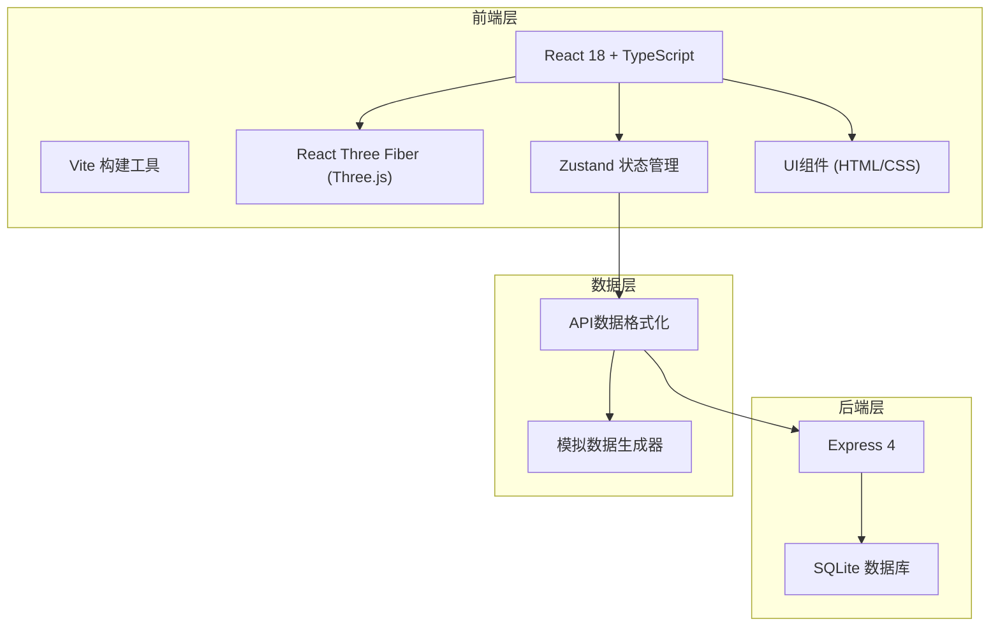
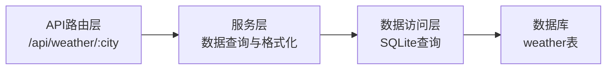
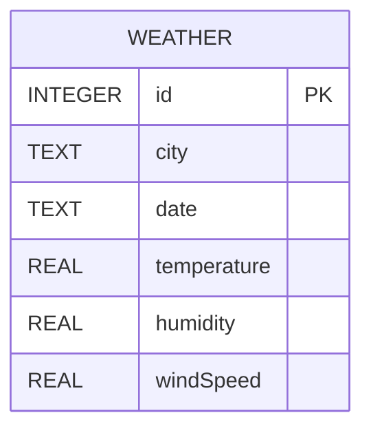

## 1. 架构设计



## 2. 技术描述

- **前端**：React@18 + TypeScript + Vite
- **3D渲染**：Three.js + @react-three/fiber + @react-three/drei
- **状态管理**：Zustand@4
- **后端**：Express@4
- **数据库**：SQLite3
- **初始化工具**：Vite create
- **样式方案**：原生CSS（CSS变量）+ 内联样式，不引入Tailwind CSS

## 3. 目录结构

```
auto46/
├── package.json
├── vite.config.js
├── tsconfig.json
├── index.html
├── src/
│   ├── main.tsx              # 应用入口
│   ├── App.tsx               # 根组件
│   ├── components/
│   │   ├── Scene.tsx         # 3D场景初始化
│   │   ├── Chart3D.tsx       # 3D柱状图组件
│   │   ├── Terrain.tsx       # 地形网格组件
│   │   └── UIPanel.tsx       # UI覆盖层组件
│   ├── store/
│   │   └── useMeteoStore.ts  # Zustand状态管理
│   ├── data/
│   │   └── mockData.ts       # 模拟数据生成
│   └── api/
│       └── weatherApi.ts     # API通信封装
└── backend/
    ├── server.ts             # Express服务
    └── database.ts           # SQLite初始化
```

## 4. 路由定义

| 路由 | 用途 |
|-----|------|
| / | 主页面，3D气象数据可视化 |
| GET /api/weather/:city?days=7 | 获取指定城市的历史气象数据 |

## 5. API定义

### 5.1 数据类型定义

```typescript
interface WeatherData {
  city: string;
  date: string;
  temperature: number;
  humidity: number;
  windSpeed: number;
}

interface MeteoState {
  selectedCity: 'beijing' | 'shanghai' | 'guangzhou';
  selectedMetric: 'temperature' | 'humidity' | 'windSpeed';
  timeRange: [number, number];
  currentDay: number;
  compareMode: boolean;
  compareCity: 'beijing' | 'shanghai' | 'guangzhou';
  opacity: number;
  data: Record<string, WeatherData[]>;
  loading: boolean;
  popupData: WeatherData | null;
  popupPosition: { x: number; y: number } | null;
}
```

### 5.2 请求/响应格式

**请求**：
```
GET /api/weather/beijing?days=7
```

**响应**：
```json
{
  "success": true,
  "data": [
    {
      "city": "beijing",
      "date": "2026-06-08",
      "temperature": 28.5,
      "humidity": 62,
      "windSpeed": 12.3
    }
  ]
}
```

## 6. 服务端架构



## 7. 数据模型

### 7.1 ER图



### 7.2 DDL语句

```sql
CREATE TABLE IF NOT EXISTS weather (
  id INTEGER PRIMARY KEY AUTOINCREMENT,
  city TEXT NOT NULL,
  date TEXT NOT NULL,
  temperature REAL NOT NULL,
  humidity REAL NOT NULL,
  windSpeed REAL NOT NULL,
  UNIQUE(city, date)
);

CREATE INDEX IF NOT EXISTS idx_weather_city ON weather(city);
CREATE INDEX IF NOT EXISTS idx_weather_date ON weather(date);
```

## 8. 关键技术点

### 8.1 3D性能优化
- 使用 `useFrame` 钩子实现动画循环，每帧计算≤16ms
- 使用 `useSpring` 或自定义插值实现平滑过渡动画
- 柱体几何体复用，减少draw call
- 正交相机避免透视畸变

### 8.2 动画实现
- 时间轴过渡：ease-out缓动，0.3秒
- 城市切换旋转：ease-in-out缓动，1秒
- UI交互：0.2秒过渡动画
- 入场动画：2秒放大旋转效果

### 8.3 状态管理
- Zustand单一状态树，避免props drilling
- 选择器优化，避免不必要的重渲染
- 异步数据获取loading状态管理

### 8.4 后端性能
- SQLite内存模式或预写日志优化
- 数据缓存策略
- 本地环境API响应<200ms
