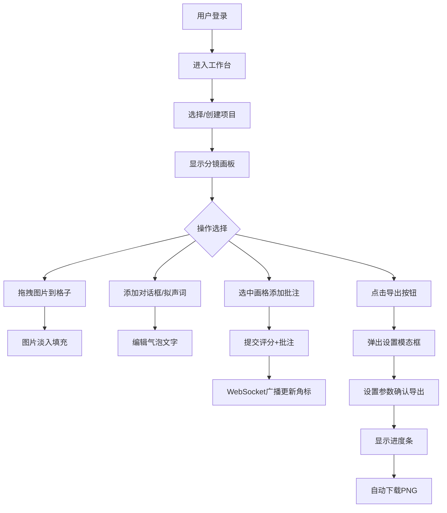

## 1. 产品概述

漫画分镜排版与协作点评平台，面向漫画作者和编辑团队，提供在线分镜编排、对话框编辑与协作批注功能，解决传统聊天软件传图沟通混乱的问题。

- 核心价值：让漫画创作流程数字化、可视化，提升团队协作效率
- 目标用户：漫画作者、漫画编辑、漫画读者/粉丝、创意团队

## 2. 核心功能

### 2.1 用户角色

| 角色 | 权限 |
|------|------|
| 作者 | 创建项目、编排分镜、添加对话框、导出图片、查看批注 |
| 编辑/读者 | 查看分镜、添加批注与评分、参与协作讨论 |

### 2.2 功能模块

1. **个人工作台**：项目列表侧边栏 + 分镜画板主区域 + 点评面板
2. **分镜编排模块**：网格画板、拖拽排序、图片上传、缩放淡入
3. **对话气泡模块**：气泡生成、文字编辑、位置拖拽、大小调整
4. **协作批注模块**：批注列表、星级评分、分页加载、实时角标
5. **导出功能**：设置参数、进度展示、PNG下载

### 2.3 页面详情

| 页面名称 | 模块名称 | 功能描述 |
|-----------|-------------|---------------------|
| 工作台 | 项目侧边栏 | 240px深色侧边栏(#1a1a2e)，项目卡片220x90px圆角14px，悬停上移+阴影，选中边框高亮#ff6b6b |
| 工作台 | 分镜画板 | 浅灰背景(#f0f0f0)，4x4网格，每格160x200px边框1px #ccc，拖拽图片跟随半透明，淡入0.3秒 |
| 工作台 | 悬浮工具栏 | 鼠标悬停显示，透明背景白色圆角，48x48px图标（编辑/对话框/拟声词/删除），点击放大变色 |
| 工作台 | 对话气泡 | 白底圆角8px带尾端，双击编辑文字，字号自适应，拖拽移动/缩放，文字自动重排 |
| 工作台 | 点评面板 | 宽340px白底圆角16px左侧阴影，批注交替背景(#f9f9f9/#ffffff)圆角10px，评分5星橙色(#ffa500)，红色角标(#ff4757)，输入框圆角20px聚焦边框#ff6b6b |
| 工作台 | 导出模态框 | 半透明黑背景(rgba(0,0,0,0.5))，白色卡500x300px圆角20px，进度条绿色(#2ed573)，加载圈旋转 |

## 3. 核心流程

## 4. 用户界面设计

### 4.1 设计风格

- **主色调**：深蓝紫(#1a1a2e) 侧边栏 + 暖珊瑚红(#ff6b6b) 高亮 + 橙色(#ffa500) 星标 + 绿色(#2ed573) 进度
- **背景色**：主区域浅灰(#f0f0f0)，面板纯白(#ffffff)，交替行(#f9f9f9)
- **按钮风格**：圆角8-16px，悬停有位移/阴影微交互，过渡0.2s
- **字体**：标题用独特衬线体，正文用清晰无衬线体，采用4级字号层次
- **布局**：左中右三栏布局，固定侧边栏，自适应主区域，右侧点评面板
- **图标风格**：线性图标，48x48px尺寸，悬停变色放大

### 4.2 页面设计概述

| 页面名称 | 模块名称 | UI元素细节 |
|-----------|-------------|-------------|
| 工作台 | 项目侧边栏 | 深色沉浸感，卡片投影，选中态红色边框呼吸感 |
| 工作台 | 分镜画板 | 网格对齐参考线，拖拽时半透明虚影，放置后淡入动画 |
| 工作台 | 悬浮工具栏 | 渐变白色模糊背景，图标缩放弹跳效果 |
| 工作台 | 对话气泡 | 拟物化阴影，尾端指向，文字自适应字号 |
| 工作台 | 点评面板 | 卡片式设计，星级交互动效，红色角标脉冲提示 |
| 工作台 | 导出模态框 | 毛玻璃背景遮罩，进度条流畅动画，加载旋转指示 |

### 4.3 响应式

- Desktop-first设计，主布局固定三栏
- 点评面板可折叠收起，画板区域自适应扩展
- 项目卡片在窄屏时缩小尺寸或横向滚动
- 触摸设备优化拖拽和点击区域

### 4.4 动效设计

- 页面加载：侧边栏项目卡片依次错落入场
- 图片放置：0.3s淡入 + 轻微缩放
- 悬停交互：工具栏滑入，卡片上移+阴影
- 批注提交：新批注滑入 + 角标弹跳
- 导出进度：进度条平滑增长 0.5s 完成
