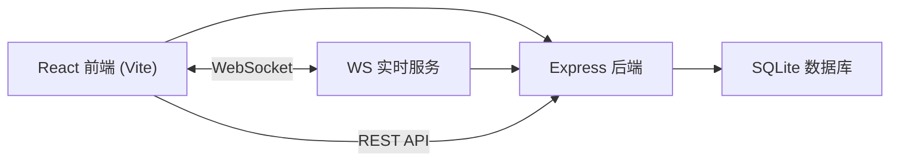
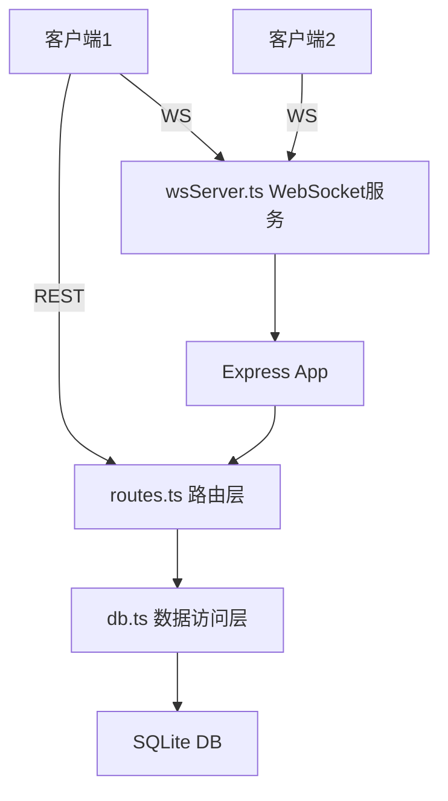
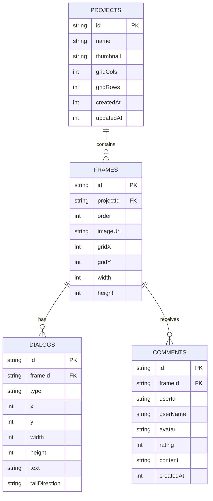

## 1. 架构设计



## 2. 技术说明

- **前端**：React@18 + TypeScript + Vite
- **UI 构建**：原生 CSS（使用 CSS 变量和 styled-components 风格的内联样式）
- **后端**：Express@4 + better-sqlite3
- **实时通信**：ws (WebSocket)
- **工具库**：uuid（ID生成），html2canvas-like 方案导出PNG
- **初始化工具**：Vite 脚手架（react-ts 模板）

## 3. 路由定义

| 路由 (前端) | 用途 |
|-------|---------|
| / | 工作台主页面（包含项目列表、分镜画板、点评面板） |

| 路由 (后端API) | 方法 | 用途 |
|-------|------|---------|
| /api/projects | GET | 获取所有项目列表 |
| /api/projects | POST | 创建新项目 |
| /api/projects/:id | GET | 获取项目详情（含画格） |
| /api/projects/:id | PUT | 更新项目信息 |
| /api/frames | POST | 新增画格 |
| /api/frames/:id | PUT | 更新画格（图片、顺序、气泡） |
| /api/frames/:id | DELETE | 删除画格 |
| /api/comments | GET | 获取批注列表（分页） |
| /api/comments | POST | 提交新批注 |
| /api/dialogs | POST | 新增对话气泡 |
| /api/dialogs/:id | PUT | 更新对话气泡 |
| /api/dialogs/:id | DELETE | 删除对话气泡 |
| /api/export/:projectId | POST | 生成并导出PNG |

## 4. API 定义

```typescript
// 项目
interface Project {
  id: string;
  name: string;
  thumbnail?: string;
  gridCols: number;
  gridRows: number;
  createdAt: number;
  updatedAt: number;
}

// 画格
interface Frame {
  id: string;
  projectId: string;
  order: number;
  imageUrl?: string;
  gridX: number;
  gridY: number;
  width: number;
  height: number;
}

// 对话气泡
interface DialogBubble {
  id: string;
  frameId: string;
  type: 'dialog' | 'sound';
  x: number;
  y: number;
  width: number;
  height: number;
  text: string;
  tailDirection: 'left' | 'right' | 'top' | 'bottom';
}

// 批注
interface Comment {
  id: string;
  frameId: string;
  userId: string;
  userName: string;
  avatar: string;
  rating: number;
  content: string;
  createdAt: number;
}

// WebSocket 事件
interface WSNewComment {
  type: 'NEW_COMMENT';
  frameId: string;
  comment: Comment;
  count: number;
}
```

## 5. 服务器架构图



## 6. 数据模型

### 6.1 ER 图



### 6.2 DDL

```sql
CREATE TABLE projects (
  id TEXT PRIMARY KEY,
  name TEXT NOT NULL,
  thumbnail TEXT,
  gridCols INTEGER DEFAULT 4,
  gridRows INTEGER DEFAULT 4,
  createdAt INTEGER NOT NULL,
  updatedAt INTEGER NOT NULL
);

CREATE TABLE frames (
  id TEXT PRIMARY KEY,
  projectId TEXT NOT NULL,
  "order" INTEGER NOT NULL,
  imageUrl TEXT,
  gridX INTEGER NOT NULL,
  gridY INTEGER NOT NULL,
  width INTEGER DEFAULT 160,
  height INTEGER DEFAULT 200,
  FOREIGN KEY (projectId) REFERENCES projects(id) ON DELETE CASCADE
);

CREATE TABLE dialogs (
  id TEXT PRIMARY KEY,
  frameId TEXT NOT NULL,
  type TEXT NOT NULL DEFAULT 'dialog',
  x INTEGER NOT NULL DEFAULT 0,
  y INTEGER NOT NULL DEFAULT 0,
  width INTEGER NOT NULL DEFAULT 100,
  height INTEGER NOT NULL DEFAULT 60,
  text TEXT NOT NULL DEFAULT '',
  tailDirection TEXT DEFAULT 'bottom',
  FOREIGN KEY (frameId) REFERENCES frames(id) ON DELETE CASCADE
);

CREATE TABLE comments (
  id TEXT PRIMARY KEY,
  frameId TEXT NOT NULL,
  userId TEXT NOT NULL,
  userName TEXT NOT NULL,
  avatar TEXT NOT NULL,
  rating INTEGER NOT NULL DEFAULT 0,
  content TEXT NOT NULL,
  createdAt INTEGER NOT NULL,
  FOREIGN KEY (frameId) REFERENCES frames(id) ON DELETE CASCADE
);

CREATE INDEX idx_frames_projectId ON frames(projectId);
CREATE INDEX idx_dialogs_frameId ON dialogs(frameId);
CREATE INDEX idx_comments_frameId ON comments(frameId);
```

## 7. 性能优化策略

1. **Canvas虚拟化**：超过50画格时，仅渲染可视区域内的画格
2. **CSS Transform**：拖拽和缩放使用 `transform` + `will-change`，确保60fps
3. **请求去重**：使用防抖节流处理高频事件（拖拽、滚动）
4. **分页加载**：批注列表每次加载20条，IntersectionObserver触底加载
5. **骨架屏**：加载中显示脉冲骨架动画占位
6. **图片优化**：使用图片占位符，加载完成后淡入
7. **状态管理**：Zustand 全局状态，减少不必要的重渲染
8. **Memo优化**：React.memo + useMemo + useCallback 防止子组件无效渲染
