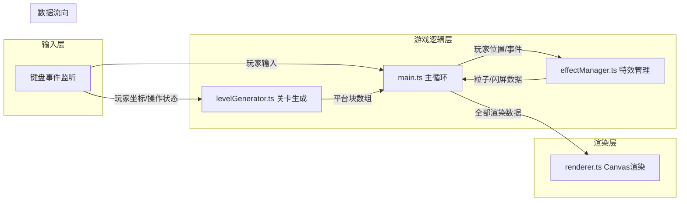

## 1. 架构设计



## 2. 技术描述
- **前端框架**：原生 TypeScript + Canvas API
- **构建工具**：Vite 5.x
- **初始化方式**：手动配置项目结构（符合用户指定的文件结构）
- **后端**：无
- **数据库**：无

## 3. 文件结构

| 文件路径 | 职责说明 |
|---------|---------|
| `package.json` | 项目依赖与启动脚本 |
| `vite.config.js` | Vite构建配置，输出到dist目录 |
| `tsconfig.json` | TypeScript严格模式配置，target ES2020 |
| `index.html` | 入口页面，全屏居中Canvas |
| `src/main.ts` | 主程序入口，游戏循环，协调各模块 |
| `src/levelGenerator.ts` | 动态关卡生成，平台块管理 |
| `src/effectManager.ts` | 粒子特效与屏幕闪烁管理 |
| `src/renderer.ts` | Canvas渲染器，视差背景、HUD |

## 4. 模块调用关系

### 4.1 主程序 (main.ts)
- **依赖**：levelGenerator, effectManager, renderer
- **输入**：键盘事件 (keydown/keyup)
- **输出**：传递玩家状态给levelGenerator，传递事件给effectManager，传递渲染数据给renderer
- **数据流向**：
  ```
  键盘输入 → 玩家物理更新 → levelGenerator.update(player) → 平台数据
                                          ↓
                                effectManager.trigger(event) → 特效数据
                                          ↓
                                renderer.render(平台, 特效, 玩家, HUD)
  ```

### 4.2 关卡生成 (levelGenerator.ts)
- **输入**：玩家坐标 {x, y}、操作状态、当前时间
- **输出**：PlatformBlock[] 平台块数组（含生成/消失动画状态）
- **核心逻辑**：
  - 维护可见区域 ±2 屏范围的平台块
  - 根据玩家前进方向预测生成新平台
  - 移除屏幕外过远的平台块
  - 相邻平台颜色从调色板随机选取且不重复
  - 平台生成时播放缩放动画(0.5x→1x, 0.2s)，消失时(1x→0.5x+渐隐, 0.15s)

### 4.3 特效管理 (effectManager.ts)
- **输入**：事件类型 (LAND/HIT/COLLECT)、位置坐标
- **输出**：Particle[] 粒子数组、ScreenFlash 闪屏状态
- **核心逻辑**：
  - 星星收集：20个彩色粒子(#ffcc00/#ff66cc/#66ff66)，随机方向，0.5s内缩小消失，带拖尾
  - 碰撞尖刺：屏幕闪红(0.7透明度, 0.3s渐隐)
  - 平台落地：对应平台闪白(0.1s)

### 4.4 渲染器 (renderer.ts)
- **输入**：平台数组、粒子数组、玩家状态、HUD数据、闪屏状态、视差偏移
- **输出**：Canvas绘制结果
- **核心逻辑**：
  - 分层渲染：视差背景 → 平台 → 障碍物 → 星星 → 玩家 → 粒子 → HUD → 闪屏
  - 像素风格渲染，禁用图像平滑
  - 16:9 Canvas 缩放适配

## 5. 数据模型

### 5.1 核心类型定义

```typescript
// 平台块
interface PlatformBlock {
  id: number;
  x: number;
  y: number;
  width: number;   // 64
  height: number;  // 64
  color: string;
  state: 'appearing' | 'visible' | 'disappearing';
  stateTime: number;  // 状态持续时间
  flashTime: number;  // 落地闪烁剩余时间
}

// 尖刺障碍物
interface Spike {
  id: number;
  x: number;
  y: number;
  size: number;    // 32
  platformId: number;
  velocity: number; // ±60
  slideInTime: number; // 滑入动画剩余时间
}

// 收集星星
interface Star {
  id: number;
  x: number;
  y: number;
  size: number;    // 24
  collected: boolean;
  respawnTimer: number;
}

// 粒子
interface Particle {
  x: number;
  y: number;
  vx: number;
  vy: number;
  color: string;
  size: number;
  life: number;
  maxLife: number;
  trail: { x: number; y: number }[];
}

// 屏幕闪屏
interface ScreenFlash {
  color: string;
  alpha: number;
  duration: number;
  time: number;
}

// 玩家状态
interface Player {
  x: number;
  y: number;
  width: number;   // 32
  height: number;  // 48
  vx: number;
  vy: number;
  onGround: boolean;
  lives: number;
  facing: 1 | -1;
  invincibleTime: number;
}

// 输入状态
interface InputState {
  left: boolean;
  right: boolean;
  jump: boolean;
  jumpPressed: boolean;
}
```

### 5.2 游戏常量

```typescript
const GAME_WIDTH = 1280;
const GAME_HEIGHT = 720;
const TILE_SIZE = 64;
const PLAYER_SPEED = 200;
const JUMP_VELOCITY = 350;
const GRAVITY = 800;
const SPIKE_SPEED = 60;
const PLATFORM_COLORS = ['#2ecc71', '#f39c12', '#e74c3c', '#3498db'];
const PARTICLE_COLORS = ['#ffcc00', '#ff66cc', '#66ff66'];
```
