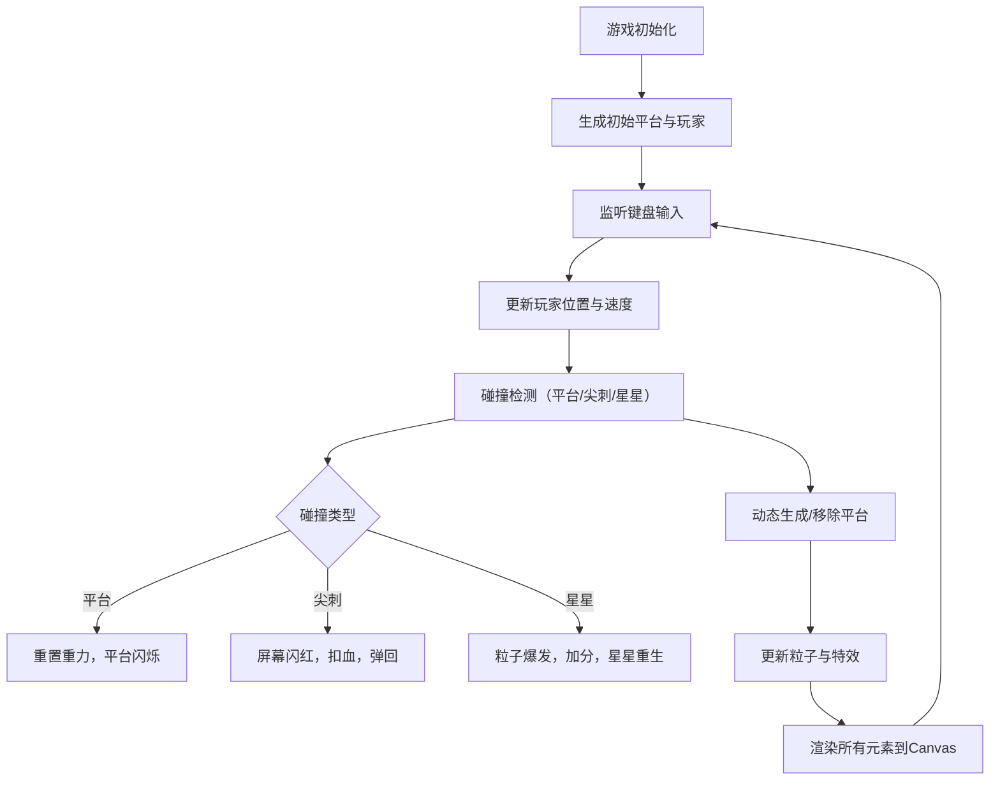

## 1. 产品概述
一款基于TypeScript和Canvas的复古像素风街机平台跳跃游戏，通过动态关卡生成和实时反馈特效，确保每次游戏体验独特且流畅。
- 面向复古游戏爱好者和休闲玩家，提供即时反馈的爽快操作体验
- 核心价值在于程序化生成的无限关卡与丰富的像素视觉特效

## 2. 核心功能

### 2.1 功能模块
1. **游戏主界面**：Canvas游戏画布、HUD信息显示、视差滚动背景
2. **玩家控制模块**：键盘输入、移动跳跃、碰撞检测、生命系统
3. **动态关卡生成**：平台块生成与移除、颜色管理、生成/消失动画
4. **障碍物系统**：移动尖刺、碰撞伤害、屏幕闪红反馈
5. **收集与特效**：星星收集、像素粒子爆发、重生机制

### 2.2 页面详情
| 页面名称 | 模块名称 | 功能描述 |
|-----------|-------------|---------------------|
| 游戏主界面 | Canvas画布 | 16:9固定宽高比，全屏居中，黑色背景填充 |
| 游戏主界面 | HUD条 | 半透明黑色背景，显示分数、生命值心形、生成等级 |
| 游戏主界面 | 视差背景 | 多层视差滚动背景，增强深度感 |
| 游戏主界面 | 玩家精灵 | 32x48像素风格小人，支持左右移动和跳跃动画 |

## 3. 核心流程
玩家启动游戏后，控制像素小人在动态生成的平台上跳跃移动，躲避尖刺障碍物并收集星星获取分数。系统根据玩家位置实时预测并生成前方平台，同时移除后方平台，保持性能稳定。

## 4. 用户界面设计
### 4.1 设计风格
- **主色调**：复古像素调色板 - 平台色(#2ecc71, #f39c12, #e74c3c, #3498db)、星星金色(#ffcc00)、粒子色(#ffcc00, #ff66cc, #66ff66)
- **背景**：纯黑色(#000)填充外部区域，内部视差滚动深色星空
- **字体**：像素风格字体，白色，大小24px
- **整体风格**：饱和对比鲜明的复古像素风，所有交互均有即时视觉反馈

### 4.2 页面设计概述
| 页面名称 | 模块名称 | UI元素 |
|-----------|-------------|-------------|
| 游戏主界面 | Canvas画布 | 16:9比例，居中显示，黑色边框 |
| 游戏主界面 | HUD条 | 48px高半透明黑底，左分数/中心生命/右等级 |
| 游戏主界面 | 平台块 | 64x64像素，彩色，相邻异色，缩放动画 |
| 游戏主界面 | 玩家角色 | 32x48像素小人，像素风格 |
| 游戏主界面 | 尖刺障碍 | 红色三角形，32像素边长 |
| 游戏主界面 | 星星 | 金色五角星，24像素 |
| 游戏主界面 | 粒子特效 | 像素大小彩色粒子，带拖尾效果 |

### 4.3 响应式
桌面端优先，Canvas固定16:9比例居中显示，外部区域黑色填充。

### 4.4 性能要求
- 游戏循环稳定60 FPS（requestAnimationFrame）
- 200个活动平台 + 100个粒子时单帧渲染 ≤ 14ms
