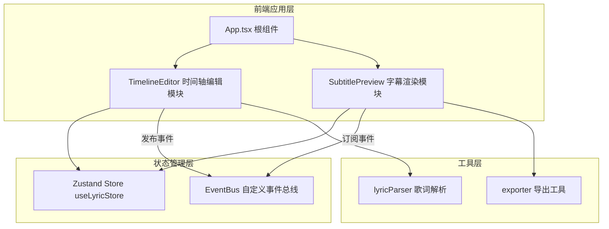

## 1. 架构设计



## 2. 技术描述
- **前端框架**：React@18 + TypeScript@5
- **构建工具**：Vite@5 + @vitejs/plugin-react
- **状态管理**：Zustand@4
- **文件导出**：file-saver
- **初始化方式**：vite-init react-ts模板

## 3. 路由定义
| 路由 | 用途 |
|------|------|
| / | 主页面（单页应用，无需额外路由） |

## 4. 数据模型

### 4.1 数据定义

```typescript
interface LyricLine {
  id: string;
  text: string;
  startTime: number;
  endTime: number;
  index: number;
}

interface LyricStyle {
  fontSize: number;
  fontFamily: string;
  color: string;
}

interface LyricState {
  lyrics: LyricLine[];
  currentTime: number;
  isPlaying: boolean;
  selectedLyricId: string | null;
  style: LyricStyle;
  totalDuration: number;
}
```

### 4.2 事件总线事件类型

```typescript
enum EventType {
  LYRIC_TIMELINE_UPDATED = 'lyricTimelineUpdated',
  LYRIC_SELECTED = 'lyricSelected',
  PLAYBACK_STATE_CHANGED = 'playbackStateChanged',
}
```

## 5. 文件结构

```
├── package.json
├── vite.config.js
├── tsconfig.json
├── index.html
├── src/
│   ├── main.tsx              # 应用入口
│   ├── App.tsx               # 根组件
│   ├── components/
│   │   ├── TimelineEditor.tsx   # 时间轴编辑模块
│   │   └── SubtitlePreview.tsx  # 字幕渲染模块
│   ├── store/
│   │   └── useLyricStore.ts     # Zustand状态管理
│   └── utils/
│       ├── eventBus.ts          # 自定义事件总线
│       └── exporter.ts          # SRT/ASS导出工具
```

## 6. 性能优化策略
1. 使用transform属性进行拖拽动画，避免重排
2. requestAnimationFrame驱动播放和动画循环
3. 拖拽节流处理，确保16ms内响应
4. 组件memo优化避免不必要重渲染
5. CSS will-change提示浏览器优化
