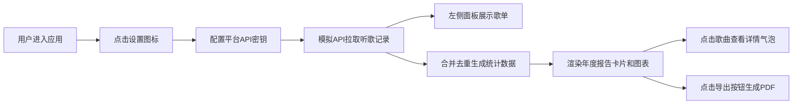

## 1. 产品概述

音乐聚合年度报告应用，解决用户听歌记录分散在多个音乐平台（网易云、QQ音乐、Spotify），无法一站式回顾全年音乐品味和发现新歌的问题。通过聚合多平台数据，生成可视化的年度听歌报告，支持PDF导出。

- 目标用户：在多个音乐平台听歌、希望统一查看年度音乐数据的音乐爱好者
- 产品价值：打破平台数据壁垒，提供沉浸式年度音乐回顾体验

## 2. 核心功能

### 2.1 用户角色
| 角色 | 注册方式 | 核心权限 |
|------|----------|----------|
| 普通用户 | 无需注册，本地存储配置 | 配置平台密钥、查看歌单、生成报告、导出PDF |

### 2.2 功能模块
1. **平台配置模块**：通过设置入口添加各平台API密钥/Token
2. **歌单面板模块**：左侧展示各平台歌单列表，支持展开查看歌曲
3. **报告统计模块**：合并去重多平台数据，生成年度统计图表
4. **歌曲详情模块**：点击歌曲卡片展示详细播放数据和平台分布
5. **PDF导出模块**：将年度报告导出为PDF文件

### 2.3 页面详情
| 页面名称 | 模块名称 | 功能描述 |
|----------|----------|----------|
| 主页面 | 平台配置入口 | 左上角齿轮图标，悬停旋转45度，点击弹出配置面板 |
| 主页面 | 左侧歌单面板 | 宽320px，背景#fafafa，圆角12px，展示平台图标和歌曲数，点击展开歌曲列表 |
| 主页面 | 年度统计报告 | 彩虹渐变条、总播放量大字、最爱歌曲卡片、最爱歌手、曲风环形图 |
| 主页面 | 歌曲详情气泡 | 点击歌曲卡片弹出，显示播放次数、首次收听日期、平台分布条形图 |
| 主页面 | PDF导出按钮 | 右下角固定圆形按钮，点击旋转动画后导出PDF |

## 3. 核心流程

用户进入应用 → 点击左上角设置图标配置平台Token → 系统通过模拟API拉取各平台最近一年听歌记录 → 左侧面板展示平台歌单列表 → 系统自动合并去重生成年度统计报告 → 用户可点击歌曲查看详情 → 用户点击右下角导出按钮生成PDF报告

## 4. 用户界面设计

### 4.1 设计风格
- **主色调**：红蓝绿渐变（#ff6b6b → #6b6bff → #6bff6b）
- **背景色**：#f5f5f5（浅灰），卡片白色圆角16px，边框2px #e0e0e0
- **卡片样式**：悬停上浮4px，阴影增强，transition 0.3s
- **字体**：现代无衬线字体，大字展示150px总播放量
- **图标风格**：平台图标圆形32px，Lucide图标库

### 4.2 页面设计概述
| 页面名称 | 模块名称 | UI元素 |
|----------|----------|--------|
| 主页面 | 设置入口 | 齿轮图标，悬停旋转45度过渡0.3s ease-out |
| 主页面 | 歌单面板 | 平台圆形图标32px，列表行高48px，悬停背景#eeeeee，滑动动画0.2s |
| 主页面 | 彩虹渐变条 | 全宽8px高，三色渐变 |
| 主页面 | 总播放量 | 150px大字深色#1a1a2e，+号颜色#ff6b6b |
| 主页面 | 最爱歌曲卡片 | 180×240px圆角16px，封面色块+歌手名 |
| 主页面 | 最爱歌手 | 圆形头像64px+名字 |
| 主页面 | 曲风环形图 | 半径80px，5种预设颜色 |
| 主页面 | 歌曲详情气泡 | 圆角20px宽280px背景白色带阴影，fadeIn动画0.3s |
| 主页面 | 平台分布条形图 | 每条高24px，颜色对应平台色 |
| 主页面 | 导出按钮 | 圆形56px背景#ff6b6b白色图标，点击旋转360度缩小恢复0.5s |

### 4.3 响应式设计
- **桌面端**：左侧歌单面板固定320px宽度，右侧报告区域自适应
- **移动端**：歌单面板折叠为顶部标签，每个标签宽33%，报告区域全宽
- **触控优化**：增大点击区域，列表行高度适配触控

### 4.4 性能要求
- 报告生成页面2秒内渲染完毕
- 所有图表和卡片动画3秒内完成
- 使用CSS动画优先，避免阻塞主线程
