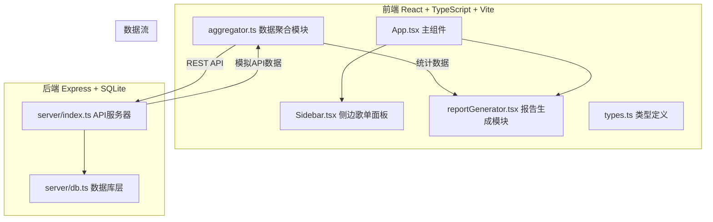
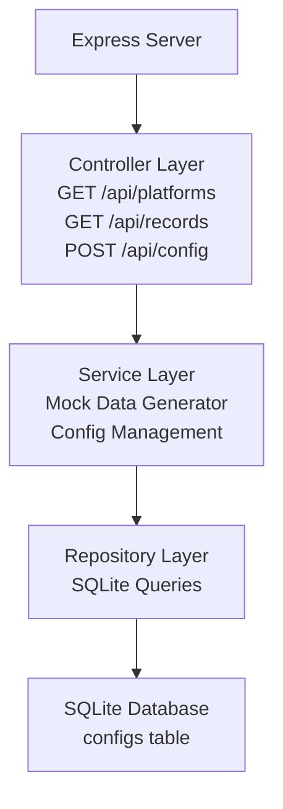
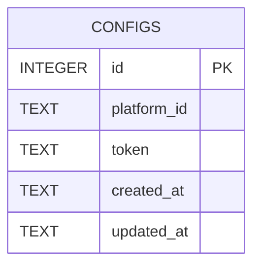

## 1. 架构设计



## 2. 技术描述

- **前端框架**：React@18 + TypeScript + Vite
- **前端库**：html2canvas, jspdf, lucide-react, zustand
- **后端框架**：Express@4 + TypeScript
- **数据库**：SQLite（sqlite3）
- **构建工具**：Vite（前端） + ts-node/tsx（后端）
- **CSS方案**：原生CSS + CSS变量（按用户指定精确颜色值）

## 3. 路由定义

| 路由 | 用途 |
|------|------|
| / | 主页面（歌单面板 + 年度报告） |

## 4. API定义

### 4.1 TypeScript 类型定义

```typescript
interface Platform {
  id: string;
  name: string;
  icon: string;
  color: string;
  token?: string;
}

interface SongRecord {
  id: string;
  platformId: string;
  title: string;
  artist: string;
  playCount: number;
  date: string;
  genre?: string;
  coverColor?: string;
}

interface YearlyReport {
  totalPlays: number;
  topSongs: Array<{
    id: string;
    title: string;
    artist: string;
    playCount: number;
    firstPlayDate: string;
    platformDistribution: Record<string, number>;
    coverColor: string;
  }>;
  topArtists: Array<{
    name: string;
    playCount: number;
    avatarColor: string;
  }>;
  genreDistribution: Array<{
    genre: string;
    percentage: number;
    color: string;
  }>;
}
```

### 4.2 后端API端点

| 方法 | 路径 | 描述 | 请求体 | 响应 |
|------|------|------|--------|------|
| GET | /api/platforms | 获取支持的平台列表 | - | Platform[] |
| GET | /api/records?platform=xxx | 获取指定平台听歌记录 | - | SongRecord[] |
| POST | /api/config | 保存用户平台配置 | {platformId, token} | {success: boolean} |

## 5. 服务器架构图



## 6. 数据模型

### 6.1 数据模型定义



### 6.2 数据定义语言

```sql
CREATE TABLE IF NOT EXISTS configs (
  id INTEGER PRIMARY KEY AUTOINCREMENT,
  platform_id TEXT NOT NULL UNIQUE,
  token TEXT,
  created_at DATETIME DEFAULT CURRENT_TIMESTAMP,
  updated_at DATETIME DEFAULT CURRENT_TIMESTAMP
);
```

## 7. 文件组织结构

```
auto51/
├── package.json
├── vite.config.js
├── tsconfig.json
├── index.html
├── server/
│   ├── index.ts          # Express服务器，模拟API
│   └── db.ts             # SQLite初始化与查询
└── src/
    ├── App.tsx           # 主组件，路由和状态管理
    ├── aggregator.ts     # 数据聚合模块
    ├── reportGenerator.tsx  # 报告生成模块
    ├── types.ts          # TypeScript类型定义
    └── components/
        └── Sidebar.tsx   # 侧边歌单面板
```
