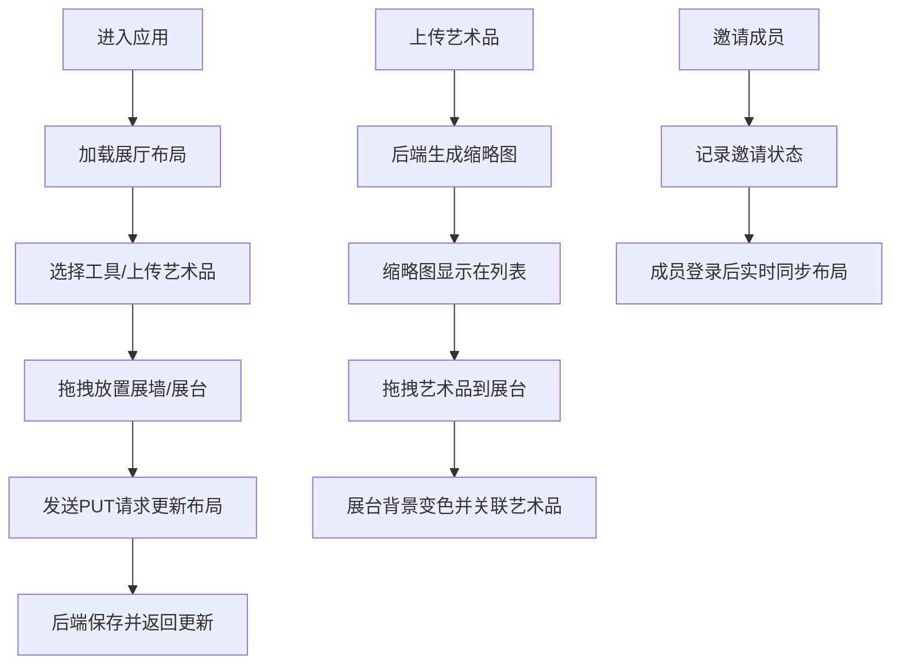

## 1. 产品概述

虚拟艺术展策展协作平台是一款面向独立策展人的在线协作工具，让策展人能够在虚拟空间中规划展厅布局、上传数字艺术品，并邀请团队成员进行协作批注和修改。

- 解决独立策展人在实体展览筹备阶段缺乏可视化协作工具的痛点
- 目标用户为独立策展人、画廊从业者、艺术机构展览团队
- 核心价值是提供沉浸式的虚拟策展体验，降低展览筹备成本，提升团队协作效率

## 2. 核心功能

### 2.1 用户角色

| 角色 | 注册方式 | 核心权限 |
|------|----------|----------|
| 策展人（创建者） | 系统默认 | 创建展厅、上传艺术品、邀请成员、编辑布局、分配展品 |
| 协作成员 | 邮件邀请 | 查看布局、添加/移动展墙和展台、批注修改 |

### 2.2 功能模块

1. **展厅布局管理模块**：创建和编辑展厅平面图，拖拽调整展墙和展台位置，实时同步协作修改
2. **艺术品管理模块**：上传数字艺术品（图片/3D模型），生成缩略图，添加标签描述，分配至展位
3. **团队协作模块**：邀请成员、权限管理、实时布局同步

### 2.3 页面详情

| 页面名称 | 模块名称 | 功能描述 |
|----------|----------|----------|
| 主策展页面 | 展厅布局编辑器 | Canvas绘制平面图，拖拽放置展墙/展台，选中编辑属性 |
| 主策展页面 | 工具栏 | 选择、添加展墙、添加展台、删除工具，支持快捷键切换 |
| 主策展页面 | 艺术品面板 | 拖拽上传、缩略图浏览、搜索过滤、拖拽分配至展台 |
| 主策展页面 | 属性面板 | 展台坐标显示、艺术品分配下拉选择 |
| 主策展页面 | 邀请成员模态框 | 邮箱输入、邀请发送、状态管理 |

## 3. 核心流程

### 主用户流程
用户进入应用后，首先看到空白展厅平面图。可通过左侧工具栏选择工具，在平面图上拖拽放置展墙和展台。从右侧艺术品面板上传作品后，可将艺术品拖拽分配到指定展台上。点击右上角邀请按钮，输入团队成员邮箱发送邀请。所有布局修改通过 REST API 实时保存到后端，并通过轮询机制同步给所有协作用户。

## 4. 用户界面设计

### 4.1 设计风格
- **主色调**：深紫色系，背景 #1e1e2e，主色 #6c63ff
- **辅助色**：绿色（展台 #c8e6c9）、灰色（展墙 #e0e0e0）
- **按钮风格**：圆形工具按钮 40px，悬停高亮边框 2px #6c63ff
- **字体**：现代无衬线字体，标题 18px，正文 14px
- **布局风格**：三栏式布局（左工具栏 + 中间画布 + 右面板）
- **图标风格**：Lucide 线性图标，简洁一致
- **动画风格**：统一 0.3s ease-out 过渡，悬停微交互

### 4.2 页面设计概述

| 页面名称 | 模块名称 | UI 元素 |
|----------|----------|---------|
| 主策展页面 | 顶部导航栏 | 高 56px，背景 #25253a，应用名称"虚拟策展"，用户头像，邀请按钮 |
| 主策展页面 | 左侧工具栏 | 宽 60px，垂直排列，圆形工具按钮 40px，选中高亮 |
| 主策展页面 | 中央画布 | Canvas 绘制，浅灰色背景 #f5f5f5，网格线 20px 间距 |
| 主策展页面 | 右侧艺术品面板 | 宽 280px，背景 #33334d，上传区域，缩略图网格列表 |
| 主策展页面 | 属性面板 | 宽 200px，右侧滑入，显示选中展台信息 |
| 主策展页面 | 邀请模态框 | 宽 320px，白色背景，圆角 16px，阴影效果 |

### 4.3 响应式设计
- **桌面端（≥1024px）**：三栏式布局，左工具栏 + 中央画布 + 右面板
- **平板端（<1024px）**：工具栏移至底部横向排列，艺术品面板折叠为底部抽屉
- **移动端**：画布自适应，所有面板采用抽屉式滑出
- **触摸优化**：增大点击热区，支持触摸拖拽操作

### 4.4 性能指标
- 拖拽展墙/展台重绘延迟 ≤50ms
- 缩略图列表滚动帧率 ≥55fps
- 布局同步轮询间隔 5 秒
- 页面加载时间 ≤3 秒
