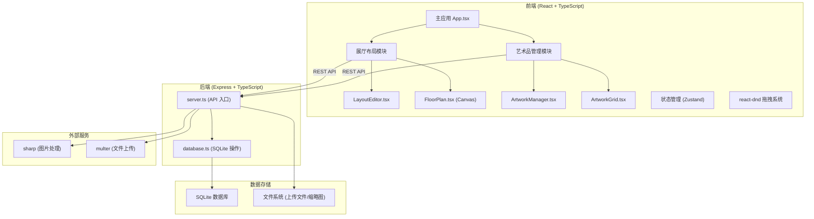
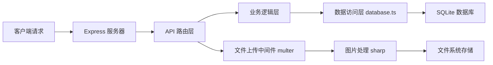
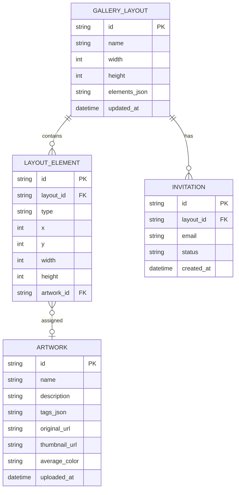

## 1. 架构设计



## 2. 技术描述

- **前端**：React 18 + TypeScript + Vite 5
- **前端框架**：使用官方 Vite React TypeScript 模板初始化
- **状态管理**：Zustand 4（轻量级状态管理）
- **拖拽库**：react-dnd + react-dnd-html5-backend
- **UI 框架**：Tailwind CSS 3
- **图标库**：lucide-react
- **后端**：Express 4 + TypeScript
- **数据库**：SQLite 3（文件型数据库）
- **文件上传**：multer 1.4
- **图片处理**：sharp 0.33
- **HTTP 客户端**：fetch API（原生）

## 3. 路由定义

| 路由 | 用途 |
|------|------|
| / | 主策展页面（唯一页面，单页应用） |

## 4. API 定义

### 类型定义

```typescript
// 布局元素类型
type LayoutElement = {
  id: string;
  type: 'wall' | 'stand';
  x: number;
  y: number;
  width: number;
  height: number;
  artworkId?: string;
  artworkColor?: string;
  artworkName?: string;
};

// 展厅布局
type GalleryLayout = {
  id: string;
  name: string;
  width: number;
  height: number;
  elements: LayoutElement[];
  updatedAt: string;
};

// 艺术品
type Artwork = {
  id: string;
  name: string;
  description: string;
  tags: string[];
  originalUrl: string;
  thumbnailUrl: string;
  averageColor: string;
  uploadedAt: string;
};

// 邀请
type Invitation = {
  id: string;
  email: string;
  status: 'pending' | 'accepted';
  createdAt: string;
};
```

### API 接口

| 方法 | 路径 | 请求 | 响应 |
|------|------|------|------|
| GET | /api/layout | 无 | `GalleryLayout` |
| PUT | /api/layout/:id | `{ elements: LayoutElement[] }` | `GalleryLayout` |
| POST | /api/artwork/upload | `multipart/form-data (file, name, description, tags)` | `Artwork` |
| GET | /api/artwork | 无 | `Artwork[]` |
| POST | /api/invite | `{ email: string }` | `{ success: boolean, invitation: Invitation }` |

## 5. 服务器架构图



## 6. 数据模型

### 6.1 数据模型定义



### 6.2 数据定义语言

```sql
-- 展厅布局表
CREATE TABLE IF NOT EXISTS gallery_layout (
  id TEXT PRIMARY KEY,
  name TEXT NOT NULL DEFAULT 'Main Gallery',
  width INTEGER NOT NULL DEFAULT 600,
  height INTEGER NOT NULL DEFAULT 400,
  elements_json TEXT NOT NULL DEFAULT '[]',
  updated_at DATETIME DEFAULT CURRENT_TIMESTAMP
);

-- 艺术品表
CREATE TABLE IF NOT EXISTS artwork (
  id TEXT PRIMARY KEY,
  name TEXT NOT NULL,
  description TEXT DEFAULT '',
  tags_json TEXT DEFAULT '[]',
  original_url TEXT NOT NULL,
  thumbnail_url TEXT NOT NULL,
  average_color TEXT DEFAULT '#6c63ff',
  uploaded_at DATETIME DEFAULT CURRENT_TIMESTAMP
);

-- 邀请表
CREATE TABLE IF NOT EXISTS invitation (
  id TEXT PRIMARY KEY,
  layout_id TEXT NOT NULL,
  email TEXT NOT NULL,
  status TEXT NOT NULL DEFAULT 'pending',
  created_at DATETIME DEFAULT CURRENT_TIMESTAMP,
  FOREIGN KEY (layout_id) REFERENCES gallery_layout(id)
);

-- 初始化默认布局
INSERT OR IGNORE INTO gallery_layout (id, name, width, height, elements_json) 
VALUES ('default', 'Main Gallery', 600, 400, '[]');
```

## 7. 项目文件结构

```
.
├── package.json
├── vite.config.ts
├── tsconfig.json
├── tsconfig.node.json
├── tailwind.config.js
├── postcss.config.js
├── index.html
├── src/
│   ├── main.tsx
│   ├── App.tsx
│   ├── index.css
│   ├── store/
│   │   └── useStore.ts
│   ├── types/
│   │   └── index.ts
│   ├── layout/
│   │   ├── LayoutEditor.tsx
│   │   ├── FloorPlan.tsx
│   │   └── Toolbar.tsx
│   ├── artwork/
│   │   ├── ArtworkManager.tsx
│   │   ├── ArtworkGrid.tsx
│   │   └── UploadArea.tsx
│   ├── components/
│   │   ├── Header.tsx
│   │   ├── PropertyPanel.tsx
│   │   ├── InviteModal.tsx
│   │   └── Tooltip.tsx
│   ├── hooks/
│   │   ├── useDragDrop.ts
│   │   └── useLayoutPolling.ts
│   └── utils/
│       ├── api.ts
│       └── colorUtils.ts
└── server/
    ├── server.ts
    ├── database.ts
    └── types.ts
```
