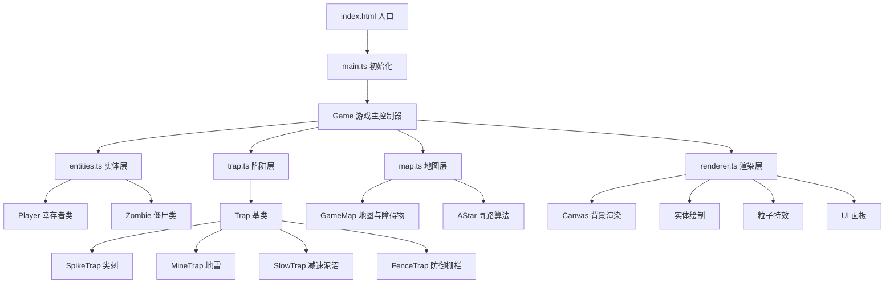

## 1. 架构设计



## 2. 技术描述

- **前端框架**：无框架，原生 TypeScript + HTML5 Canvas
- **构建工具**：Vite@5
- **语言**：TypeScript（严格模式，target ES2020，module ESNext）
- **无第三方游戏引擎**，所有逻辑自主实现

## 3. 文件结构

```
├── package.json
├── vite.config.js
├── tsconfig.json
├── index.html
└── src/
    ├── main.ts        # 入口：初始化 Canvas、创建 Game、启动循环、绑定事件
    ├── game.ts        # 游戏主循环：实体列表、资源、得分、状态切换
    ├── entities.ts    # 实体：Player 和 Zombie 类，移动/碰撞/状态更新
    ├── trap.ts        # 陷阱：Trap 基类 + 四种子类（尖刺/地雷/泥沼/栅栏）
    ├── map.ts         # 地图：障碍物、寻路网格、A* 算法
    └── renderer.ts    # 渲染：背景、实体、粒子、UI 的 Canvas 绘制
```

## 4. 核心数据结构定义

```typescript
// 位置与向量
interface Vec2 { x: number; y: number }

// 游戏状态
type GameState = 'menu' | 'playing' | 'gameover'

// 僵尸类型
type ZombieType = 'normal' | 'fast' | 'giant'

// 陷阱类型
type TrapType = 'spike' | 'mine' | 'slow' | 'fence'

// 粒子
interface Particle {
  x: number; y: number; vx: number; vy: number;
  life: number; maxLife: number; color: string; size: number;
}

// 寻路节点
interface PathNode {
  x: number; y: number;
  g: number; h: number; f: number;
  parent: PathNode | null;
  walkable: boolean;
}
```

## 5. 游戏循环时序

```
requestAnimationFrame
    ├── dt 计算（时间增量）
    ├── 输入处理（鼠标点击/移动）
    ├── Player 更新（移动、朝向）
    ├── Zombie 更新（寻路、追击、攻击）
    │   └── 每 1 秒重新计算 A* 路径
    ├── Trap 更新（触发检测、效果应用）
    ├── 碰撞检测（玩家-僵尸、僵尸-陷阱）
    ├── 粒子更新
    ├── 资源自动增长（每 5 秒 +2）
    ├── 波次生成（每 10 秒一波）
    ├── 状态检查（血量 ≤0 → gameover）
    └── Renderer 渲染全部
```

## 6. 性能优化策略

- **寻路降频**：僵尸 A* 寻路每 1 秒计算一次，而非每帧
- **空间简化**：将地图划分为网格（cell size ~20px），A* 在离散网格上运行
- **批量渲染**：同类实体使用相同绘制参数，减少 Canvas 状态切换
- **粒子池化**：限制最大粒子数，及时回收过期粒子
- **碰撞优化**：先做粗筛（距离判断），再做精确检测
