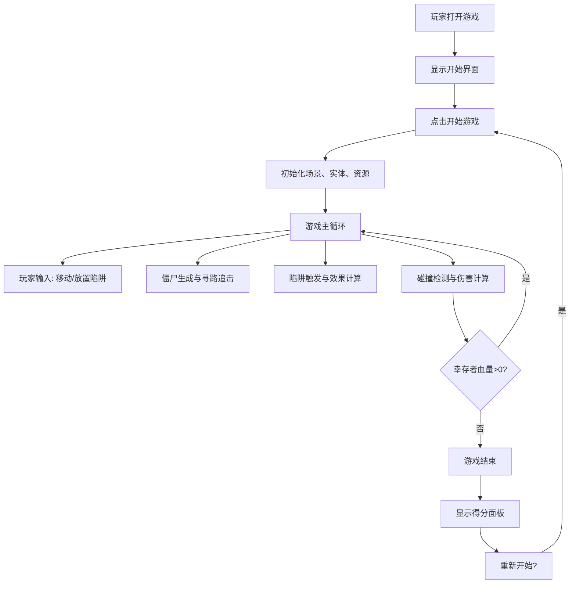

## 1. 产品概述

僵尸追击塔防小游戏是一款基于 Canvas 的策略生存游戏，玩家需要在有限资源下合理布置陷阱，利用复杂地形规划逃脱路线，抵御不断涌来的僵尸群。

- 核心玩法：控制幸存者移动 + 布置陷阱防御 + 资源管理
- 目标用户：策略游戏爱好者、休闲玩家
- 价值：提供短平快的策略博弈体验，锻炼玩家的空间规划和资源分配能力

## 2. 核心功能

### 2.1 功能模块

1. **游戏主循环**：实体管理、状态更新、碰撞检测、渲染调度
2. **幸存者系统**：鼠标点击移动、朝向最近僵尸、血量管理
3. **僵尸系统**：三类僵尸（普通/快速/巨型）、A*寻路、自动追击、波次生成
4. **陷阱系统**：四种陷阱（尖刺/地雷/减速泥沼/防御栅栏）、放置消耗、触发效果
5. **资源系统**：资源初始值、自动增长、击杀掉落、陷阱消耗
6. **地图系统**：固定障碍物、寻路网格、A*寻路算法
7. **渲染系统**：背景绘制、实体绘制、粒子效果、UI面板
8. **游戏状态管理**：开始界面、游戏进行、游戏结束、得分面板

### 2.2 页面详情

| 页面名称 | 模块名称 | 功能描述 |
|-----------|-------------|---------------------|
| 游戏主界面 | 开始界面 | 全屏深灰背景，中央"开始游戏"按钮，悬停缩放效果 |
| 游戏主界面 | 游戏画布 | Canvas 主体，自适应窗口大小（最小800x600） |
| 游戏主界面 | 状态面板 | 左上角半透明面板，显示血量进度条、资源数、杀敌数 |
| 游戏主界面 | 陷阱选择面板 | 右下角横排四个按钮，图标+文字，选中发光效果 |
| 游戏主界面 | 结束面板 | 游戏结束显示得分（杀敌数、存活时间、资源总量） |

## 3. 核心流程

```
玩家打开游戏 → 显示开始界面 → 点击"开始游戏" → 初始化游戏场景
    ↓
玩家鼠标点击移动幸存者 + 选择陷阱放置 → 僵尸波次生成并追击
    ↓
陷阱触发效果 → 僵尸受伤/减速/死亡 → 资源掉落与自动增长
    ↓
幸存者血量为 0 → 游戏结束 → 显示得分面板 → 可重新开始
```



## 4. 用户界面设计

### 4.1 设计风格

- **整体基调**：暗黑风格配亮色点缀
- **主色调**：深灰 #1a1a1a（背景）、#424242（墙壁）
- **点缀色**：绿色 #4caf50（幸存者）、橙色 #ff9800（快速僵尸）、深红 #b71c1c（巨型僵尸）、金色 #ffd54f（资源）
- **按钮样式**：圆角 8-12px，悬停缩放 1.05 倍，选中时外发光 #00e676
- **字体**：默认无衬线字体，数字加粗显示
- **布局**：Canvas 居中主体，UI 面板四角悬浮式布局
- **动效**：血量/资源变化时数字弹出缩放动画（0.3s ease-out），僵尸死亡碎裂粒子效果

### 4.2 页面设计概览

| 页面名称 | 模块名称 | UI 元素 |
|-----------|-------------|-------------|
| 游戏主界面 | 开始界面 | 全屏深灰背景、中央白色圆角按钮（160x50px）、悬停缩放、18px 加粗字体 |
| 游戏主界面 | 状态面板 | 左上角半透明黑框（rgba(0,0,0,0.6)）、圆角 8px、内边距 12px、红色进度条、金色资源数字 |
| 游戏主界面 | 陷阱面板 | 右下角半透明黑框、四个横排按钮（60x50px）、图标+文字、选中外发光过渡 0.2s |
| 游戏主界面 | 画布场景 | 深灰背景、L 形墙壁、矩形废墟块、彩色实体圆形、粒子碎片效果 |

### 4.3 响应式

- 桌面端优先设计，最小宽度 1024px
- Canvas 自适应窗口大小，最小 800x600px
- UI 面板使用固定像素尺寸，不随窗口缩放
- 按钮尺寸保持一致，确保可点击区域足够

### 4.4 性能要求

- 中等密度（同时 50 只僵尸）保持 55fps 以上
- A*寻路计算间隔 1 秒，避免每帧计算
- 粒子效果生命周期 0.4 秒后自动清理
