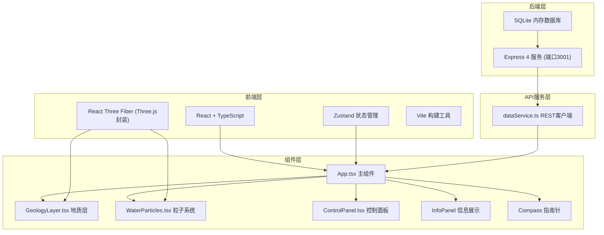
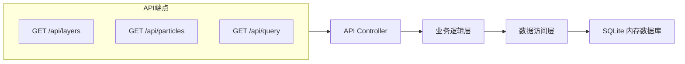
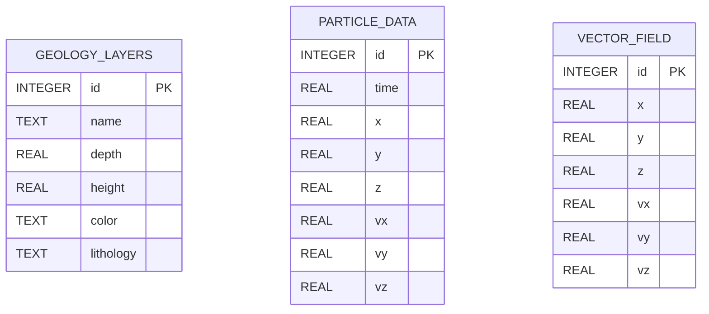
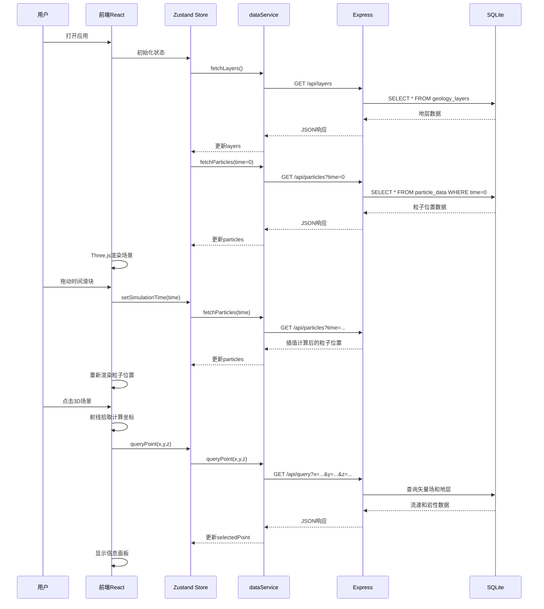

## 1. 架构设计



## 2. 技术描述

- **前端框架**：React@18 + TypeScript@5
- **3D渲染**：Three.js + @react-three/fiber@8 + @react-three/drei@9
- **状态管理**：Zustand@4
- **构建工具**：Vite@5 + @vitejs/plugin-react@4
- **后端服务**：Express@4 (端口3001)
- **数据库**：SQLite3 (内存数据库)
- **样式方案**：CSS-in-JS / 内联样式 + CSS动画
- **开发模式**：concurrently 同时启动前端Vite和后端Express

## 3. 路由定义

| 路由 | 用途 |
|-------|---------|
| / | 主可视化页面，包含3D场景和控制面板 |
| /api/layers | 获取地层结构数据 |
| /api/particles | 根据时间获取粒子位置数据 |
| /api/query | 查询指定坐标的流速和方向数据 |

## 4. API定义

### 4.1 类型定义

```typescript
// 地层数据
interface GeologyLayer {
  id: number;
  name: string;
  depth: number;
  height: number;
  color: string;
  lithology: string;
}

// 粒子数据
interface ParticleData {
  id: number;
  x: number;
  y: number;
  z: number;
  vx: number;
  vy: number;
  vz: number;
}

// 查询结果
interface QueryResult {
  x: number;
  y: number;
  z: number;
  speed: number;
  direction: {
    horizontal: number;  // 水平角度（正北为0度）
    vertical: number;    // 俯仰角度
  };
  lithology: string;
  layerId: number;
}

// 应用状态
interface AppState {
  simulationTime: number;
  particleSize: number;
  speedMultiplier: number;
  layers: GeologyLayer[];
  particles: ParticleData[];
  selectedPoint: QueryResult | null;
  setSimulationTime: (time: number) => void;
  setParticleSize: (size: number) => void;
  setSpeedMultiplier: (multiplier: number) => void;
  setSelectedPoint: (point: QueryResult | null) => void;
  fetchLayers: () => Promise<void>;
  fetchParticles: (time: number) => Promise<void>;
  queryPoint: (x: number, y: number, z: number) => Promise<void>;
}
```

### 4.2 API响应格式

```typescript
// GET /api/layers
// Response: { success: boolean; data: GeologyLayer[] }

// GET /api/particles?time=number
// Response: { success: boolean; data: ParticleData[] }

// GET /api/query?x=number&y=number&z=number
// Response: { success: boolean; data: QueryResult }
```

## 5. 服务器架构图



## 6. 数据模型

### 6.1 数据模型定义



### 6.2 DDL语句

```sql
-- 地层表
CREATE TABLE IF NOT EXISTS geology_layers (
  id INTEGER PRIMARY KEY,
  name TEXT NOT NULL,
  depth REAL NOT NULL,
  height REAL NOT NULL,
  color TEXT NOT NULL,
  lithology TEXT NOT NULL
);

-- 粒子数据表（按时间索引）
CREATE TABLE IF NOT EXISTS particle_data (
  id INTEGER PRIMARY KEY,
  time REAL NOT NULL,
  x REAL NOT NULL,
  y REAL NOT NULL,
  z REAL NOT NULL,
  vx REAL NOT NULL,
  vy REAL NOT NULL,
  vz REAL NOT NULL
);

-- 三维矢量场表
CREATE TABLE IF NOT EXISTS vector_field (
  id INTEGER PRIMARY KEY,
  x REAL NOT NULL,
  y REAL NOT NULL,
  z REAL NOT NULL,
  vx REAL NOT NULL,
  vy REAL NOT NULL,
  vz REAL NOT NULL
);

-- 初始化地层数据
INSERT INTO geology_layers (id, name, depth, height, color, lithology) VALUES
(1, '表层土', 0, 5, '#d4a373', '粉质黏土'),
(2, '黏土层', 5, 6, '#bc8f5a', '黏土'),
(3, '砂土层', 11, 4, '#a0714b', '细砂'),
(4, '基岩层', 15, 5, '#8b5e3c', '花岗岩');

-- 初始化矢量场数据（服务启动时自动生成）
-- 初始化粒子数据（服务启动时自动生成1500个粒子的时间序列）
```

## 7. 数据流向图


