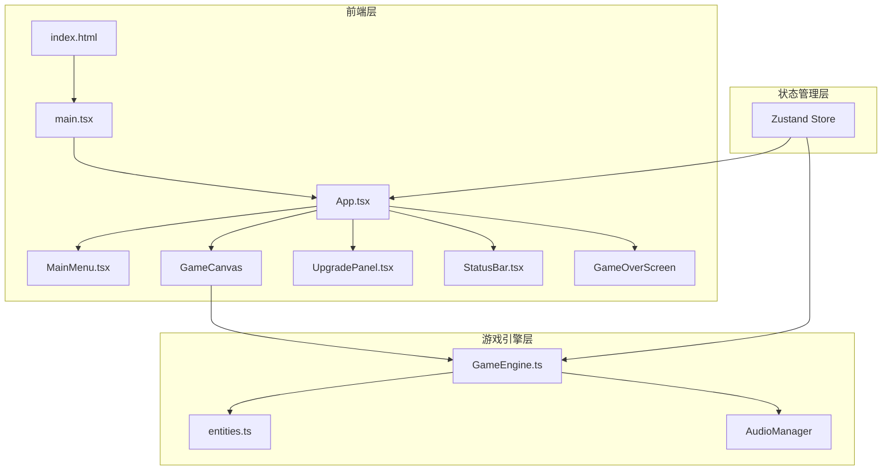
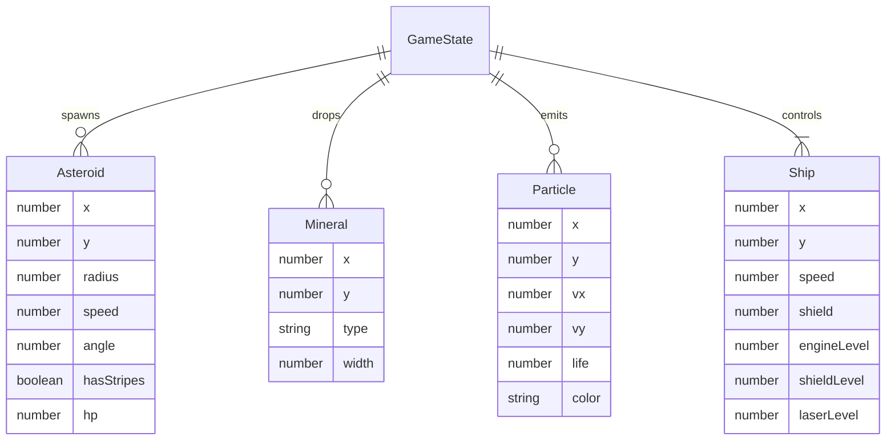

## 1. 架构设计



## 2. 技术说明

- 前端框架：React 18 + TypeScript（严格模式）
- 构建工具：Vite + @vitejs/plugin-react
- 状态管理：Zustand
- 渲染方式：Canvas 2D（游戏场景）+ React DOM（UI叠加层）
- 音频：Web Audio API（800Hz正弦波0.1秒拾取音效）
- 初始化工具：vite-init（react-ts模板）

## 3. 路由定义

本项目为单页应用，不使用路由，通过Zustand状态管理切换界面：

| 状态值 | 对应界面 |
|--------|----------|
| menu | 主菜单（星空动画 + 开始按钮） |
| galaxy-select | 星系选择（三张星系卡片） |
| playing | 游戏场景（Canvas + 状态栏） |
| game-over | 结算界面（统计信息 + 按钮） |

## 4. 数据模型

### 4.1 游戏状态数据模型



### 4.2 文件结构

```
├── package.json
├── vite.config.js
├── tsconfig.json
├── index.html
└── src/
    ├── main.tsx
    ├── App.tsx
    ├── store.ts              (Zustand状态管理)
    ├── game/
    │   ├── GameEngine.ts     (Canvas游戏循环)
    │   └── entities.ts      (实体定义和工厂函数)
    └── components/
        ├── MainMenu.tsx      (主菜单+星系选择)
        ├── UpgradePanel.tsx  (升级面板)
        └── StatusBar.tsx     (底部状态栏)
```
