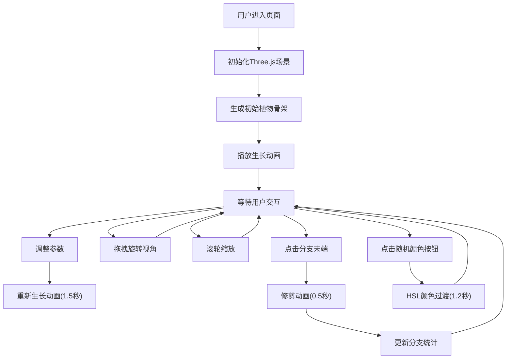

## 1. 产品概述

三维分形植物生长模拟器是一个在浏览器中动态生成并交互浏览三维分形植物（如递归树、蕨类植物）的Web应用。解决传统植物生长动画缺乏随机性和用户干预度的问题，为用户提供可交互、可参数化调整的沉浸式植物生长体验。

- 主要用途：教育演示、艺术创作、自然模拟
- 目标用户：设计师、教育工作者、自然爱好者、3D交互爱好者
- 产品价值：提供直观的L系统算法可视化演示，让用户通过参数调整理解分形植物生长规律

## 2. 核心功能

### 2.1 用户角色

| 角色 | 注册方式 | 核心权限 |
|------|----------|----------|
| 普通用户 | 无需注册 | 完整使用所有交互功能 |

### 2.2 功能模块

1. **三维分形植物生成**：基于递归L系统算法，实时生成植物骨架
2. **参数控制面板**：分支角度、递归深度、随机扰动强度三项参数调整
3. **生长动画系统**：主干伸长、侧枝展开、淡入效果的动态生长过程
4. **视角交互系统**：鼠标拖拽旋转、滚轮缩放、点击修剪
5. **颜色主题系统**：默认渐变配色 + 随机HSL颜色主题切换
6. **统计面板**：实时显示当前剩余分支数量
7. **响应式布局**：桌面端左右布局，移动端上下布局

### 2.3 页面详情

| 页面名称 | 模块名称 | 功能描述 |
|----------|----------|----------|
| 主页面 | 3D画布区域 | 70%页面宽度，深蓝渐变背景，Three.js渲染植物场景 |
| 主页面 | 控制面板 | 280px宽半透明悬浮面板，包含所有参数控件和按钮 |
| 主页面 | 统计面板 | 实时显示剩余分支数量，修剪后自动更新 |

## 3. 核心流程

## 4. 用户界面设计

### 4.1 设计风格

- 主色调：深蓝渐变背景（#0b0f19 到 #1a2332）
- 植物配色：主干棕色渐变（#8d6e63 到 #a1887f），叶子绿色（#66bb6a）
- 控制面板：半透明深色背景 rgba(10,10,20,0.85)，圆角16px
- 按钮/滑块：圆角8px，点击涟漪动画
- 字体：现代无衬线字体，标题14px加粗，正文12px常规
- 整体风格：科技感与自然感结合，深色主题突出3D植物主体

### 4.2 页面设计概述

| 页面名称 | 模块名称 | UI元素 |
|----------|----------|--------|
| 主页面 | 3D画布 | 居中70%宽度，深蓝渐变背景，植物居中生长，地面参考线 |
| 主页面 | 控制面板 | 右侧悬浮，圆角16px，内边距16px，控件间距12px，微信息密度设计 |
| 主页面 | 参数滑块 | 圆角8px轨道，圆形滑块手柄，实时数值显示 |
| 主页面 | 步进按钮 | ±按钮组，圆角8px，点击涟漪效果 |
| 主页面 | 功能按钮 | 圆角8px，悬停高亮，涟漪动画 |
| 主页面 | 统计面板 | 底部数字显示，等宽字体 |

### 4.3 响应式

- 桌面端（>768px）：3D画布居中70%宽度，控制面板右侧悬浮280px宽
- 移动端（≤768px）：上下结构，画布占上部60%，控制面板占下部40%
- 移动端：控制面板内控件改为网格排列（2列）
- 触摸优化：滑块增大触控区域，按钮最小44px触控尺寸

### 4.4 3D场景指引

- **环境**：深蓝渐变背景，无HDRI，柔和雾效增强深度感
- **光照**：半球光 + 两盏方向光，主光暖白色，补光冷蓝色，形成自然对比
- **相机**：PerspectiveCamera，fov 60，初始距离5，目标点植物中心
- **相机运动**：OrbitControls改造，拖拽旋转灵敏度0.005 rad/px，缩放范围0.5x-3x
- **构图**：植物居中，地面在y=-1.5位置，预留足够生长空间
- **交互**：Raycaster检测分支末端点击，精确修剪
- **后处理**：轻微抗锯齿，无过度特效保证性能
- **性能**：BufferGeometry合并几何体，InstancedMesh优化渲染，递归深度8层时帧率≥30fps

