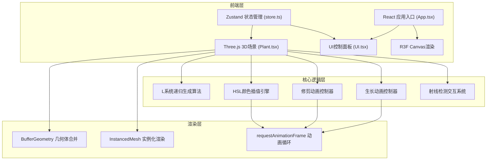

## 1. 架构设计



## 2. 技术描述

- **前端框架**：React 18 + TypeScript
- **构建工具**：Vite 5
- **3D渲染**：Three.js 0.160 + @react-three/fiber 8.15 + @react-three/drei 9.92
- **状态管理**：Zustand 4.4
- **样式方案**：CSS Modules + 内联样式（动画）
- **动画系统**：自定义requestAnimationFrame循环 + Three.js动画混合器

## 3. 核心文件结构

| 文件路径 | 职责描述 |
|----------|----------|
| [package.json](file:///d:/VersionFastPro/tasks/auto58/package.json) | 项目依赖与脚本配置 |
| [vite.config.js](file:///d:/VersionFastPro/tasks/auto58/vite.config.js) | Vite构建配置 |
| [tsconfig.json](file:///d:/VersionFastPro/tasks/auto58/tsconfig.json) | TypeScript严格模式配置 |
| [index.html](file:///d:/VersionFastPro/tasks/auto58/index.html) | 入口HTML页面 |
| [src/App.tsx](file:///d:/VersionFastPro/tasks/auto58/src/App.tsx) | 主组件，布局与Canvas配置 |
| [src/store.ts](file:///d:/VersionFastPro/tasks/auto58/src/store.ts) | Zustand状态管理 |
| [src/Plant.tsx](file:///d:/VersionFastPro/tasks/auto58/src/Plant.tsx) | 植物生成与3D渲染 |
| [src/UI.tsx](file:///d:/VersionFastPro/tasks/auto58/src/UI.tsx) | 控制面板与用户交互 |
| [src/utils/lSystem.ts](file:///d:/VersionFastPro/tasks/auto58/src/utils/lSystem.ts) | L系统递归算法 |
| [src/utils/color.ts](file:///d:/VersionFastPro/tasks/auto58/src/utils/color.ts) | HSL颜色插值工具 |
| [src/utils/animation.ts](file:///d:/VersionFastPro/tasks/auto58/src/utils/animation.ts) | 动画缓动函数 |

## 4. 数据模型

### 4.1 Zustand Store 状态定义

```typescript
interface PlantState {
  // 生长参数
  branchAngle: number;      // 分支角度 10-60度
  recursionDepth: number;   // 递归深度 3-8层
  randomStrength: number;   // 随机扰动强度 0-0.5
  
  // 颜色主题
  trunkColorBottom: string;  // 主干底部颜色
  trunkColorTop: string;     // 主干顶部颜色
  leafColor: string;         // 叶子颜色
  
  // 植物数据
  branches: BranchData[];    // 所有分支数据
  branchCount: number;       // 当前分支数量
  
  // 动画状态
  isGrowing: boolean;
  isPrunding: boolean;
  
  // 操作方法
  setBranchAngle: (angle: number) => void;
  setRecursionDepth: (depth: number) => void;
  setRandomStrength: (strength: number) => void;
  setColors: (trunkBottom: string, trunkTop: string, leaf: string) => void;
  regeneratePlant: () => void;
  pruneBranch: (branchId: string) => void;
  randomizeColors: () => void;
}
```

### 4.2 分支数据结构

```typescript
interface BranchData {
  id: string;
  parentId: string | null;
  level: number;           // 递归层级 0=主干
  start: THREE.Vector3;    // 起点
  end: THREE.Vector3;      // 终点
  baseLength: number;      // 基础长度
  lengthFactor: number;    // 长度随机系数
  radius: number;          // 分支半径
  isLeaf: boolean;         // 是否为叶子节点
  children: string[];      // 子分支ID列表
  growProgress: number;    // 生长进度 0-1
  opacity: number;         // 透明度 0-1
  pruneProgress: number;   // 修剪进度 0-1 (0=完整, 1=消失)
  isPruned: boolean;       // 是否已被修剪
}
```

## 5. 核心算法

### 5.1 L系统递归生成

```
函数 generateBranch(parent, level, direction, length):
  如果 level >= maxDepth:
    返回
  
  计算随机扰动 = randomStrength * (random() * 2 - 1)
  实际长度 = length * (1 + 扰动)
  
  创建分支数据
  计算终点 = 起点 + 方向 * 实际长度
  
  如果 level == maxDepth - 1:
    标记为叶子节点
  
  左方向 = 方向旋转 branchAngle + 随机扰动
  右方向 = 方向旋转 -branchAngle + 随机扰动
  
  递归调用 generateBranch(左方向, level+1, length*0.7)
  递归调用 generateBranch(右方向, level+1, length*0.7)
```

### 5.2 生长动画时序

```
总时长: 1.5秒
阶段1 (0-0.6秒): 主干生长，progress 0→1
阶段2 (0.3-1.0秒): 第1层侧枝生长，延迟0.3秒开始
阶段3 (0.5-1.2秒): 第2层侧枝生长，延迟0.5秒开始
...
每层生长动画: 0.8秒，progress 0→1，同时 opacity 0→1
生长进度使用 easeOutCubic 缓动函数
```

### 5.3 修剪动画

```
时长: 0.5秒
方向: 从末端向根部收缩
算法:
  1. 找到被点击分支及其所有子分支
  2. 按层级从深到浅排序（叶子先消失）
  3. 每层延迟0.05秒开始
  4. 分支沿自身轴向从末端向起点收缩
  5. 收缩进度 0→1，使用 easeInQuad 缓动
  6. 完成后从branches数组移除，更新计数
```

### 5.4 HSL颜色插值

```
时长: 1.2秒
算法:
  1. 将当前颜色和目标颜色转换为HSL
  2. 对H(色相)、S(饱和度)、L(亮度)分别线性插值
  3. 色相插值选择最短路径（顺时针或逆时针）
  4. 每帧更新材质颜色
  5. 使用 easeInOutQuad 缓动函数
```

## 6. 性能优化

1. **BufferGeometry合并**：将所有分支几何体合并为单个BufferGeometry，减少draw call
2. **InstancedMesh**：相同尺寸的分支使用实例化渲染
3. **材质复用**：所有分支共享材质，仅更新颜色uniform
4. **动画节流**：参数变化后延迟50ms再重新生成，避免连续触发
5. **可见性剔除**：修剪的分支立即从场景移除，不参与渲染
6. **几何简化**：圆柱体使用8边截面，平衡视觉质量与性能
7. **帧率监控**：递归深度8层时，目标帧率≥30fps

